# JARKOM MODUL 2-2026-K-06

## Anggota Kelompok
|Nama|NRP|
|---|---|
|Dewa Ngakan Gede Wira Adhimukti|5027251063|
|Razana Aulia|5027251127|

### 1 - Topologi The Mesh
Sebagai pusat kesadaran The Mesh, `rootkit` harus merentangkan koneksinya ke lima gerbang utama (Switch). Tetapkan alamat IP dan default gateway untuk seluruh Entitas, mulai dari para operator (`alpha`, `beta`, `gamma`), penjaga directory (`prab`, `tedd`), gerbang penyaring (`abbey`, `penny`), hingga repository (`obladi`, `desmond`, `oblada`, `molly`) sesuai dengan topologi pembagian switch yang dirancang.

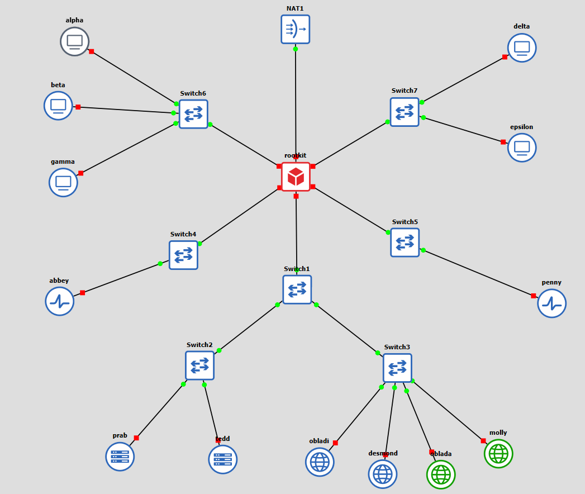

Gambar di atas merupakan gambaran topologi jaringan The Mesh.

Berikut adalah konfiguari IP dan default gateway pada topologi The Mesh.

#### rootkit (router)
 
```
auto eth1
iface eth1 inet static
    address 192.214.1.1
    netmask 255.255.255.0

auto eth2
iface eth2 inet static
    address 192.214.2.1
    netmask 255.255.255.0

auto eth3
iface eth3 inet static
    address 192.214.3.1
    netmask 255.255.255.0

auto eth4
iface eth4 inet static
    address 192.214.4.1
    netmask 255.255.255.0

auto eth5
iface eth5 inet static
    address 192.214.5.1
    netmask 255.255.255.0
    post-up echo 1 > /proc/sys/net/ipv4/ip_forward
```
 
 
 
#### alpha
```
auto eth0
iface eth0 inet static
    address 192.214.4.2
    netmask 255.255.255.0
    gateway 192.214.4.1
```
 
#### beta
```
auto eth0
iface eth0 inet static
    address 192.214.4.3
    netmask 255.255.255.0
    gateway 192.214.4.1
```
 
#### gamma
```
auto eth0
iface eth0 inet static
    address 192.214.4.4
    netmask 255.255.255.0
    gateway 192.214.4.1
```
 
#### delta
```
auto eth0
iface eth0 inet static
    address 192.214.5.2
    netmask 255.255.255.0
    gateway 192.214.5.1
```
 
#### epsilon
```
auto eth0
iface eth0 inet static
    address 192.214.5.3
    netmask 255.255.255.0
    gateway 192.214.5.1
```
 
#### abbey
```
auto eth0
iface eth0 inet static
    address 192.214.2.2
    netmask 255.255.255.0
    gateway 192.214.2.1
```
 
#### penny
```
auto eth0
iface eth0 inet static
    address 192.214.3.2
    netmask 255.255.255.0
    gateway 192.214.3.1
```
 
#### prab
```
auto eth0
iface eth0 inet static
    address 192.214.1.2
    netmask 255.255.255.0
    gateway 192.214.1.1
```
 
#### tedd
```
auto eth0
iface eth0 inet static
    address 192.214.1.3
    netmask 255.255.255.0
    gateway 192.214.1.1
```
 
#### obladi
```
auto eth0
iface eth0 inet static
    address 192.214.1.11
    netmask 255.255.255.0
    gateway 192.214.1.1
```
 
#### desmond
```
auto eth0
iface eth0 inet static
    address 192.214.1.12
    netmask 255.255.255.0
    gateway 192.214.1.1
```
 
#### oblada 
```
auto eth0
iface eth0 inet static
    address 192.214.1.21
    netmask 255.255.255.0
    gateway 192.214.1.1
```
 
#### molly
```
auto eth0
iface eth0 inet static
    address 192.214.1.22
    netmask 255.255.255.0
    gateway 192.214.1.1
```

### 2 - Jalur NAT The Mesh

Meskipun The Mesh beroperasi dalam bayang-bayang, Rootkit menyadari bahwa Entitas di dalamnya masih membutuhkan asupan paket dari dunia luar. Buka jalur menuju NAT dengan memastikan antarmuka WAN di router `rootkit` aktif. Konfigurasikan NAT agar dapat meneruskan lalu lintas keluar bagi seluruh alamat internal, sehingga semua host di dalam jaringan dapat menjangkau internet publik menggunakan IP address.

Untuk membuka jalur dari `rootkit` menuju NAT, ditambahkan konfigurasi berikut pada `/etc/network/interfaces` milik `rootkit`:

```
auto eth0
iface eth0 inet dhcp
```

Selanjutnya dilakukan tes untuk melihat apakah `rootkit` sudah bisa terhubung ke internet, menggunakan ping ke alamat publik (`8.8.8.8`).


Berhasil terhubung ke internet, dibuktikan dengan berhasilnya ping ke `8.8.8.8` dari rootkit.

Setelah antarmuka WAN aktif, langkah selanjutnya adalah mengonfigurasi NAT agar seluruh alamat internal dapat menjangkau internet publik. Pertama, diaktifkan IP forwarding agar `rootkit` bersedia meneruskan paket antar interface:

```sh
echo 1 > /proc/sys/net/ipv4/ip_forward
```

Kemudian ditambahkan aturan NAT (masquerade) menggunakan iptables, agar paket yang keluar dari jaringan internal (`192.214.0.0/16`) melalui eth0 diterjemahkan menggunakan alamat IP WAN `rootkit`:

```sh
iptables -t nat -A POSTROUTING -o eth0 -s 192.214.0.0/16 -j MASQUERADE
```

Kedua command di atas dituliskan ke dalam script `/root/nat.sh` agar dapat dijalankan ulang setelah restart.

```sh
#!/bin/sh
echo 1 > /proc/sys/net/ipv4/ip_forward
iptables -t nat -C POSTROUTING -o eth0 -s 192.214.0.0/16 -j MASQUERADE 2>/dev/null || \
iptables -t nat -A POSTROUTING -o eth0 -s 192.214.0.0/16 -j MASQUERADE
```

Selanjutnya dilakukan tes dari salah satu client internal (`prab`) untuk melihat apakah host tersebut sudah dapat menjangkau internet publik menggunakan alamat IP.

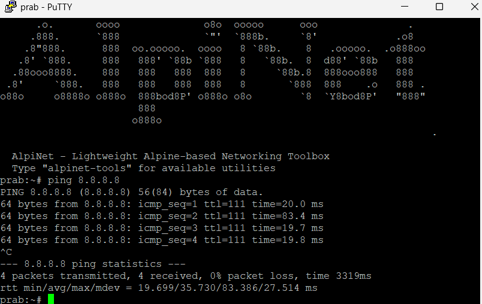

Dari gambar di atas dapat dilihat bahwa `prab` berhasil melakukan ping ke `8.8.8.8`, yang membuktikan bahwa NAT pada `rootkit` telah berhasil meneruskan lalu lintas dari jaringan internal menuju internet publik.

### 3 - Konfigurasi Routing Internal dan DNS Server

Jaringan rahasia tidak akan berfungsi tanpa sinkronisasi antar divisi. Pastikan seluruh Entitas dapat saling terhubung dan berkomunikasi lintas jalur (routing internal via `rootkit` berfungsi). Untuk menghindari fragmentasi saat persiapan, pastikan setiap host non-router menambahkan resolver `192.168.122.1` saat antarmukanya aktif agar akses untuk mengunduh paket instalasi dari internet tersedia sejak awal beroperasi.

Pada soal 2 sebelumnya, `ip_forward` sudah diaktifkan di `rootkit` sehingga routing antar segmen sudah berjalan secara otomatis, karena `rootkit` merupakan default gateway bagi seluruh segmen yang terhubung langsung padanya. Selanjutnya dilakukan tes komunikasi lintas segmen untuk membuktikan hal tersebut.

- `alpha` ke `delta`


- `abbey` ke `obladi`


- `epsilon` ke `penny`
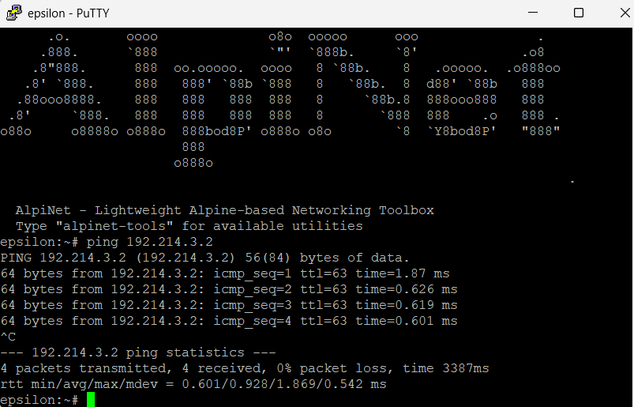

- `gamma` ke `abbey`


Dari hasil tes yang sudah dilakukan, terlihat bahwa komunikasi antar segmen berhasil dilakukan, yang membuktikan bahwa routing internal via `rootkit` telah berfungsi dengan baik untuk seluruh segmen jaringan.

Selanjutnya adalah pemasangan resolver awal untuk setiap host non-router. Agar resolver ini otomatis ditambahkan kembali setiap kali antarmuka jaringan host aktif (termasuk setelah restart), baris resolver dituliskan sebagai perintah `post-up` pada konfigurasi `/etc/network/interfaces` masing-masing host, bukan diedit langsung satu kali ke `/etc/resolv.conf`. Berikut contoh konfigurasi pada `alpha`:

```
auto eth0
iface eth0 inet static
    address 192.214.4.2
    netmask 255.255.255.0
    gateway 192.214.4.1
    echo "nameserver 192.168.122.1" > /etc/resolv.conf
```

Konfigurasi serupa diterapkan pada seluruh host non-router lainnya (`beta`, `gamma`, `delta`, `epsilon`, `abbey`, `penny`, `prab`, `tedd`, `obladi`, `desmond`, `oblada`, `molly`), menyesuaikan alamat IP dan gateway masing-masing.

Selanjutnya dilakukan tes untuk melihat apakah host tersebut sudah dapat menjangkau internet publik menggunakan alamat domain (google.com), yang membuktikan resolver telah berfungsi dengan benar.

- `alpha`
  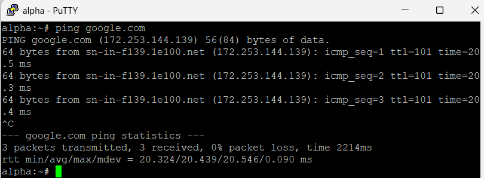

- `delta`
  

- `abbey`
  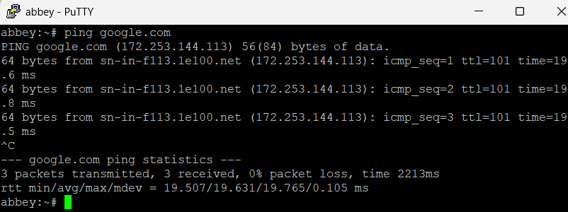

- `penny`
  

- `prab`
  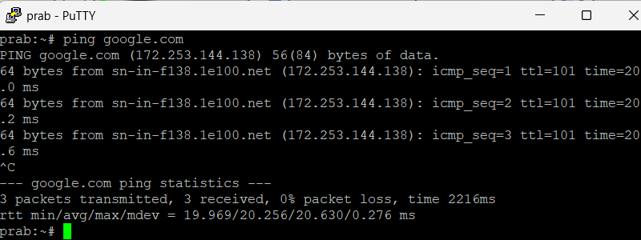

Dari hasil tes yang sudah dilakukan, terlihat bahwa seluruh host non-router yang diuji berhasil melakukan ping ke google.com. Hal ini membuktikan bahwa resolver `192.168.122.1` telah aktif dan berfungsi dengan benar pada setiap host, sehingga host-host tersebut dapat melakukan resolusi nama domain sekaligus menjangkau internet publik melalui NAT yang telah dikonfigurasi pada `rootkit`.

### 4 - DNS Authoritative (Master di prab, Slave di tedd)

Penjaga Direktori mulai menuliskan hukum The Mesh. Pada node `prab`, dibangun zona `k06.com` sebagai authoritative dengan SOA yang menunjuk ke `prab.k06.com`, catatan NS untuk `prab.k06.com` dan `tedd.k06.com`, A record untuk `prab` dan `tedd` yang mengarah ke IP masing-masing, serta A record apex `k06.com` yang mengarah ke gerbang aplikasi dinamis (`penny`). Diaktifkan fitur notify dan allow-transfer ke `tedd`, serta forwarders ke `192.168.122.1`. Node `tedd` menarik zona dari master dan menjawab secara authoritative. Setelah itu urutan resolver pada seluruh host non-router diubah menjadi `prab`, `tedd`, lalu `192.168.122.1`.

Di soal ini akan dibangun DNS authoritative untuk domain `k06.com` menggunakan BIND9 dengan node `prab` sebagai master dan `tedd` sebagai slave, agar The Mesh memiliki sistem resolusi nama internal sendiri yang tetap konsisten dan tersedia meskipun salah satu name server bermasalah.

Perlu dicatat bahwa image docker yang digunakan bersifat ephemeral: setiap kali node di-restart, seluruh paket yang diinstal lewat `apk` (termasuk BIND9 beserta binary `/usr/sbin/named`) dan konfigurasi di luar direktori persisten akan hilang. Karena image juga tidak menyertakan OpenRC (`rc-service` / `rc-update` tidak tersedia), seluruh instalasi dan konfigurasi tidak dijalankan manual sekali saja, melainkan dibungkus dalam script `/root/soal4.sh` yang dipanggil otomatis dari `post-up` pada `/etc/network/interfaces` saat node boot. Penjelasan mekanisme persistensi ada pada bagian akhir soal.

#### Konfigurasi di prab (Master)

BIND9 dipasang di `prab` karena node ini berperan sebagai name server utama (master) untuk zona `k06.com`, yang bertugas menyimpan dan menjawab query DNS secara authoritative.

Seluruh langkah (instalasi BIND9, penulisan `named.conf`, penulisan file zona, penetapan kepemilikan, dan start named) ditulis ke dalam script `/root/soal4.sh` berikut:

```sh
#!/bin/sh
# /root/soal4.sh - prab (DNS Master untuk zona k06.com)

# Berhenti kalau named sudah jalan (hindari install/start ganda)
pgrep -x named >/dev/null 2>&1 && exit 0

# Tunggu koneksi internet siap (NAT rootkit), karena apk butuh akses mirror.
i=0
while [ $i -lt 30 ]; do
    ping -c1 -W1 192.168.122.1 >/dev/null 2>&1 && break
    i=$((i+1))
    sleep 1
done

# 1. Install BIND9
apk update
apk add bind bind-tools

# 2. named.conf (options + zone master)
cat > /etc/bind/named.conf <<'EOF'
options {
    directory "/var/bind";

    forwarders {
        192.168.122.1;
    };

    allow-query { any; };
    auth-nxdomain no;
    listen-on { any; };
    listen-on-v6 { any; };
};

zone "k06.com" {
    type master;
    file "/etc/bind/zones/k06.com.db";
    notify yes;
    allow-transfer { 192.214.1.3; };
};
EOF

# 3. File zone
mkdir -p /etc/bind/zones
cat > /etc/bind/zones/k06.com.db <<'EOF'
$TTL    604800
@       IN      SOA     prab.k06.com. root.k06.com. (
                        2026100401 ; Serial
                        604800     ; Refresh
                        86400      ; Retry
                        2419200    ; Expire
                        604800 )   ; Negative Cache TTL

@               IN      NS      prab.k06.com.
@               IN      NS      tedd.k06.com.

prab            IN      A       192.214.1.2
tedd            IN      A       192.214.1.3

@               IN      A       192.214.3.2
EOF

# 4. Kepemilikan + start
chown -R named:named /etc/bind/zones
named -c /etc/bind/named.conf -u named
```

Penjelasan bagian penting:
- Block `options` mengatur `forwarders` ke `192.168.122.1` agar query untuk domain di luar zona `k06.com` (misalnya google.com) tetap dapat diteruskan ke resolver luar, bukan langsung gagal dijawab.
- Block `zone` mendefinisikan `k06.com` sebagai master dengan `notify yes` dan `allow-transfer` ke IP `tedd` (`192.214.1.3`) agar setiap perubahan zona langsung diberitahukan dan dapat ditarik oleh slave.
- File zona berisi record SOA (`prab` sebagai otoritas utama, email admin `root.k06.com.`), NS untuk `prab` dan `tedd`, A record `prab` (`192.214.1.2`) dan `tedd` (`192.214.1.3`), serta A record apex `@` (`k06.com`) yang mengarah ke `192.214.3.2` yaitu IP `penny` sebagai gerbang aplikasi dinamis.
- Pada Alpine, paket `bind` tidak menyediakan `/etc/bind/named.conf` utama dan tidak melakukan include otomatis seperti Debian, sehingga seluruh konfigurasi (options + zone) ditulis dalam satu file. named dijalankan langsung lewat binary-nya dengan `-c` (file konfigurasi) dan `-u named` (user proses).


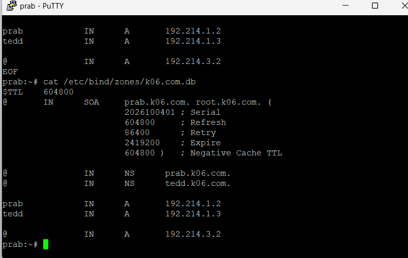

Agar script dipanggil otomatis saat node boot, ditambahkan baris `post-up` pada `/etc/network/interfaces` prab. Baris penulisan `/etc/resolv.conf` diletakkan lebih dahulu karena `apk` membutuhkan resolver aktif, dan script dijalankan dengan `nohup ... &` agar kebal SIGHUP serta tidak membuat proses boot (ifup) menggantung menunggu instalasi selesai:

```
auto eth0
iface eth0 inet static
    address 192.214.1.2
    netmask 255.255.255.0
    gateway 192.214.1.1
    post-up printf "nameserver 192.214.1.2\nnameserver 192.214.1.3\nnameserver 192.168.122.1\n" > /etc/resolv.conf
    post-up nohup sh /root/soal4.sh >/tmp/soal4.log 2>&1 &
```

##### Verifikasi Master

Verifikasi dilakukan dengan memastikan proses named berjalan, lalu melakukan query langsung ke server lokal (`127.0.0.1`) untuk apex domain dan hostname di dalam zona.

```bash
ps aux | grep [n]amed
dig @127.0.0.1 k06.com +short
dig @127.0.0.1 prab.k06.com +short
dig @127.0.0.1 tedd.k06.com +short
```

Hasil yang diharapkan:
- `k06.com` -> `192.214.3.2` (IP `penny`)
- `prab.k06.com` -> `192.214.1.2`
- `tedd.k06.com` -> `192.214.1.3`

Ketiga query dijawab dengan benar oleh `prab`, membuktikan zona `k06.com` aktif dan dijawab secara authoritative oleh master.

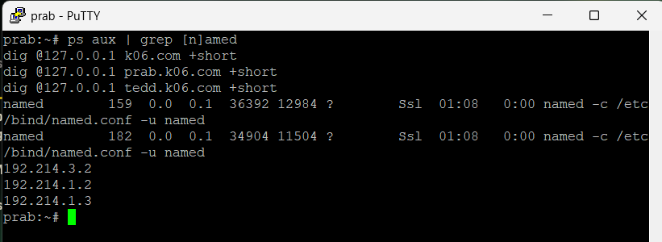

#### Konfigurasi di tedd (Slave)

`tedd` dikonfigurasi sebagai name server slave (secondary) yang menarik salinan zona `k06.com` dari master `prab` melalui zone transfer, sehingga `tedd` juga dapat menjawab query secara authoritative tanpa perlu mendefinisikan record zona secara manual. Isi `/root/soal4.sh` pada `tedd` sama polanya dengan `prab`, hanya berbeda pada block `zone`:

```sh
#!/bin/sh
# /root/soal4.sh - tedd (DNS Slave untuk zona k06.com)

pgrep -x named >/dev/null 2>&1 && exit 0

i=0
while [ $i -lt 30 ]; do
    ping -c1 -W1 192.168.122.1 >/dev/null 2>&1 && break
    i=$((i+1))
    sleep 1
done

# 1. Install BIND9
apk update
apk add bind bind-tools

# 2. named.conf (options + zone slave)
cat > /etc/bind/named.conf <<'EOF'
options {
    directory "/var/bind";

    forwarders {
        192.168.122.1;
    };

    allow-query { any; };
    auth-nxdomain no;
    listen-on { any; };
    listen-on-v6 { any; };
};

zone "k06.com" {
    type slave;
    masters { 192.214.1.2; };
    file "/var/bind/slave/k06.com.db";
};
EOF

# 3. Direktori slave (writable oleh named untuk salinan zona)
mkdir -p /var/bind/slave
chown -R named:named /var/bind/slave

# 4. Start
named -c /etc/bind/named.conf -u named
```

Penjelasan bagian penting:
- Pada block `zone`, tipe diubah menjadi `slave`, `masters { 192.214.1.2; }` menunjuk ke `prab` sebagai sumber zona, dan `file` diarahkan ke `/var/bind/slave/k06.com.db` sebagai lokasi salinan zona.
- Direktori `/var/bind/slave` harus dapat ditulis oleh user `named`, karena file zona dibuat dan diperbarui otomatis oleh BIND setiap kali zone transfer terjadi.

Baris `post-up` pada `/etc/network/interfaces` `tedd` sama polanya dengan `prab`:

```
auto eth0
iface eth0 inet static
    address 192.214.1.3
    netmask 255.255.255.0
    gateway 192.214.1.1
    post-up printf "nameserver 192.214.1.2\nnameserver 192.214.1.3\nnameserver 192.168.122.1\n" > /etc/resolv.conf
    post-up nohup sh /root/soal4.sh >/tmp/soal4.log 2>&1 &
```

##### Verifikasi Slave dan Zone Transfer

Keberhasilan zone transfer dibuktikan dengan munculnya file salinan zona di `/var/bind/slave/`, lalu `tedd` melakukan query lokal dan mengembalikan jawaban yang sama seperti master.

```bash
ps aux | grep [n]amed
ls -la /var/bind/slave/
dig @127.0.0.1 k06.com +short
dig @127.0.0.1 prab.k06.com +short
dig @127.0.0.1 tedd.k06.com +short
```

Hasil yang diharapkan:
- File `k06.com.db` muncul di `/var/bind/slave/` sebagai bukti zone transfer dari `prab` berhasil.
- Ketiga query mengembalikan IP yang sama seperti pada master (`192.214.3.2`, `192.214.1.2`, `192.214.1.3`), membuktikan `tedd` menjawab secara authoritative dari salinan zonanya sendiri.


#### Penataan Ulang Resolver (Semua Host Non-Router)

Setelah DNS internal berdiri, urutan resolver pada seluruh host non-router (`alpha`, `beta`, `gamma`, `delta`, `epsilon`, `abbey`, `penny`, `prab`, `tedd`, `obladi`, `desmond`, `oblada`, `molly`) diperbarui menjadi `prab`, `tedd`, lalu `192.168.122.1`. Tujuannya agar resolusi nama internal The Mesh diprioritaskan ke `prab` dan `tedd` terlebih dahulu, dan hanya diteruskan ke resolver luar (`192.168.122.1`) bila nama yang dicari berada di luar zona `k06.com`.

Karena resolver harus tetap aktif setiap kali antarmuka jaringan naik (termasuk setelah restart), penataan ini dituliskan sebagai perintah `post-up` pada `/etc/network/interfaces` masing-masing host, menggantikan baris resolver awal (`192.168.122.1` tunggal) dari soal 3. Berikut contoh pada `alpha`:

```
auto eth0
iface eth0 inet static
    address 192.214.4.2
    netmask 255.255.255.0
    gateway 192.214.4.1
    post-up printf "nameserver 192.214.1.2\nnameserver 192.214.1.3\nnameserver 192.168.122.1\n" > /etc/resolv.conf
```

Perubahan serupa diterapkan pada seluruh host non-router lainnya (menyesuaikan alamat IP dan gateway masing-masing).

##### Verifikasi Akhir dari Klien

Verifikasi dilakukan dari dua klien berbeda (`alpha` dan `delta`) untuk memastikan query apex maupun hostname di dalam zona dijawab dengan benar melalui `prab` atau `tedd`, bukan lagi lewat resolver luar.

```bash
cat /etc/resolv.conf
dig k06.com +short
dig prab.k06.com +short
dig tedd.k06.com +short
```

Hasil yang diharapkan: resolver teratas adalah `192.214.1.2` (`prab`) dan `192.214.1.3` (`tedd`), serta seluruh query mengembalikan IP yang benar, membuktikan resolusi nama internal telah diprioritaskan ke DNS milik The Mesh.


Hasil tes berhasil.

### 5 - Penamaan Hostname dan Domain per Node

"Entitas tanpa identitas adalah anomali," pesan Rootkit. Namai semua Entitas (hostname) sesuai glosarium: `rootkit`, `alpha`, `beta`, `gamma`, `delta`, `epsilon`, `prab`, `tedd`, `abbey`, `penny`, `obladi`, `desmond`, `oblada`, `molly`, dan verifikasi bahwa setiap host mengenali hostname tersebut secara system-wide. Buat setiap domain untuk masing-masing node sesuai dengan namanya (contoh: alpha.<xxxx>.com) dan assign IP masing-masing juga. Lakukan pengecualian untuk node yang bertanggung jawab atas `prab` dan tedd.

Pada soal ini dilakukan dua hal. Pertama, seluruh entitas (host) diberi nama (hostname) sesuai glosarium dan dipastikan dikenali secara system-wide. Kedua, dibuat domain untuk masing-masing node sesuai namanya (contoh: `alpha.k06.com`) dengan A record yang mengarah ke IP masing-masing pada zona `k06.com`. Node `prab` dan `tedd` dikecualikan dari pembuatan A record baru karena keduanya sudah didaftarkan pada soal 4.

Tujuannya agar setiap host tidak hanya dapat dihubungi melalui alamat IP, tetapi juga melalui nama domain yang lebih mudah diingat, dan setiap host mengenali identitas namanya sendiri secara konsisten di seluruh sistem.

#### 1 - Penamaan Hostname (Semua Node)

Setiap node diberi hostname sesuai glosarium: `rootkit`, `alpha`, `beta`, `gamma`, `delta`, `epsilon`, `prab`, `tedd`, `abbey`, `penny`, `obladi`, `desmond`, `oblada`, molly. Pada topologi GNS3, hostname sudah otomatis diset sesuai nama node (terlihat dari prompt shell, misalnya `alpha:~#`), sehingga setiap host telah mengenali namanya secara system-wide.

Verifikasi hostname pada salah satu node:

```bash
hostname
cat /etc/hostname
```

Hasil yang diharapkan: perintah `hostname` mengembalikan nama node yang benar (misalnya `alpha`), dan prompt shell menampilkan nama yang sama.


#### 2 - Menambahkan A Record per Node

Seluruh perubahan DNS dilakukan pada master (`prab`). Ditambahkan A record baru ke file zona `k06.com` yang memetakan tiap hostname ke IP statis yang telah ditetapkan pada soal 1. Node `prab` dan `tedd` tidak ditambahkan lagi karena sudah ada sejak soal 4. Node `rootkit` adalah router dengan banyak interface (`192.214.1.1` hingga `192.214.5.1`) sehingga tidak diberi satu A record tunggal.

A record ditambahkan ke akhir file zona `/etc/bind/zones/k06.com.db`:

```bash
cat >> /etc/bind/zones/k06.com.db <<'EOF'

alpha           IN      A       192.214.4.2
beta            IN      A       192.214.4.3
gamma           IN      A       192.214.4.4
delta           IN      A       192.214.5.2
epsilon         IN      A       192.214.5.3
abbey           IN      A       192.214.2.2
penny           IN      A       192.214.3.2
obladi          IN      A       192.214.1.11
desmond         IN      A       192.214.1.12
oblada          IN      A       192.214.1.21
molly           IN      A       192.214.1.22
EOF
```

#### 3 - Menaikkan Serial SOA

Agar slave (`tedd`) mendeteksi versi zona lebih baru dan menarik ulang salinannya, nilai serial SOA dinaikkan dari `2026100401` menjadi `2026100402`:

```bash
sed -i 's/2026100401 ; Serial/2026100402 ; Serial/' /etc/bind/zones/k06.com.db
```

#### 4 - Menerapkan Perubahan

File zona divalidasi terlebih dahulu, lalu named di-reload agar record baru aktif tanpa perlu mematikan proses:

```bash
chown named:named /etc/bind/zones/k06.com.db
named-checkzone k06.com /etc/bind/zones/k06.com.db
rndc reload k06.com
```

Hasil yang diharapkan: `named-checkzone` menampilkan `loaded serial 2026100402` dan `OK`.

#### 5 - Verifikasi

Verifikasi dari `prab` bahwa A record baru terjawab dengan benar:

```bash
dig @127.0.0.1 alpha.k06.com +short
dig @127.0.0.1 molly.k06.com +short
dig @127.0.0.1 abbey.k06.com +short
```

Hasil yang diharapkan: `alpha` -> `192.214.4.2`, `molly` -> `192.214.1.22`, `abbey` -> `192.214.2.2`.


Karena serial dinaikkan dan `notify yes` aktif, `tedd` otomatis menarik salinan zona terbaru. Verifikasi zona di `tedd` sudah ikut terbarui:

```bash
dig @127.0.0.1 alpha.k06.com +short
dig @127.0.0.1 obladi.k06.com +short
```


Terakhir, verifikasi dari salah satu klien dengan ping ke beberapa hostname pada segmen berbeda untuk membuktikan resolusi nama dan konektivitas berjalan benar di seluruh jaringan:

```bash
ping -c3 beta.k06.com
ping -c3 molly.k06.com
ping -c3 abbey.k06.com
```

Hasil yang diharapkan: setiap nama domain diterjemahkan ke IP yang benar (`beta` -> `192.214.4.3`, `molly` -> `192.214.1.22`, `abbey` -> `192.214.2.2`) dan klien menerima balasan reply. Keberhasilan ping ke host di segmen berbeda (sayap kiri, area core, dan gerbang) membuktikan seluruh A record berfungsi dengan benar.


#### Persistensi

Karena file zona di-generate ulang oleh `/root/soal4.sh` setiap kali node `prab` boot, penambahan A record di atas akan hilang saat restart bila dilakukan manual. Oleh karena itu seluruh langkah 2 sampai 4 dibungkus dalam script terpisah `/root/soal5.sh`. Script ini menunggu `soal4.sh` selesai, lalu menambahkan A record per-node, menaikkan serial, dan me-reload named.

```sh
#!/bin/sh
# /root/soal5.sh 

ZONE=/etc/bind/zones/k06.com.db

# Tunggu soal4.sh selesai membuat file zona dan menjalankan named.
i=0
while [ $i -lt 90 ]; do
    if [ -f "$ZONE" ] && pgrep -x named >/dev/null 2>&1; then
        break
    fi
    i=$((i+1))
    sleep 1
done

# Idempoten: kalau record node sudah ada, tidak usah menambah lagi.
grep -q '^alpha' "$ZONE" && exit 0

# Tambahkan A record per-node (prab & tedd sudah ada dari soal4, tidak diulang).
cat >> "$ZONE" <<'EOF'

alpha           IN      A       192.214.4.2
beta            IN      A       192.214.4.3
gamma           IN      A       192.214.4.4
delta           IN      A       192.214.5.2
epsilon         IN      A       192.214.5.3
abbey           IN      A       192.214.2.2
penny           IN      A       192.214.3.2
obladi          IN      A       192.214.1.11
desmond         IN      A       192.214.1.12
oblada          IN      A       192.214.1.21
molly           IN      A       192.214.1.22
EOF

# Naikkan serial agar tedd (slave) menarik ulang salinan zona.
sed -i 's/2026100401 ; Serial/2026100402 ; Serial/' "$ZONE"

# Terapkan perubahan: reload lewat rndc, fallback restart named.
chown named:named "$ZONE"
rndc reload k06.com 2>/dev/null || { pkill named; named -c /etc/bind/named.conf -u named; }
```

Agar script dijalankan otomatis saat boot, ditambahkan baris `post-up` pada `/etc/network/interfaces` `prab`, setelah baris pemanggilan `soal4.sh`:

```
    post-up nohup sh /root/soal4.sh >/tmp/soal4.log 2>&1 &
    post-up nohup sh /root/soal5.sh >/tmp/soal5.log 2>&1 &
```

### 6 - Verifikasi Zone Transfer 

Pastikan zone transfer berjalan, pastikan `tedd` telah menerima salinan zona terbaru dari prab. Nilai serial SOA di keduanya harus sama karena keduanya tidak bisa dipisahkan dan saling melengkapi.

Pada soal ini dipastikan bahwa zone transfer antara master (`prab`) dan slave (`tedd`) berjalan dengan benar, yaitu `tedd` telah menerima salinan zona `k06.com` terbaru dari `prab`, dan nilai serial SOA pada keduanya identik. Serial yang sama menjadi bukti bahwa kedua name server memegang versi zona yang persis sama dan saling melengkapi.

Mekanisme zone transfer sendiri sudah dibangun pada soal 4 (`notify yes` dan `allow-transfer` ke `tedd` pada `prab`, serta `type slave` dengan `masters` menunjuk `prab` pada `tedd`), sehingga pada soal ini tidak ada konfigurasi baru yang ditambahkan; yang dilakukan adalah verifikasi bahwa sinkronisasi benar-benar terjadi.

#### 1 - Cek Serial SOA di prab (Master)

Serial SOA pada master diperiksa dengan query langsung ke `prab`:

```bash
dig @127.0.0.1 k06.com SOA +short
```

Hasil yang diharapkan: baris SOA menampilkan serial terbaru, yaitu `2026100402` (nilai setelah dinaikkan pada soal 5).

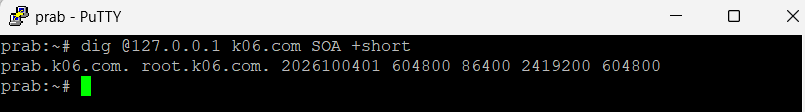

#### 2 - Cek Serial SOA di tedd (Slave)

Serial SOA pada slave diperiksa dengan cara yang sama di `tedd`:

```bash
dig @127.0.0.1 k06.com SOA +short
```

Hasil yang diharapkan: serial yang ditampilkan sama persis dengan di `prab`, yaitu `2026100402`, membuktikan `tedd` telah menarik versi zona terbaru.


#### 3 - Bukti Salinan Zona di tedd

Keberhasilan zone transfer juga dibuktikan dengan keberadaan file salinan zona yang ditulis otomatis oleh BIND di direktori slave:

```bash
ls -la /var/bind/slave/
```

Hasil yang diharapkan: file `k06.com.db` ada di `/var/bind/slave/`, yang berarti `tedd` berhasil menerima dan menyimpan salinan zona dari prab.


#### 4 - Verifikasi Konsistensi Record

Untuk memastikan isi zona  konsisten, beberapa record di-query dari kedua name server dan hasilnya dibandingkan:

```bash
# dari prab
dig @192.214.1.2 alpha.k06.com +short
dig @192.214.1.2 molly.k06.com +short

# dari tedd
dig @192.214.1.3 alpha.k06.com +short
dig @192.214.1.3 molly.k06.com +short
```

Hasil yang diharapkan: kedua name server mengembalikan IP yang identik untuk setiap record (`alpha` -> `192.214.4.2`, `molly` -> `192.214.1.22`), membuktikan `prab` dan `tedd` memegang zona yang benar-benar sama dan menjawab secara authoritative.


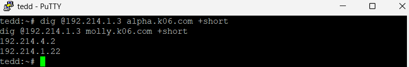

Hasil tes identik.

### 7 - A Record vault/core dan CNAME www/static

`abbey` dan `penny` sebagai gerbang utama, `obladi` dan `desmond` sebagai web statis, `oblada` dan `molly` sebagai web dinamis. Tambahkan pada zona <xxxx>.com A record untuk vault.<xxxx>.com (IP `obladi` & `desmond`), dan core.<xxxx>.com (IP `oblada` & `molly`). Tetapkan CNAME:

- www.<xxxx>.com → penny.<xxxx>.com
- static.<xxxx>.com → abbey.<xxxx>.com
  
Verifikasi dari dua klien berbeda bahwa seluruh hostname tersebut ter-resolve ke tujuan yang benar dan konsisten.

Pada soal ini ditambahkan record DNS untuk mengelompokkan layanan sesuai perannya: `abbey` dan `penny` sebagai gerbang utama, `obladi` dan `desmond` sebagai web statis (area vault), serta `oblada` dan `molly` sebagai web dinamis (area core). Ditambahkan A record untuk `vault.k06.com` (mengarah ke IP `obladi` dan `desmond`) dan `core.k06.com` (mengarah ke IP `oblada` dan `molly`), serta dua CNAME: `www.k06.com` menuju `penny.k06.com` dan `static.k06.com` menuju `abbey.k06.com`.

Tujuannya agar layanan dapat diakses lewat nama kanonik yang merepresentasikan fungsinya (vault untuk arsip statis, core untuk aplikasi dinamis, www dan static sebagai pintu masuk publik). Karena vault dan core masing-masing memiliki dua A record, DNS akan menjawab keduanya sehingga permintaan dapat tersebar antar node dalam satu area.

Seluruh perubahan dilakukan pada master (`prab`), lalu `tedd` menariknya otomatis lewat zone transfer.

#### 1 - Menambahkan A Record vault dan core (di prab)

Ditambahkan A record ke file zona `/etc/bind/zones/k06.com.db`. `vault.k06.com` diarahkan ke dua IP (`obladi` `192.214.1.11` dan `desmond` `192.214.1.12`), dan `core.k06.com` ke dua IP (`oblada` `192.214.1.21` dan `molly` `192.214.1.22`):

```bash
cat >> /etc/bind/zones/k06.com.db <<'EOF'

vault           IN      A       192.214.1.11
vault           IN      A       192.214.1.12
core            IN      A       192.214.1.21
core            IN      A       192.214.1.22
EOF
```

#### 2 - Menambahkan CNAME www dan static

Ditambahkan dua CNAME. `www` menunjuk ke `penny.k06.com` (gerbang aplikasi dinamis) dan `static` menunjuk ke `abbey.k06.com` (gerbang web statis):

```bash
cat >> /etc/bind/zones/k06.com.db <<'EOF'
www             IN      CNAME   penny.k06.com.
static          IN      CNAME   abbey.k06.com.
EOF
```

Catatan: target CNAME ditulis dengan tanda titik di akhir (FQDN) agar tidak ditambahi nama zona secara otomatis.

#### 3 - Menaikkan Serial SOA dan Menerapkan Perubahan

Serial SOA diset ke nilai baru agar `tedd` menarik ulang zona, lalu file zona divalidasi dan named di-reload. Serial memakai konvensi 2 digit terakhir sesuai nomor soal (soal 7 -> `2026100407`) agar setiap soal punya serial unik dan selalu naik tanpa bergantung pada nilai serial soal sebelumnya:

```bash
sed -i 's/[0-9]\{10\} ; Serial/2026100407 ; Serial/' /etc/bind/zones/k06.com.db
chown named:named /etc/bind/zones/k06.com.db
named-checkzone k06.com /etc/bind/zones/k06.com.db
rndc reload k06.com
```

#### 4 - Verifikasi dari Dua Klien Berbeda

Verifikasi dilakukan dari dua klien berbeda untuk memastikan seluruh nama ter-resolve ke tujuan yang benar dan konsisten.

```bash
dig vault.k06.com +short
dig core.k06.com +short
dig www.k06.com +short
dig static.k06.com +short
```

Hasil yang diharapkan:
- `vault.k06.com` -> `192.214.1.11` dan `192.214.1.12` (dua IP)
- `core.k06.com` -> `192.214.1.21` dan `192.214.1.22` (dua IP)
- `www.k06.com` -> `penny.k06.com` lalu `192.214.3.2` (CNAME diikuti A record `penny`)
- `static.k06.com` -> `abbey.k06.com` lalu `192.214.2.2` (CNAME diikuti A record `abbey`)


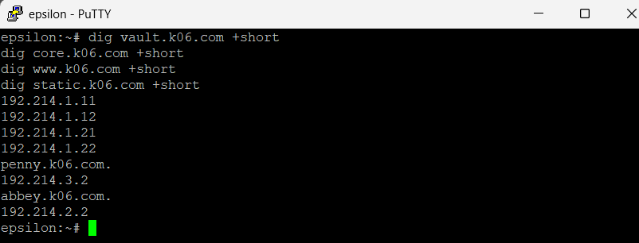

Hasil dari kedua klien  identik yang membuktikan resolusi konsisten di seluruh jaringan.

#### Persistensi

Sama seperti soal 5, penambahan record ini akan hilang saat `prab` restart karena file zona di-generate ulang oleh `/root/soal4.sh`. Oleh karena itu langkah 1 sampai 3 dibungkus dalam script `/root/soal7.sh` yang menunggu record soal 5 sudah terpasang, lalu menambahkan record vault/core dan CNAME, menetapkan serial, dan me-reload named.

```sh
#!/bin/sh
# /root/soal7.sh - prab

ZONE=/etc/bind/zones/k06.com.db

# Tunggu record soal5 (alpha) sudah terpasang agar urutan record konsisten.
i=0
while [ $i -lt 120 ]; do
    if [ -f "$ZONE" ] && grep -q '^alpha' "$ZONE" && pgrep -x named >/dev/null 2>&1; then
        break
    fi
    i=$((i+1))
    sleep 1
done

# Idempoten: kalau record vault sudah ada, tidak usah menambah lagi.
grep -q '^vault' "$ZONE" && exit 0

# Tambahkan A record vault/core dan CNAME www/static.
cat >> "$ZONE" <<'EOF'

vault           IN      A       192.214.1.11
vault           IN      A       192.214.1.12
core            IN      A       192.214.1.21
core            IN      A       192.214.1.22
www             IN      CNAME   penny.k06.com.
static          IN      CNAME   abbey.k06.com.
EOF

# Set serial absolut untuk soal 7 (selalu lebih besar dari soal sebelumnya).
sed -i 's/[0-9]\{10\} ; Serial/2026100407 ; Serial/' "$ZONE"

# Terapkan perubahan.
chown named:named "$ZONE"
rndc reload k06.com 2>/dev/null || { pkill named; named -c /etc/bind/named.conf -u named; }
```

Baris `post-up` pada `/etc/network/interfaces` `prab` ditambahkan setelah pemanggilan `soal5.sh`:

```
    post-up nohup sh /root/soal4.sh >/tmp/soal4.log 2>&1 &
    post-up nohup sh /root/soal5.sh >/tmp/soal5.log 2>&1 &
    post-up nohup sh /root/soal7.sh >/tmp/soal7.log 2>&1 &
```

### 8 - Reverse Zone dan PTR Record

Di `prab` (ns1) deklarasikan reverse zone untuk segmen jaringan  tempat `abbey`, `penny`, area vault, dan area core berada. Di `tedd` (ns2) tarik reverse zone tersebut sebagai slave, isi PTR untuk keempat hostname itu agar pencarian balik IP address mengembalikan hostname yang benar, lalu pastikan query reverse untuk alamat `abbey`, `penny`, area vault, dan area core dijawab authoritative.

Pada soal ini dibuat reverse zone (pencarian balik: dari IP address ke hostname) untuk segmen jaringan tempat `abbey`, `penny`, area vault (`obladi`, `desmond`), dan area core (`oblada`, `molly`) berada. `prab` (ns1) menjadi master reverse zone, dan `tedd` (ns2) menariknya sebagai slave. Diisi PTR record untuk keempat kelompok host tersebut agar query reverse mengembalikan hostname yang benar, dan dijawab secara authoritative oleh kedua name server.

Tujuannya agar tidak hanya pencarian maju (hostname -> IP) yang berfungsi, tetapi juga pencarian balik (IP -> hostname), yang penting untuk logging, verifikasi identitas server, dan validasi lalu lintas.

#### Pembagian Reverse Zone

Keempat kelompok host berada di tiga segmen /24 yang berbeda, sehingga diperlukan tiga reverse zone (satu per segmen /24), karena reverse DNS di BIND dideklarasikan per /24:

| Host | IP | Segmen /24 | Reverse zone |
|---|---|---|---|
| `obladi`, `desmond` (vault) | `192.214.1.11`, .12 | `192.214.1.0` | 1.214.192.in-addr.arpa |
| `oblada`, `molly` (core) | `192.214.1.21`, .22 | `192.214.1.0` | 1.214.192.in-addr.arpa |
| `abbey` | `192.214.2.2` | `192.214.2.0` | 2.214.192.in-addr.arpa |
| `penny` | `192.214.3.2` | `192.214.3.0` | 3.214.192.in-addr.arpa |

Catatan: `prab` dan `tedd` sendiri (`192.214.1.2` dan .3) juga berada di segmen `192.214.1.0`, sehingga bisa sekalian diberi PTR pada reverse zone segmen 1; namun sesuai fokus soal, PTR wajib diisi untuk `abbey`, `penny`, vault, dan core.

#### 1 - Deklarasi Reverse Zone di prab (Master)

Ditambahkan tiga blok zone reverse ke `/etc/bind/named.conf` `prab`, masing-masing bertipe master dengan notify dan allow-transfer ke `tedd` (`192.214.1.3`):

```bash
cat >> /etc/bind/named.conf <<'EOF'

zone "1.214.192.in-addr.arpa" {
    type master;
    file "/etc/bind/zones/db.192.214.1";
    notify yes;
    allow-transfer { 192.214.1.3; };
};

zone "2.214.192.in-addr.arpa" {
    type master;
    file "/etc/bind/zones/db.192.214.2";
    notify yes;
    allow-transfer { 192.214.1.3; };
};

zone "3.214.192.in-addr.arpa" {
    type master;
    file "/etc/bind/zones/db.192.214.3";
    notify yes;
    allow-transfer { 192.214.1.3; };
};
EOF
```

#### 2 - Membuat File Reverse Zone / PTR (di prab)

File PTR hanya dibuat di master, `tedd` tidak menulis PTR manual melainkan menarik salinannya otomatis dari prab. Reverse zone segmen 1 (vault dan core) berisi PTR untuk `obladi`, `desmond`, `oblada`, molly. Angka paling depan pada nama PTR adalah oktet terakhir IP (misalnya 11 untuk `192.214.1.11`):

```bash
cat > /etc/bind/zones/db.192.214.1 <<'EOF'
$TTL    604800
@       IN      SOA     prab.k06.com. root.k06.com. (
                        2026100408 ; Serial
                        604800     ; Refresh
                        86400      ; Retry
                        2419200    ; Expire
                        604800 )   ; Negative Cache TTL

@       IN      NS      prab.k06.com.
@       IN      NS      tedd.k06.com.

11      IN      PTR     obladi.k06.com.
12      IN      PTR     desmond.k06.com.
21      IN      PTR     oblada.k06.com.
22      IN      PTR     molly.k06.com.
EOF
```

Reverse zone segmen 2 (`abbey`):

```bash
cat > /etc/bind/zones/db.192.214.2 <<'EOF'
$TTL    604800
@       IN      SOA     prab.k06.com. root.k06.com. (
                        2026100408 ; Serial
                        604800     ; Refresh
                        86400      ; Retry
                        2419200    ; Expire
                        604800 )   ; Negative Cache TTL

@       IN      NS      prab.k06.com.
@       IN      NS      tedd.k06.com.

2       IN      PTR     abbey.k06.com.
EOF
```

Reverse zone segmen 3 (`penny`):

```bash
cat > /etc/bind/zones/db.192.214.3 <<'EOF'
$TTL    604800
@       IN      SOA     prab.k06.com. root.k06.com. (
                        2026100408 ; Serial
                        604800     ; Refresh
                        86400      ; Retry
                        2419200    ; Expire
                        604800 )   ; Negative Cache TTL

@       IN      NS      prab.k06.com.
@       IN      NS      tedd.k06.com.

2       IN      PTR     penny.k06.com.
EOF
```

#### 3 - Validasi dan Menerapkan Perubahan

Setiap file reverse zone divalidasi, lalu named di-reload:

```bash
chown -R named:named /etc/bind/zones
named-checkconf /etc/bind/named.conf
named-checkzone 1.214.192.in-addr.arpa /etc/bind/zones/db.192.214.1
named-checkzone 2.214.192.in-addr.arpa /etc/bind/zones/db.192.214.2
named-checkzone 3.214.192.in-addr.arpa /etc/bind/zones/db.192.214.3
rndc reload
```

Hasil yang diharapkan: `named-checkconf` bersih (tanpa output error) dan ketiga `named-checkzone` menampilkan `loaded serial 2026100408` dan `OK`.

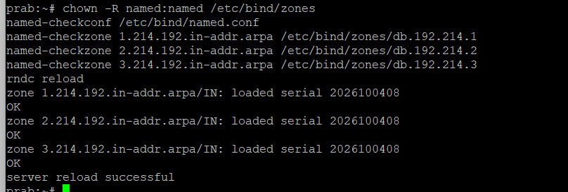

#### 4 - Konfigurasi Slave di tedd

Di `tedd` ditambahkan tiga blok zone reverse bertipe slave yang menarik dari `prab` (`192.214.1.2`), dengan file disimpan di direktori slave:

```bash
cat >> /etc/bind/named.conf <<'EOF'

zone "1.214.192.in-addr.arpa" {
    type slave;
    masters { 192.214.1.2; };
    file "/var/bind/slave/db.192.214.1";
};

zone "2.214.192.in-addr.arpa" {
    type slave;
    masters { 192.214.1.2; };
    file "/var/bind/slave/db.192.214.2";
};

zone "3.214.192.in-addr.arpa" {
    type slave;
    masters { 192.214.1.2; };
    file "/var/bind/slave/db.192.214.3";
};
EOF

named-checkconf /etc/bind/named.conf
rndc reload
```

#### 5 - Verifikasi

Query reverse (pencarian balik IP ke hostname) dilakukan dari salah satu klien menggunakan `host -t ptr` untuk memastikan keempat kelompok host mengembalikan hostname yang benar.

```bash
host -t ptr 192.214.2.2
host -t ptr 192.214.3.2
host -t ptr 192.214.1.11
host -t ptr 192.214.1.12
host -t ptr 192.214.1.21
host -t ptr 192.214.1.22
```

Hasil yang diharapkan:
- `192.214.2.2` -> `abbey.k06.com`.
- `192.214.3.2` -> `penny.k06.com`.
- `192.214.1.11` -> `obladi.k06.com`.
- `192.214.1.12` -> `desmond.k06.com`.
- `192.214.1.21` -> `oblada.k06.com`.
- `192.214.1.22` -> `molly.k06.com`.

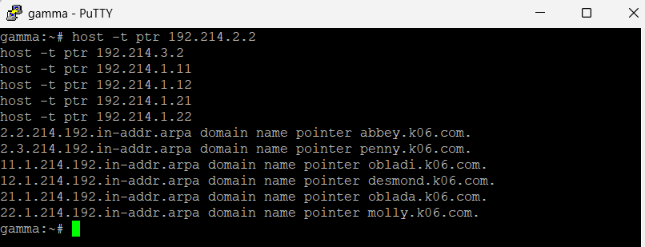

Untuk membuktikan bahwa kedua name server menjawab secara authoritative (bukan hanya `prab`), query reverse yang sama dapat diarahkan langsung ke `prab` (ns1) dan `tedd` (ns2) dengan `dig -x`, dan hasilnya harus identik:

```bash
# prab 
dig -x 192.214.2.2 @192.214.1.2 +short
dig -x 192.214.1.11 @192.214.1.2 +short

# tedd 
dig -x 192.214.2.2 @192.214.1.3 +short
dig -x 192.214.1.11 @192.214.1.3 +short
```


#### Persistensi

Karena `/etc/bind/named.conf` dan file zona di-generate ulang oleh `/root/soal4.sh` setiap kali node boot, blok reverse zone di atas akan hilang saat restart. Oleh karena itu langkah reverse zone dibungkus dalam script terpisah yakni `/root/soal8.sh` di `prab` dan `/root/soal8.sh` di tedd.

Script `prab` menunggu named siap, lalu menambahkan tiga blok zone reverse ke named.conf, menulis ketiga file PTR, dan me-reload named:

```sh
#!/bin/sh
# /root/soal8.sh

CONF=/etc/bind/named.conf

# Tunggu named siap (soal4 sudah jalan).
i=0
while [ $i -lt 120 ]; do
    pgrep -x named >/dev/null 2>&1 && [ -f "$CONF" ] && break
    i=$((i+1))
    sleep 1
done

# Idempoten: kalau reverse zone sudah ada di named.conf, berhenti.
grep -q 'in-addr.arpa' "$CONF" && exit 0

# Tambahkan deklarasi tiga reverse zone (master).
cat >> "$CONF" <<'EOF'

zone "1.214.192.in-addr.arpa" {
    type master;
    file "/etc/bind/zones/db.192.214.1";
    notify yes;
    allow-transfer { 192.214.1.3; };
};

zone "2.214.192.in-addr.arpa" {
    type master;
    file "/etc/bind/zones/db.192.214.2";
    notify yes;
    allow-transfer { 192.214.1.3; };
};

zone "3.214.192.in-addr.arpa" {
    type master;
    file "/etc/bind/zones/db.192.214.3";
    notify yes;
    allow-transfer { 192.214.1.3; };
};
EOF

# File PTR segmen 1 (vault + core).
cat > /etc/bind/zones/db.192.214.1 <<'EOF'
$TTL    604800
@       IN      SOA     prab.k06.com. root.k06.com. (
                        2026100408 ; Serial
                        604800     ; Refresh
                        86400      ; Retry
                        2419200    ; Expire
                        604800 )   ; Negative Cache TTL

@       IN      NS      prab.k06.com.
@       IN      NS      tedd.k06.com.

11      IN      PTR     obladi.k06.com.
12      IN      PTR     desmond.k06.com.
21      IN      PTR     oblada.k06.com.
22      IN      PTR     molly.k06.com.
EOF

# File PTR segmen 2 (abbey).
cat > /etc/bind/zones/db.192.214.2 <<'EOF'
$TTL    604800
@       IN      SOA     prab.k06.com. root.k06.com. (
                        2026100408 ; Serial
                        604800     ; Refresh
                        86400      ; Retry
                        2419200    ; Expire
                        604800 )   ; Negative Cache TTL

@       IN      NS      prab.k06.com.
@       IN      NS      tedd.k06.com.

2       IN      PTR     abbey.k06.com.
EOF

# File PTR segmen 3 (penny).
cat > /etc/bind/zones/db.192.214.3 <<'EOF'
$TTL    604800
@       IN      SOA     prab.k06.com. root.k06.com. (
                        2026100408 ; Serial
                        604800     ; Refresh
                        86400      ; Retry
                        2419200    ; Expire
                        604800 )   ; Negative Cache TTL

@       IN      NS      prab.k06.com.
@       IN      NS      tedd.k06.com.

2       IN      PTR     penny.k06.com.
EOF

chown -R named:named /etc/bind/zones
rndc reload 2>/dev/null || { pkill named; named -c /etc/bind/named.conf -u named; }
```

Script `tedd` menambahkan tiga blok reverse zone slave, lalu me-reload named:

```sh
#!/bin/sh
# /root/soal8.sh

CONF=/etc/bind/named.conf

i=0
while [ $i -lt 120 ]; do
    pgrep -x named >/dev/null 2>&1 && [ -f "$CONF" ] && break
    i=$((i+1))
    sleep 1
done

grep -q 'in-addr.arpa' "$CONF" && exit 0

cat >> "$CONF" <<'EOF'

zone "1.214.192.in-addr.arpa" {
    type slave;
    masters { 192.214.1.2; };
    file "/var/bind/slave/db.192.214.1";
};

zone "2.214.192.in-addr.arpa" {
    type slave;
    masters { 192.214.1.2; };
    file "/var/bind/slave/db.192.214.2";
};

zone "3.214.192.in-addr.arpa" {
    type slave;
    masters { 192.214.1.2; };
    file "/var/bind/slave/db.192.214.3";
};
EOF

rndc reload 2>/dev/null || { pkill named; named -c /etc/bind/named.conf -u named; }
```

Penjelasan bagian penting:
- Guard `grep -q 'in-addr.arpa'` membuat kedua script idempoten (blok reverse zone hanya ditambahkan bila belum ada).
- Loop `while` memastikan reverse zone ditambahkan setelah named dari soal4 berjalan.
- Reverse zone slave di `tedd` tidak berisi PTR manual; file di `/var/bind/slave/` diisi otomatis oleh BIND saat menarik dari prab.

Baris `post-up` ditambahkan pada `/etc/network/interfaces` masing-masing node setelah pemanggilan script soal sebelumnya:

```
# prab
    post-up nohup sh /root/soal8.sh >/tmp/soal8.log 2>&1 &

# tedd
    post-up nohup sh /root/soal8.sh >/tmp/soal8.log 2>&1 &
```

### 9 - Web Statis dengan Autoindex (Area Vault)

Jalankan layanan web statis pada hostname di node area vault (menggunakan apache). Buka folder direktori /arsip/ dan aktifkan fitur autoindex (directory listing) pada konfigurasi Apache sehingga seluruh daftar file di dalamnya dapat ditelusuri langsung dari browser. Akses pengujian harus dilakukan melalui hostname, bukan IP address.

Pada soal ini dijalankan layanan web statis pada node area vault, yaitu `obladi` dan `desmond`, menggunakan Apache. Server menyajikan isi direktori `/arsip/` dengan fitur autoindex (directory listing) aktif, sehingga seluruh daftar file di dalamnya dapat ditelusuri langsung dari browser. Akses pengujian dilakukan melalui hostname (`obladi.k06.com` dan `desmond.k06.com`), bukan melalui alamat IP.

Tujuannya agar area vault berfungsi sebagai repositori arsip statis yang dapat dijelajahi isinya tanpa perlu halaman indeks manual, cukup mengandalkan directory listing bawaan Apache.

Konfigurasi berikut dijalankan pada kedua node vault (`obladi` dan `desmond`) dengan langkah yang sama. Perbedaan utama terdapat pada `ServerName` yang disesuaikan dengan hostname masing-masing node.

#### 1 - Instal Apache

Pada Alpine, web server Apache disediakan oleh paket `apache2`, sedangkan binary yang digunakan untuk menjalankan Apache bernama `httpd`.

```bash
# dijalankan di obladi dan desmond
apk update
apk add apache2
```

Setelah instalasi, keberadaan Apache dapat diperiksa menggunakan:

```bash
# dijalankan di obladi dan desmond
apk info -e apache2
httpd -v
```

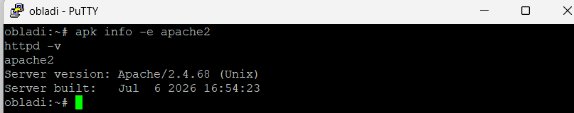

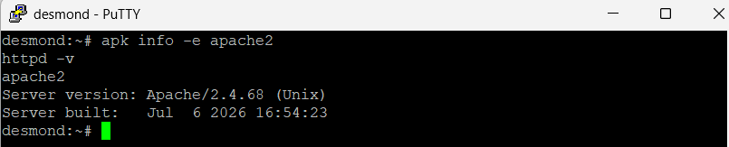

#### 2 - Membuat Direktori Arsip dan Isi Contoh

Dijalankan di node `obladi` dan `desmond`. Dibuat direktori `/arsip/` sebagai folder yang akan ditampilkan oleh Apache, lalu diisi beberapa file contoh agar directory listing memiliki isi untuk ditelusuri.

```bash
# dijalankan di obladi dan desmond
mkdir -p /arsip

echo "Arsip rahasia The Mesh - node vault" > /arsip/readme.txt
echo "data operasi 001" > /arsip/operasi-001.txt
echo "data operasi 002" > /arsip/operasi-002.txt
```

Isi direktori kemudian dapat diperiksa menggunakan:

```bash
# dijalankan di obladi dan desmond
ls -la /arsip
```


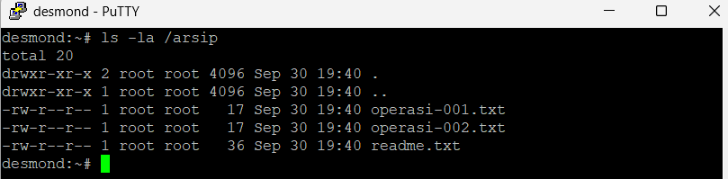

#### 3 - Konfigurasi Virtual Host

Dibuat file konfigurasi virtual host yang mengarahkan `DocumentRoot` ke `/arsip` dan mengaktifkan `Options +Indexes` untuk mengizinkan directory listing. `ServerName` diisi hostname masing-masing node agar akses berbasis nama dapat dikenali.

Pada `obladi`, konfigurasi dibuat sebagai berikut:

```bash
# dijalankan di obladi
cat > /etc/apache2/conf.d/vault.conf <<'EOF'
<VirtualHost *:80>
    ServerName obladi.k06.com
    DocumentRoot /arsip

    <Directory /arsip>
        Options +Indexes
        AllowOverride None
        Require all granted
    </Directory>

    ErrorLog /var/log/apache2/error.log
    CustomLog /var/log/apache2/access.log combined
</VirtualHost>
EOF
```

Sedangkan pada `desmond`, konfigurasi yang digunakan sama, tetapi `ServerName` disesuaikan menjadi `desmond.k06.com`:

```bash
# dijalankan di desmond
cat > /etc/apache2/conf.d/vault.conf <<'EOF'
<VirtualHost *:80>
    ServerName desmond.k06.com
    DocumentRoot /arsip

    <Directory /arsip>
        Options +Indexes
        AllowOverride None
        Require all granted
    </Directory>

    ErrorLog /var/log/apache2/error.log
    CustomLog /var/log/apache2/access.log combined
</VirtualHost>
EOF
```

Konfigurasi yang telah dibuat dapat diperiksa menggunakan:

```bash
# dijalankan di obladi dan desmond
cat /etc/apache2/conf.d/vault.conf
```


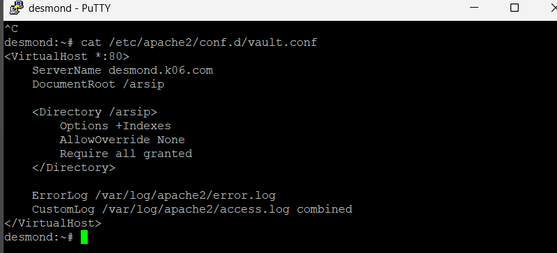

#### 4 - Menjalankan Apache

Karena image Alpine yang digunakan tidak menyertakan OpenRC, Apache dijalankan langsung menggunakan binary `httpd`.

Sebelum dijalankan, konfigurasi divalidasi terlebih dahulu:

```bash
# dijalankan di obladi dan desmond
httpd -t
```

Jika konfigurasi benar, Apache akan mengembalikan:

```text
Syntax OK
```

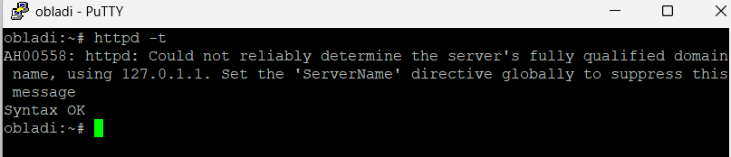


Setelah konfigurasi berhasil divalidasi, Apache dijalankan:

```bash
# dijalankan di obladi dan desmond
httpd
```

Untuk memastikan Apache telah berjalan dan mendengarkan pada port 80, dilakukan pemeriksaan proses dan port:

```bash
# dijalankan di obladi dan desmond
ps aux | grep [h]ttpd
netstat -tulnp | grep :80
```


#### 5 - Verifikasi

Verifikasi dilakukan dari salah satu klien, misalnya `alpha`, menggunakan `curl` ke hostname dan bukan alamat IP. Pengujian dilakukan pada kedua node vault:

```bash
# dijalankan di client
curl http://obladi.k06.com
curl http://desmond.k06.com
```

Hasil yang diharapkan adalah `curl` mengembalikan halaman HTML autoindex bawaan Apache dengan judul `Index of /` yang memuat daftar file `readme.txt`, `operasi-001.txt`, dan `operasi-002.txt`.

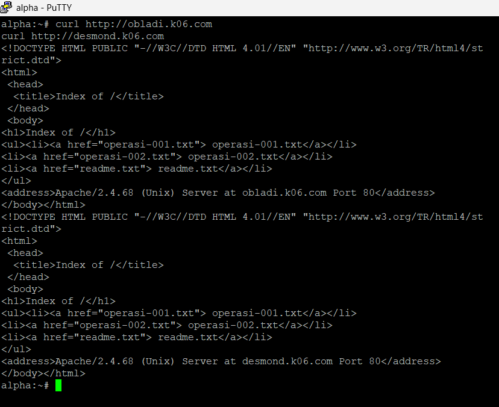

Hasil tersebut menunjukkan bahwa layanan web statis telah berjalan, directory listing aktif, dan masing-masing node dapat diakses melalui hostname yang telah ditentukan.

#### Persistensi

Karena image AlpiNet tidak menggunakan OpenRC, mekanisme startup yang digunakan adalah `/root/init.sh`. File `/root/init.sh` dipanggil oleh `/etc/alpinet-init.sh` ketika node dimulai.

Pada masing-masing node vault dibuat script `/root/soal9.sh`. Script ini menunggu koneksi jaringan siap, memastikan Apache terpasang, menyiapkan direktori arsip dan konfigurasi virtual host, kemudian menjalankan Apache.

Pada `obladi`, isi `/root/soal9.sh` adalah:

```sh
#!/bin/sh
# /root/soal9.sh - obladi (web statis vault)

# Tunggu koneksi internet untuk apk
i=0
while [ $i -lt 30 ]; do
    ping -c1 -W1 192.168.122.1 >/dev/null 2>&1 && break
    i=$((i + 1))
    sleep 1
done

# Install Apache jika belum terpasang
if ! apk info -e apache2 >/dev/null 2>&1; then
    apk update
    apk add apache2
fi

# Pastikan direktori tersedia
mkdir -p /etc/apache2/conf.d
mkdir -p /var/log/apache2
mkdir -p /arsip

# Buat file arsip jika belum ada
if [ ! -f /arsip/readme.txt ]; then
    echo "Arsip rahasia The Mesh - node vault" > /arsip/readme.txt
    echo "data operasi 001" > /arsip/operasi-001.txt
    echo "data operasi 002" > /arsip/operasi-002.txt
fi

# Konfigurasi Virtual Host
cat > /etc/apache2/conf.d/vault.conf <<'APACHE'
<VirtualHost *:80>
    ServerName obladi.k06.com
    DocumentRoot /arsip

    <Directory /arsip>
        Options +Indexes
        AllowOverride None
        Require all granted
    </Directory>

    ErrorLog /var/log/apache2/error.log
    CustomLog /var/log/apache2/access.log combined
</VirtualHost>
APACHE

# Jika Apache masih berjalan, hentikan terlebih dahulu
pkill -x httpd 2>/dev/null

# Tunggu sampai port 80 kosong
j=0
while [ $j -lt 10 ]; do
    netstat -tulnp 2>/dev/null | grep -q ':80 ' || break
    pkill -x httpd 2>/dev/null
    j=$((j + 1))
    sleep 1
done

# Validasi konfigurasi Apache
httpd -t || exit 1

# Jalankan Apache
httpd
```

Pada `desmond`, isi `/root/soal9.sh` sama dengan `obladi`, tetapi `ServerName` pada konfigurasi Apache diganti menjadi `desmond.k06.com`.

Script startup `/root/init.sh` pada masing-masing node adalah:

```sh
#!/bin/sh

nohup /root/soal9.sh >/tmp/soal9.log 2>&1 &
```

Kemudian kedua file dibuat executable:

```bash
# dijalankan di obladi dan desmond
chmod +x /root/init.sh
chmod +x /root/soal9.sh
```

Untuk memastikan mekanisme persistensi berjalan setelah node di-restart, node dapat di-restart terlebih dahulu kemudian dilakukan pemeriksaan:

```bash
# dijalankan di obladi dan desmond setelah restart
ps aux | grep [h]ttpd
netstat -tulnp | grep :80
```

Kemudian akses hostname diuji kembali dari klien:

```bash
# dijalankan di klien setelah restart node
curl http://obladi.k06.com
curl http://desmond.k06.com
```

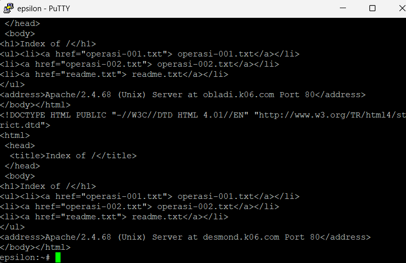

Dengan konfigurasi tersebut, `/root/init.sh` akan menjalankan `/root/soal9.sh` ketika node dimulai. Script kemudian memastikan Apache, direktori `/arsip/`, file arsip, dan konfigurasi virtual host tersedia sebelum menjalankan web server.

### 10 - Web Dinamis PHP-FPM + Nginx (Area Core)

Jalankan layanan web dinamis (PHP-FPM) pada hostname di node core (menggunakan nginx). Buat sebuah aplikasi sederhana yang memuat halaman beranda dan halaman profil. Terapkan aturan rewrite pada server sehingga akses ke /profil dapat berfungsi dengan URL bersih (tanpa akhiran .php). Akses pengujian wajib dilakukan melalui hostname.

Pada soal ini dijalankan layanan web dinamis pada node area core, yaitu `oblada` dan `molly`, menggunakan Nginx sebagai web server dan PHP-FPM sebagai pemroses PHP. Dibuat aplikasi sederhana dengan dua halaman: beranda dan profil. Diterapkan aturan rewrite pada Nginx sehingga akses ke `/profil` berfungsi dengan URL bersih (tanpa akhiran `.php`). Akses pengujian dilakukan melalui hostname (`oblada.k06.com` dan `molly.k06.com`), bukan IP.

Tujuannya agar area core berfungsi sebagai layanan aplikasi dinamis yang mampu mengeksekusi PHP dan menyajikan URL yang rapi tanpa ekstensi file.

Konfigurasi berikut dijalankan pada kedua node core (`oblada` dan `molly`) dengan langkah yang sama.

#### 1 - Instal Nginx dan PHP-FPM
Pada Alpine, digunakan Nginx dan PHP-FPM versi 8.4

```bash
apk update
apk add nginx php84 php84-fpm
```

#### 2 - Membuat Aplikasi (Beranda dan Profil)

Dibuat direktori aplikasi `/var/www/core` berisi dua file PHP: `index.php` (beranda) dan `profil.php` (profil). 

```bash
mkdir -p /var/www/core

cat > /var/www/core/index.php <<'EOF'
<?php
echo "<h1>Beranda - The Mesh Core</h1>\n";
echo "<p>Selamat datang di layanan web dinamis area core.</p>\n";
echo "<p>Dilayani oleh: " . gethostname() . "</p>\n";
EOF

cat > /var/www/core/profil.php <<'EOF'
<?php
echo "<h1>Profil - The Mesh Core</h1>\n";
echo "<p>Halaman profil aplikasi dinamis.</p>\n";
echo "<p>Dilayani oleh: " . gethostname() . "</p>\n";
EOF
```

#### 3 - Konfigurasi Nginx (dengan Rewrite Clean URL)

Dibuat server block Nginx yang mengarahkan root ke `/var/www/core`, meneruskan file `.php` ke PHP-FPM, dan menerapkan aturan agar `/profil` (tanpa `.php`) tetap dijalankan sebagai `profil.php`. Server block bawaan Nginx (`default.conf`) dihapus lebih dulu agar tidak bentrok di port 80. 

- `oblada`
```bash
rm -f /etc/nginx/http.d/default.conf
cat > /etc/nginx/http.d/core.conf <<'EOF'
server {
    listen 80;
    server_name oblada.k06.com;
    root /var/www/core;
    index index.php;

    location / {
        try_files $uri $uri/ @php;
    }

    location @php {
        fastcgi_pass 127.0.0.1:9000;
        include fastcgi.conf;
        fastcgi_param SCRIPT_FILENAME $document_root$uri.php;
    }

    location ~ \.php$ {
        fastcgi_pass 127.0.0.1:9000;
        include fastcgi.conf;
    }
}
EOF
```

-molly

```bash
rm -f /etc/nginx/http.d/default.conf
cat > /etc/nginx/http.d/core.conf <<'EOF'
server {
    listen 80;
    server_name molly.k06.com;
    root /var/www/core;
    index index.php;

    location / {
        try_files $uri $uri/ @php;
    }

    location @php {
        fastcgi_pass 127.0.0.1:9000;
        include fastcgi.conf;
        fastcgi_param SCRIPT_FILENAME $document_root$uri.php;
    }

    location ~ \.php$ {
        fastcgi_pass 127.0.0.1:9000;
        include fastcgi.conf;
    }
}
EOF
```

`location /` dengan `try_files $uri $uri/ @php;` mencoba mencari file/direktori persis dulu; bila tidak ada, request dilempar ke named location `@php`. `location @php` mengeksekusi PHP dengan `SCRIPT_FILENAME $document_root$uri.php`. Saat klien mengakses `/profil`, file `profil` tidak ada, sehingga diteruskan ke `@php` yang menjalankan `profil.php`. Inilah yang membuat `/profil` berfungsi tanpa `.php`. `location ~ \.php$` menangani akses langsung ke file `.php` (misalnya `index.php`).

#### 4 - Menjalankan PHP-FPM dan Nginx

Selanjutnya, konfigurasi Nginx divalidasi, lalu PHP-FPM dan Nginx dijalankan langsung lewat binary-nya (image Alpine tidak menyertakan OpenRC):

```bash
nginx -t
php-fpm84
nginx
```

`nginx -t` harus menampilkan `syntax is ok` dan `test is successful`. Verifikasi kedua proses berjalan:

```bash
pgrep -x nginx
pgrep -x php-fpm84
```

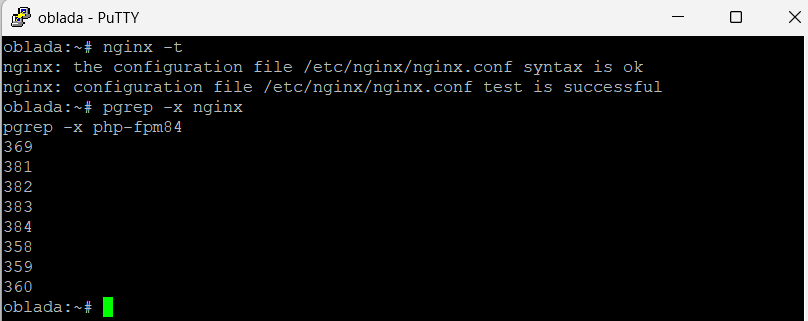

#### 5 - Verifikasi

Verifikasi dilakukan dengan membuat salah satu client mengakses beranda dan profil melalui hostname, dengan `/profil` tanpa `.php`:

```bash
curl http://oblada.k06.com/
curl http://oblada.k06.com/profil
curl http://molly.k06.com/
curl http://molly.k06.com/profil
```

Hasil yang diharapkan:
- `oblada.k06.com/` menampilkan beranda ("Beranda - The Mesh Core", "Dilayani oleh: `oblada`")
- `oblada.k06.com/profil` menampilkan profil ("Profil - The Mesh Core") meskipun tanpa akhiran `.php`
- `molly.k06.com/` dan `/profil` menampilkan hal serupa dengan "Dilayani oleh: `molly`"
- Baris "Dilayani oleh:" menampilkan hostname node, membuktikan PHP dieksekusi

!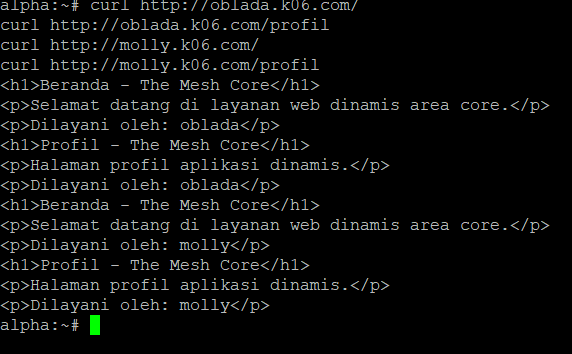

#### Persistensi

Karena paket dan konfigurasi hilang saat node core di-restart, seluruh langkah dibungkus dalam script `/root/soal10.sh` pada masing-masing node core. 

 - `oblada`:

```sh
#!/bin/sh
# /root/soal10.sh

# Berhenti kalau nginx sudah jalan.
pgrep -x nginx >/dev/null 2>&1 && exit 0

# Tunggu koneksi internet siap (untuk apk).
i=0
while [ $i -lt 30 ]; do
    ping -c1 -W1 192.168.122.1 >/dev/null 2>&1 && break
    i=$((i+1))
    sleep 1
done

# 1. Install nginx + php-fpm
apk update
apk add nginx php84 php84-fpm

# 2. Aplikasi beranda + profil
mkdir -p /var/www/core
cat > /var/www/core/index.php <<'EOF'
<?php
echo "<h1>Beranda - The Mesh Core</h1>\n";
echo "<p>Selamat datang di layanan web dinamis area core.</p>\n";
echo "<p>Dilayani oleh: " . gethostname() . "</p>\n";
EOF
cat > /var/www/core/profil.php <<'EOF'
<?php
echo "<h1>Profil - The Mesh Core</h1>\n";
echo "<p>Halaman profil aplikasi dinamis.</p>\n";
echo "<p>Dilayani oleh: " . gethostname() . "</p>\n";
EOF

# 3. Konfigurasi nginx (clean URL /profil via named location @php)
rm -f /etc/nginx/http.d/default.conf
cat > /etc/nginx/http.d/core.conf <<'EOF'
server {
    listen 80;
    server_name oblada.k06.com;
    root /var/www/core;
    index index.php;

    location / {
        try_files $uri $uri/ @php;
    }

    location @php {
        fastcgi_pass 127.0.0.1:9000;
        include fastcgi.conf;
        fastcgi_param SCRIPT_FILENAME $document_root$uri.php;
    }

    location ~ \.php$ {
        fastcgi_pass 127.0.0.1:9000;
        include fastcgi.conf;
    }
}
EOF

# 4. Start php-fpm + nginx
php-fpm84
nginx
```

 - `molly`:

```sh
#!/bin/sh
# /root/soal10.sh

# Berhenti kalau nginx sudah jalan.
pgrep -x nginx >/dev/null 2>&1 && exit 0

# Tunggu koneksi internet siap (untuk apk).
i=0
while [ $i -lt 30 ]; do
    ping -c1 -W1 192.168.122.1 >/dev/null 2>&1 && break
    i=$((i+1))
    sleep 1
done

# 1. Install nginx + php-fpm
apk update
apk add nginx php84 php84-fpm

# 2. Aplikasi beranda + profil
mkdir -p /var/www/core
cat > /var/www/core/index.php <<'EOF'
<?php
echo "<h1>Beranda - The Mesh Core</h1>\n";
echo "<p>Selamat datang di layanan web dinamis area core.</p>\n";
echo "<p>Dilayani oleh: " . gethostname() . "</p>\n";
EOF
cat > /var/www/core/profil.php <<'EOF'
<?php
echo "<h1>Profil - The Mesh Core</h1>\n";
echo "<p>Halaman profil aplikasi dinamis.</p>\n";
echo "<p>Dilayani oleh: " . gethostname() . "</p>\n";
EOF

# 3. Konfigurasi nginx (clean URL /profil via named location @php)
rm -f /etc/nginx/http.d/default.conf
cat > /etc/nginx/http.d/core.conf <<'EOF'
server {
    listen 80;
    server_name molly.k06.com;
    root /var/www/core;
    index index.php;

    location / {
        try_files $uri $uri/ @php;
    }

    location @php {
        fastcgi_pass 127.0.0.1:9000;
        include fastcgi.conf;
        fastcgi_param SCRIPT_FILENAME $document_root$uri.php;
    }

    location ~ \.php$ {
        fastcgi_pass 127.0.0.1:9000;
        include fastcgi.conf;
    }
}
EOF

# 4. Start php-fpm + nginx
php-fpm84
nginx
```


Baris `post-up` ditambahkan pada `/etc/network/interfaces` masing-masing node core:

```
    post-up nohup sh /root/soal10.sh >/tmp/soal10.log 2>&1 &
```

### Soal 11: Reverse Proxy (Penny → Vault, Abbey → Core)

Konfigurasikan Penny (menggunakan Apache) sebagai reverse proxy yang mengarah ke semua node di area vault (Obladi & Desmond). Sementara itu, konfigurasikan Abbey (menggunakan Nginx) sebagai reverse proxy menuju area core (Oblada & Molly). Pastikan kedua gerbang ini meneruskan identitas asli pengunjung ke server backend dengan melakukan forwarding header Host dan X-Real-IP. Buktikan bahwa Penny dan Abbey berhasil mendistribusikan lalu lintas dengan tepat.

Pada soal ini, kedua gerbang dikonfigurasi sebagai reverse proxy yang mendistribusikan lalu lintas ke dua node backend di areanya masing-masing:
- **Penny** (Apache) → area vault: `obladi` (`192.214.1.11`) dan `desmond` (`192.214.1.12`)
- **Abbey** (Nginx) → area core: `oblada` (`192.214.1.21`) dan `molly` (`192.214.1.22`)

Kedua gerbang meneruskan identitas asli pengunjung ke backend melalui forwarding header `Host` dan `X-Real-IP`. ServerName pada masing-masing gerbang disesuaikan dengan nama kanonik (`www.k06.com` untuk `penny` dan `static.k06.com` untuk `abbey`) agar selaras dengan konfigurasi redirect soal 13, di mana akses lewat `penny.k06.com` maupun IP akan diarahkan ke `www.k06.com`, dan akses lewat `abbey.k06.com` maupun IP akan diarahkan ke `static.k06.com`.


#### A. Penny sebagai Reverse Proxy ke Vault (Apache)

###v# 1. Install Apache

Paket `apache2-proxy` menyediakan modul `mod_proxy`, `mod_proxy_http`, dan `mod_proxy_balancer` yang dibutuhkan untuk reverse proxy dan load balancing.

```sh
# dijalankan di penny
apk update
apk add apache2 apache2-proxy
```

##### 2. Konfigurasi Reverse Proxy

Dibuat konfigurasi virtual host dengan `ServerName www.k06.com` agar `penny` merespons permintaan yang sudah menggunakan nama kanonik. `ProxyPreserveHost On` memastikan header `Host` asli pengunjung diteruskan ke backend, sementara `RequestHeader set X-Real-IP` menambahkan header berisi IP asli pengunjung. Blok `balancer://vault` berisi dua `BalancerMember` (`obladi` dan `desmond`) sehingga permintaan disebar ke keduanya secara bergantian.

```sh
# dijalankan di penny
cat > /etc/apache2/conf.d/proxy-vault.conf <<'EOF'
LoadModule proxy_module modules/mod_proxy.so
LoadModule proxy_http_module modules/mod_proxy_http.so
LoadModule proxy_balancer_module modules/mod_proxy_balancer.so
LoadModule lbmethod_byrequests_module modules/mod_lbmethod_byrequests.so
LoadModule headers_module modules/mod_headers.so

<VirtualHost *:80>
    ServerName www.k06.com

    ProxyPreserveHost On
    RequestHeader set X-Real-IP expr=%{REMOTE_ADDR}

    <Proxy "balancer://vault">
        BalancerMember "http://192.214.1.11"
        BalancerMember "http://192.214.1.12"
    </Proxy>

    ProxyPass        "/" "balancer://vault/"
    ProxyPassReverse "/" "balancer://vault/"
</VirtualHost>
EOF
```

##### 3. Jalankan Apache

```sh
# dijalankan di penny
httpd -t
httpd
```


#### B. Abbey sebagai Reverse Proxy ke Core (Nginx)

##### 1. Install Nginx

Nginx dipasang di `abbey` sebagai reverse proxy yang meneruskan request ke area core (`oblada` dan `molly`).

```sh
# dijalankan di abbey
apk update
apk add nginx
```

##### 2. Konfigurasi Reverse Proxy

File default Nginx dihapus terlebih dahulu untuk menghindari konflik server block. `server_name` disetel ke `static.k06.com` sebagai nama kanonik abbey. Blok `upstream core` berisi dua server (`oblada` dan `molly`), Nginx menyebar permintaan ke keduanya secara round-robin. `proxy_set_header Host` meneruskan header `Host` asli pengunjung, dan `proxy_set_header X-Real-IP` menambahkan header berisi IP asli pengunjung.

```sh
# dijalankan di abbey
rm -f /etc/nginx/http.d/default.conf

cat > /etc/nginx/http.d/proxy-core.conf <<'EOF'
upstream core {
    server 192.214.1.21;
    server 192.214.1.22;
}

server {
    listen 80;
    server_name static.k06.com;

    location / {
        proxy_pass http://core;
        proxy_set_header Host $host;
        proxy_set_header X-Real-IP $remote_addr;
        proxy_set_header X-Forwarded-For $proxy_add_x_forwarded_for;
    }
}
EOF
```

##### 3. Jalankan Nginx

```sh
# dijalankan di abbey
nginx -t
nginx
```


#### C. Verifikasi

Verifikasi dilakukan dari `alpha` menggunakan nama kanonik (`www.k06.com` dan `static.k06.com`) secara berulang untuk membuktikan distribusi lalu lintas ke dua backend masing-masing.

```sh
# dijalankan di alpha

# Penny → vault (obladi/desmond)
curl http://www.k06.com/
curl http://www.k06.com/

# Abbey → core (oblada/molly)
curl http://static.k06.com/
curl http://static.k06.com/
curl http://static.k06.com/
curl http://static.k06.com/
```

Hasil yang diharapkan:
- `www.k06.com` mengembalikan halaman autoindex dari node vault berisi daftar file arsip. Baris `Server at www.k06.com Port 80` muncul karena `ProxyPreserveHost On` meneruskan header `Host: www.k06.com` ke backend.
- `static.k06.com` mengembalikan halaman beranda core, dengan baris "Dilayani oleh:" menampilkan `oblada` dan `molly` secara bergantian pada permintaan berulang, membuktikan distribusi ke dua backend berhasil.

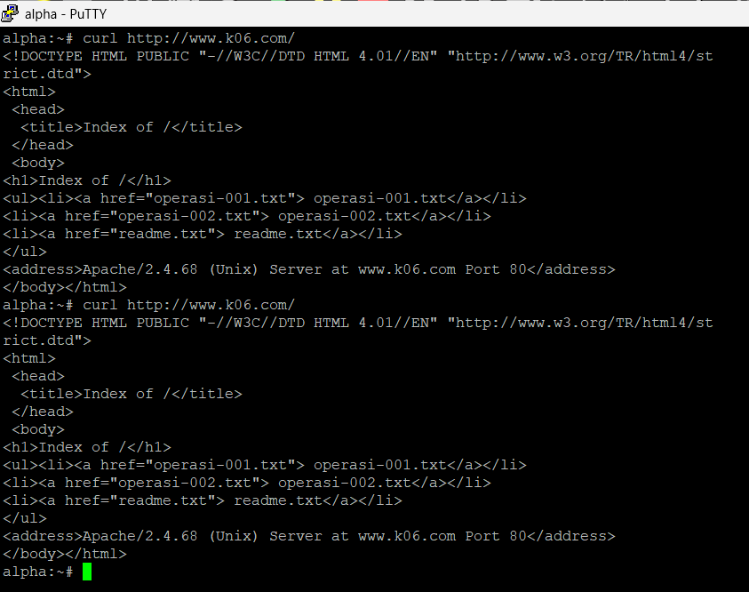

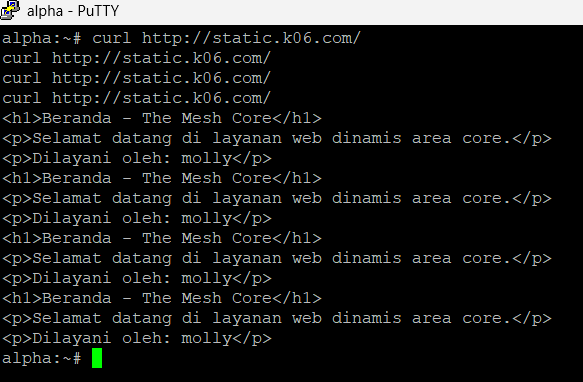

Untuk membuktikan forwarding `X-Real-IP` sampai ke backend, diperiksa access log di salah satu node backend. Log seharusnya mencatat IP asli klien (`alpha`: `192.214.4.2`), bukan IP gerbang (`abbey`: `192.214.2.2` atau `penny`: `192.214.3.2`).

```sh
# dijalankan di oblada
tail -f /var/log/nginx/access.log
```

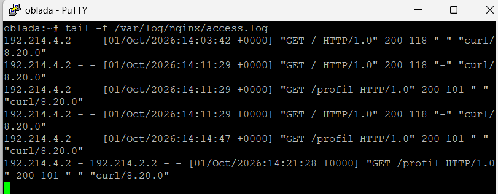


#### Persistensi

Seluruh langkah dibungkus dalam script `/root/soal11.sh` pada masing-masing node agar tetap aktif setelah restart. Script menunggu koneksi internet tersedia sebelum menjalankan `apk`, sehingga instalasi tidak gagal saat node baru saja menyala.

##### Script penny

```sh
#!/bin/sh
# /root/soal11.sh - penny (Apache reverse proxy -> vault)

pgrep -x httpd >/dev/null 2>&1 && exit 0

i=0
while [ $i -lt 30 ]; do
    ping -c1 -W1 192.168.122.1 >/dev/null 2>&1 && break
    i=$((i+1))
    sleep 1
done

apk update
apk add apache2 apache2-proxy

cat > /etc/apache2/conf.d/proxy-vault.conf <<'CONF'
LoadModule proxy_module modules/mod_proxy.so
LoadModule proxy_http_module modules/mod_proxy_http.so
LoadModule proxy_balancer_module modules/mod_proxy_balancer.so
LoadModule lbmethod_byrequests_module modules/mod_lbmethod_byrequests.so
LoadModule headers_module modules/mod_headers.so

<VirtualHost *:80>
    ServerName www.k06.com

    ProxyPreserveHost On
    RequestHeader set X-Real-IP expr=%{REMOTE_ADDR}

    <Proxy "balancer://vault">
        BalancerMember "http://192.214.1.11"
        BalancerMember "http://192.214.1.12"
    </Proxy>

    ProxyPass        "/" "balancer://vault/"
    ProxyPassReverse "/" "balancer://vault/"
</VirtualHost>
CONF

httpd
```

##### Script abbey

```sh
#!/bin/sh
# /root/soal11.sh - abbey (Nginx reverse proxy -> core)

pgrep -x nginx >/dev/null 2>&1 && exit 0

i=0
while [ $i -lt 30 ]; do
    ping -c1 -W1 192.168.122.1 >/dev/null 2>&1 && break
    i=$((i+1))
    sleep 1
done

apk update
apk add nginx

rm -f /etc/nginx/http.d/default.conf
cat > /etc/nginx/http.d/proxy-core.conf <<'CONF'
upstream core {
    server 192.214.1.21;
    server 192.214.1.22;
}

server {
    listen 80;
    server_name static.k06.com;

    location / {
        proxy_pass http://core;
        proxy_set_header Host $host;
        proxy_set_header X-Real-IP $remote_addr;
        proxy_set_header X-Forwarded-For $proxy_add_x_forwarded_for;
    }
}
CONF

nginx
```

Script dipanggil otomatis saat interface aktif dengan menambahkan baris `post-up` pada `/etc/network/interfaces` masing-masing node:

```
post-up sh /root/soal11.sh
```


### 12 - Basic Authentication pada Path `/admin`

Pada soal ini diterapkan perlindungan Basic Authentication pada path `/admin` di node `penny`. Direktori tersebut digunakan untuk menyimpan dokumen rahasia, sehingga pengunjung tanpa kredensial harus ditolak dan hanya pengguna dengan kredensial yang ditentukan yang dapat mengaksesnya.

Kredensial yang digunakan:

- Username: `prabs`
- Password: `pakar_pinter_jadi_gob***`

Konfigurasi dilakukan di node `penny` yang menggunakan Apache sebagai reverse proxy.

#### 1 - Instalasi Tools Apache

Paket `apache2-utils` menyediakan command `htpasswd` untuk membuat file kredensial Basic Authentication.

```bash
# dijalankan di penny
apk update
apk add apache2 apache2-proxy apache2-utils
```

#### 2 - Membuat Direktori dan File Rahasia

Dibuat direktori lokal `/var/www/admin` yang tidak diteruskan ke backend vault. Direktori ini berisi dokumen rahasia yang hanya dapat diakses setelah autentikasi berhasil.

```bash
# dijalankan di penny
mkdir -p /var/www/admin
echo "Dokumen rahasia sindikat The Mesh" > /var/www/admin/rahasia.txt

cat > /var/www/admin/index.html <<'EOF'
<!DOCTYPE html>
<html>
<head>
    <title>Ruang Rahasia The Mesh</title>
</head>
<body>
    <h1>Dokumen Rahasia Sindikat The Mesh</h1>
    <p>Akses berhasil menggunakan Basic Authentication.</p>
</body>
</html>
EOF
```

#### 3 - Membuat File Kredensial

File `.htpasswd` dibuat dengan user `prabs`. Password disimpan dalam bentuk hash oleh `htpasswd`, bukan sebagai teks biasa di dalam file kredensial.

```bash
# dijalankan di penny
htpasswd -bc /etc/apache2/.htpasswd prabs 'pakar_pinter_jadi_gob***'
chown root:apache /etc/apache2/.htpasswd
chmod 640 /etc/apache2/.htpasswd
```

#### 4 - Konfigurasi Apache

Konfigurasi `/admin` ditambahkan ke virtual host Apache yang sudah digunakan sebagai reverse proxy ke area vault. `ProxyPass "/admin" "!"` diletakkan sebelum `ProxyPass "/"` agar request `/admin` tidak diteruskan ke backend, melainkan dilayani secara lokal oleh penny.

```bash
# dijalankan di penny
cat > /etc/apache2/conf.d/proxy-vault.conf <<'EOF'
<VirtualHost *:80>
    ServerName penny.k06.com

    ProxyPreserveHost On
    RequestHeader set X-Real-IP expr=%{REMOTE_ADDR}

    # /admin dilayani lokal oleh penny, bukan diteruskan ke backend.
    ProxyPass "/admin" "!"
    Alias "/admin" "/var/www/admin"

    <Directory "/var/www/admin">
        Options -Indexes
        AllowOverride None
        AuthType Basic
        AuthName "Ruang Rahasia The Mesh"
        AuthUserFile "/etc/apache2/.htpasswd"
        Require valid-user
    </Directory>

    <Proxy "balancer://vault">
        BalancerMember "http://192.214.1.11"
        BalancerMember "http://192.214.1.12"
    </Proxy>

    ProxyPass        "/" "balancer://vault/"
    ProxyPassReverse "/" "balancer://vault/"
</VirtualHost>
EOF
```

#### 5 - Validasi dan Menjalankan Apache

Konfigurasi divalidasi terlebih dahulu, kemudian proses Apache dimulai ulang agar konfigurasi Basic Authentication terbaca.

```bash
# dijalankan di penny
httpd -t
pkill -9 httpd 2>/dev/null
sleep 1
httpd
```

Hasil yang diharapkan dari `httpd -t` adalah `Syntax OK`.

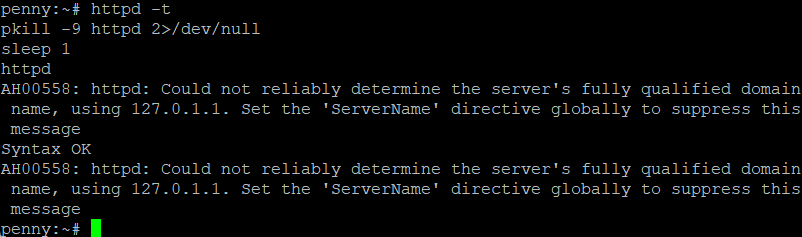

#### Verifikasi

Dijalankan dari klien, misalnya `alpha`, menggunakan hostname penny.

Pertama, akses `/admin` tanpa kredensial:

```bash
# dijalankan di klien, contoh: alpha
curl -i http://penny.k06.com/admin/
```

Hasil yang diharapkan:

```text
HTTP/1.1 401 Unauthorized
```

Respons `401 Unauthorized` membuktikan bahwa pengunjung tanpa kredensial ditolak. Karena konfigurasi menggunakan `Options -Indexes`, file `index.html` diperlukan agar path `/admin/` dapat menampilkan halaman setelah autentikasi berhasil.

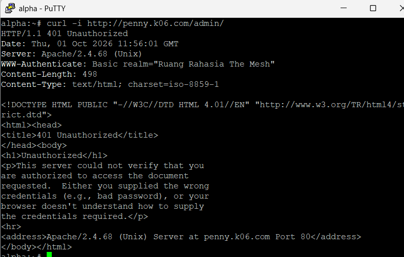

Selanjutnya, akses `/admin` dengan kredensial yang benar:

```bash
# dijalankan di klien, contoh: alpha
curl -i -u 'prabs:pakar_pinter_jadi_gob***' http://penny.k06.com/admin/
```

Hasil yang diharapkan adalah `HTTP/1.1 200 OK` disertai halaman `index.html` yang menampilkan judul `Dokumen Rahasia Sindikat The Mesh`. Hal ini membuktikan bahwa autentikasi berhasil dan akses ke path `/admin/` diizinkan.

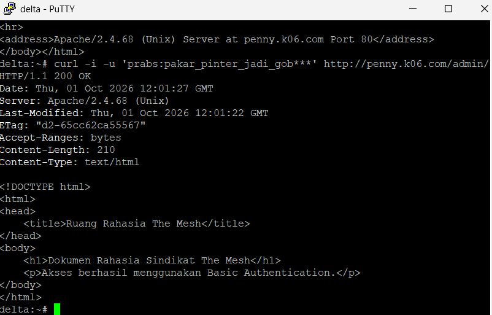

Sebagai pemeriksaan tambahan, kredensial yang salah harus tetap ditolak:

```bash
# dijalankan di klien, contoh: alpha
curl -i -u 'prabs:password-salah' http://penny.k06.com/admin/
```

Hasil yang diharapkan adalah `HTTP/1.1 401 Unauthorized`.

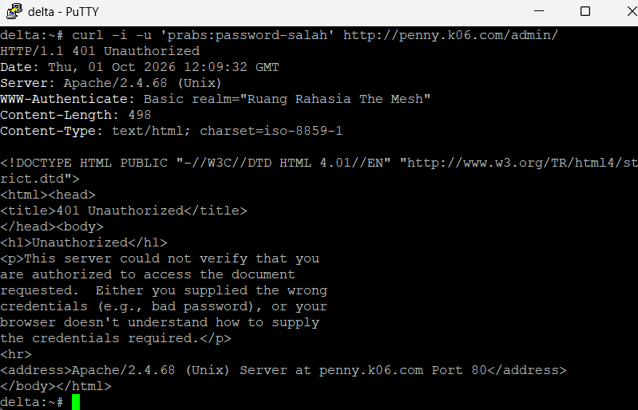

#### Persistensi

Karena paket, file kredensial, direktori `/admin`, dan konfigurasi Apache dapat hilang ketika node docker di-restart, seluruh konfigurasi soal 12 dibungkus dalam script `/root/soal12.sh` di node `penny`.

Script berikut menyiapkan Apache, membuat file kredensial, membuat dokumen rahasia, menulis ulang konfigurasi reverse proxy Penny beserta pengecualian `/admin`, kemudian me-restart Apache agar konfigurasi aktif.

```sh
#!/bin/sh
# /root/soal12.sh - penny (

i=0
while [ $i -lt 30 ]; do
    ping -c1 -W1 192.168.122.1 >/dev/null 2>&1 && break
    i=$((i + 1))
    sleep 1
done

# Instal Apache dan tools yang diperlukan jika belum tersedia.
if ! apk info -e apache2 >/dev/null 2>&1 || \
   ! apk info -e apache2-proxy >/dev/null 2>&1 || \
   ! apk info -e apache2-utils >/dev/null 2>&1; then
    apk update
    apk add apache2 apache2-proxy apache2-utils
fi

mkdir -p /etc/apache2/conf.d /var/log/apache2 /var/www/admin

echo "Dokumen rahasia sindikat The Mesh" > /var/www/admin/rahasia.txt

cat > /var/www/admin/index.html <<'EOF'
<!DOCTYPE html>
<html>
<head>
    <title>Ruang Rahasia The Mesh</title>
</head>
<body>
    <h1>Dokumen Rahasia Sindikat The Mesh</h1>
    <p>Akses berhasil menggunakan Basic Authentication.</p>
</body>
</html>
EOF

# Buat atau perbarui kredensial Basic Authentication.
htpasswd -bc /etc/apache2/.htpasswd prabs 'pakar_pinter_jadi_gob***'
chown root:apache /etc/apache2/.htpasswd
chmod 640 /etc/apache2/.htpasswd

# Konfigurasi reverse proxy + pengecualian /admin.
cat > /etc/apache2/conf.d/proxy-vault.conf <<'EOF'
<VirtualHost *:80>
    ServerName penny.k06.com

    ProxyPreserveHost On
    RequestHeader set X-Real-IP expr=%{REMOTE_ADDR}

    ProxyPass "/admin" "!"
    Alias "/admin" "/var/www/admin"

    <Directory "/var/www/admin">
        Options -Indexes
        AllowOverride None
        AuthType Basic
        AuthName "Ruang Rahasia The Mesh"
        AuthUserFile "/etc/apache2/.htpasswd"
        Require valid-user
    </Directory>

    <Proxy "balancer://vault">
        BalancerMember "http://192.214.1.11"
        BalancerMember "http://192.214.1.12"
    </Proxy>

    ProxyPass        "/" "balancer://vault/"
    ProxyPassReverse "/" "balancer://vault/"
</VirtualHost>
EOF

# Terapkan konfigurasi terbaru.
httpd -t || exit 1
pkill -9 httpd 2>/dev/null
sleep 1
httpd
```

Script startup `/root/init.sh` pada node `penny` menjalankan konfigurasi soal 11 dan soal 12 secara berurutan. Soal 12 dijalankan setelah soal 11 selesai karena script soal 12 menulis ulang `proxy-vault.conf` dengan pengecualian lokal untuk `/admin`.

```sh
#!/bin/sh

sh /root/soal11.sh >/tmp/soal11.log 2>&1
status11=$?

sh /root/soal12.sh >/tmp/soal12.log 2>&1
status12=$?

[ "$status11" -eq 0 ] && [ "$status12" -eq 0 ]
```

Pemanggilan otomatis dilakukan oleh `/etc/alpinet-init.sh`, yang menjalankan `/root/init.sh` jika file tersebut ada dan memiliki permission executable:

```sh
[ -f /root/init.sh ] && [ -x /root/init.sh ] && /root/init.sh
```

Oleh karena itu, seluruh script dibuat executable dan hanya resolver yang ditulis pada `/etc/network/interfaces`:

```bash
# dijalankan di penny
chmod +x /root/init.sh
chmod +x /root/soal11.sh
chmod +x /root/soal12.sh
```

### Soal 13: Redirect Kanonik

Setiap entitas dari luar harus memanggil gerbang dengan nama kanoniknya. Jika ada yang mencoba mengakses IP penny dan domain  penny.xxx.com, paksa sistem untuk melakukan redirect secara permanen (status code 301) menuju www.xxx.com. Sebaliknya, jika ada yang mengakses IP abbey dan domain abbey.xxx.com, lakukan redirect sementara (status code 302) menuju static.xxx.com.

Pada soal ini, setiap entitas yang mengakses gerbang menggunakan nama non-kanonik (IP atau hostname langsung) harus dipaksa diarahkan ke nama kanonik yang benar. Aturan yang berlaku:

- Akses ke IP `penny` (`192.214.3.2`) atau `penny.k06.com` → redirect **permanen (301)** ke `www.k06.com`
- Akses ke IP `abbey` (`192.214.2.2`) atau `abbey.k06.com` → redirect **sementara (302)** ke `static.k06.com`


#### A. Penny

##### 1. Konfigurasi Redirect

Ditambahkan VirtualHost khusus pada `penny` untuk menangkap akses lewat IP (`192.214.3.2`) dan hostname (`penny.k06.com`), kemudian mengarahkannya secara permanen ke `www.k06.com`. VirtualHost proxy soal 11 sudah menggunakan `ServerName www.k06.com`, sehingga kedua VirtualHost tidak bentrok — redirect menangkap akses non-kanonik, proxy melayani akses kanonik.

```sh
# dijalankan di penny
cat > /etc/apache2/conf.d/redirect-penny.conf <<'EOF'
<VirtualHost *:80>
    ServerName 192.214.3.2
    ServerAlias penny.k06.com
    Redirect permanent / http://www.k06.com/
</VirtualHost>
EOF
```

##### 2. Validasi dan Restart Apache

Konfigurasi divalidasi terlebih dahulu, kemudian Apache di-restart agar VirtualHost redirect aktif berdampingan dengan VirtualHost proxy.

```sh
# dijalankan di penny
httpd -t
pkill -9 httpd 2>/dev/null
sleep 1
httpd
```

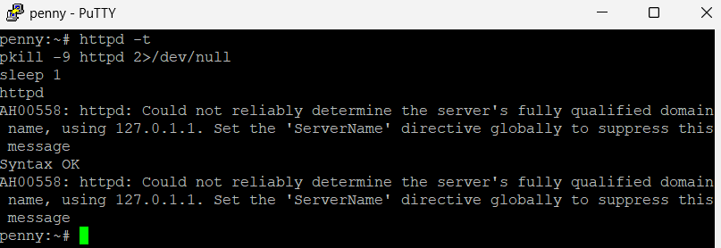

#### B. Abbey 

##### 1. Konfigurasi Redirect

Ditambahkan server block khusus pada `abbey` untuk menangkap akses lewat IP (`192.214.2.2`) dan hostname (`abbey.k06.com`), kemudian mengarahkannya sementara ke `static.k06.com`. Server block proxy soal 11 sudah menggunakan `server_name static.k06.com`, sehingga kedua server block tidak bentrok.

```sh
# dijalankan di abbey
cat > /etc/nginx/http.d/redirect-abbey.conf <<'EOF'
server {
    listen 80;
    server_name 192.214.2.2 abbey.k06.com;
    return 302 http://static.k06.com/;
}
EOF
```

##### 2. Validasi dan Reload Nginx

```sh
# dijalankan di abbey
nginx -t
nginx -s reload 2>/dev/null || nginx
```

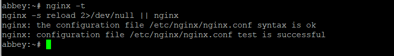


#### Verifikasi

Verifikasi dilakukan dari `alpha` dengan mengakses keempat titik (IP dan hostname masing-masing gerbang) untuk membuktikan status code redirect yang benar.

```sh
# dijalankan di alpha
curl -i http://192.214.3.2/
curl -i http://penny.k06.com/
curl -i http://192.214.2.2/
curl -i http://abbey.k06.com/
```

Hasil yang diharapkan:
- `192.214.3.2` dan `penny.k06.com` mengembalikan `301 Moved Permanently` dengan `Location: http://www.k06.com/`
- `192.214.2.2` dan `abbey.k06.com` mengembalikan `302 Moved Temporarily` dengan `Location: http://static.k06.com/`

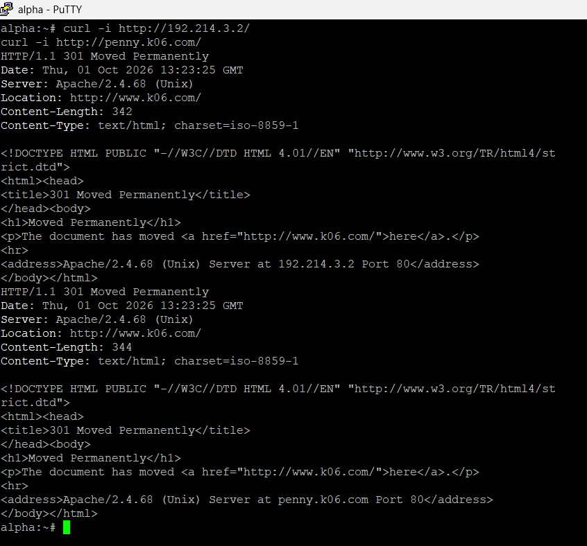

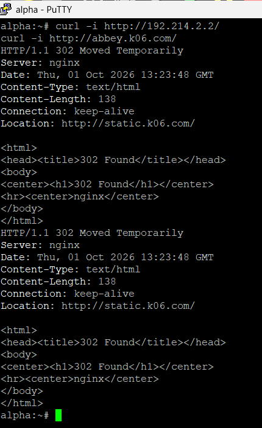


#### Persistensi

Konfigurasi redirect dibungkus dalam script `/root/soal13.sh` pada masing-masing node agar tetap aktif setelah restart. Script soal 13 dijalankan setelah soal 11 di `init.sh` karena soal 11 yang menjalankan httpd/nginx, sehingga soal 13 cukup menulis config redirect dan reload.

##### Script penny

```sh
#!/bin/sh
# /root/soal13.sh

cat > /etc/apache2/conf.d/redirect-penny.conf <<'EOF'
<VirtualHost *:80>
    ServerName 192.214.3.2
    ServerAlias penny.k06.com
    Redirect permanent / http://www.k06.com/
</VirtualHost>
EOF

pkill -9 httpd 2>/dev/null
sleep 1
httpd
```

##### Script abbey

```sh
#!/bin/sh
# /root/soal13.sh

cat > /etc/nginx/http.d/redirect-abbey.conf <<'EOF'
server {
    listen 80;
    server_name 192.214.2.2 abbey.k06.com;
    return 302 http://static.k06.com/;
}
EOF

nginx -s reload 2>/dev/null || nginx
```

##### `init.sh` penny

Script `init.sh` menjalankan soal 11, 12, dan 13 secara berurutan. Soal 13 dijalankan paling akhir agar config redirect tidak tertimpa oleh soal 11 yang menulis ulang `proxy-vault.conf`.

```sh
#!/bin/sh
sh /root/soal11.sh >/tmp/soal11.log 2>&1
sh /root/soal12.sh >/tmp/soal12.log 2>&1
sh /root/soal13.sh >/tmp/soal13.log 2>&1
```

##### `init.sh` abbey

```sh
#!/bin/sh
sh /root/soal11.sh >/tmp/soal11.log 2>&1
sh /root/soal13.sh >/tmp/soal13.log 2>&1
```

Seluruh script dibuat executable:

```sh
# dijalankan di penny
chmod +x /root/init.sh /root/soal11.sh /root/soal12.sh /root/soal13.sh

# dijalankan di abbey
chmod +x /root/init.sh /root/soal11.sh /root/soal13.sh
```

### 14 - Access Log dengan IP Asli Klien

Pada soal ini dipastikan bahwa access log pada seluruh backend web di area vault dan core mencatat alamat IP asli pengunjung, bukan alamat IP reverse proxy. Penny dan Abbey dari soal 11 sudah meneruskan header `X-Real-IP`, sehingga backend dikonfigurasi untuk menggunakan header tersebut saat menulis access log.

Tujuannya agar rekam jejak akses tetap akurat. Jika klien `alpha` dengan IP `192.214.4.2` mengakses layanan melalui Penny atau Abbey, backend harus mencatat `192.214.4.2`, bukan IP Penny `192.214.3.2` atau IP Abbey `192.214.2.2`.

#### 1 - Memastikan Penny Meneruskan IP Asli

Dijalankan pada node `penny`. Agar backend menerima IP asli klien, Penny harus mengisi header `X-Real-IP` dengan alamat pengunjung yang terhubung, bukan alamat Penny sendiri. Pada Apache, nilai ini diambil melalui ekspresi `%{REMOTE_ADDR}`.

```bash
# dijalankan di penny
sed -i 's#RequestHeader set X-Real-IP.*#RequestHeader set X-Real-IP expr=%{REMOTE_ADDR}#' \
/etc/apache2/conf.d/proxy-vault.conf

httpd -t
pkill -9 httpd 2>/dev/null
sleep 2
httpd
```

Tanpa langkah ini, backend akan mencatat IP Penny (`192.214.3.2`), bukan IP asli klien. Setelah diperbaiki, header `X-Real-IP` berisi IP pengunjung sebenarnya.

#### 2 - Konfigurasi Backend Vault (Apache)

Dijalankan pada node `obladi` dan `desmond`. Apache dikonfigurasi menggunakan modul `mod_remoteip`, sehingga nilai `X-Real-IP` dari reverse proxy digunakan sebagai alamat klien pada access log. IP reverse proxy yang dipercaya adalah Penny (`192.214.3.2`).

```bash
# dijalankan di obladi dan desmond
cat > /etc/apache2/conf.d/real-ip.conf <<'EOF'
LoadModule remoteip_module modules/mod_remoteip.so

RemoteIPHeader X-Real-IP
RemoteIPTrustedProxy 192.214.3.2

LogFormat "%a - %u %t \"%r\" %>s %b \"%{Referer}i\" \"%{User-Agent}i\"" realip
EOF

sed -i 's#CustomLog /var/log/apache2/access.log combined#CustomLog /var/log/apache2/access.log realip#' \
/etc/apache2/conf.d/vault.conf

httpd -t
pkill -9 httpd 2>/dev/null
sleep 1
httpd
```

Pada Apache, `mod_remoteip` memproses nilai `X-Real-IP`, lalu `LogFormat realip` menggunakan `%a` agar alamat klien hasil pemrosesan tersebut dicatat sebagai IP pertama pada access log.

#### 3 - Konfigurasi Backend Core (Nginx)

Dijalankan pada node `oblada` dan `molly`. Nginx menggunakan variabel `$http_x_real_ip` untuk menulis alamat IP asli dari header yang diteruskan Abbey (`192.214.2.2`).

Pada konfigurasi server block core, ditambahkan format log dan `access_log` berikut:

```bash
# dijalankan di oblada dan molly
cat > /etc/nginx/http.d/00-real-ip-log.conf <<'EOF'
log_format realip '$http_x_real_ip - $remote_addr - $remote_user [$time_local] "$request" '
                  '$status $body_bytes_sent "$http_referer" '
                  '"$http_user_agent"';
EOF
```

Kemudian pada `/etc/nginx/http.d/core.conf`, di dalam block `server`, ditambahkan:

```nginx
access_log /var/log/nginx/access.log realip;
```

Contoh posisi konfigurasinya:

```nginx
server {
    listen 80;
    server_name oblada.k06.com;
    root /var/www/core;
    index index.php;

    access_log /var/log/nginx/access.log realip;

    location / {
        try_files $uri $uri/ @php;
    }

    location @php {
        fastcgi_pass 127.0.0.1:9000;
        include fastcgi.conf;
        fastcgi_param SCRIPT_FILENAME $document_root$uri.php;
    }

    location ~ \.php$ {
        fastcgi_pass 127.0.0.1:9000;
        include fastcgi.conf;
    }
}
```

Pada `molly`, `server_name` disesuaikan menjadi `molly.k06.com`.

Konfigurasi Nginx divalidasi dan dimuat ulang:

```bash
# dijalankan di oblada dan molly
nginx -t
nginx -s reload
```

#### 4 - Menghasilkan Request dari Klien

Sebelum memeriksa log, request dibuat dari klien `alpha` dengan IP `192.214.4.2`. Request dikirim melalui nama kanonik masing-masing gerbang:

```bash
# dijalankan di alpha
curl http://www.k06.com/
curl http://static.k06.com/
```

Request pertama melewati Penny menuju backend vault, sedangkan request kedua melewati Abbey menuju backend core.

#### 5 - Memeriksa Access Log Backend

Pada backend vault, log Apache diperiksa:

```bash
# dijalankan di obladi atau desmond
tail -n 10 /var/log/apache2/access.log
```

Pada backend core, log Nginx diperiksa:

```bash
# dijalankan di oblada atau molly
tail -n 10 /var/log/nginx/access.log
```

Hasil yang diharapkan: baris log Apache menampilkan `192.214.4.2` sebagai IP pertama. Pada log Nginx, format menampilkan `192.214.4.2` sebagai IP pertama dan IP reverse proxy (`192.214.2.2`) sebagai IP kedua. IP Penny (`192.214.3.2`) atau Abbey (`192.214.2.2`) tidak boleh menggantikan IP asli pada posisi pertama.

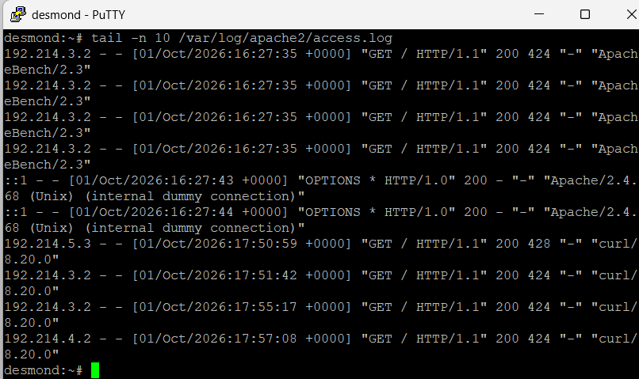

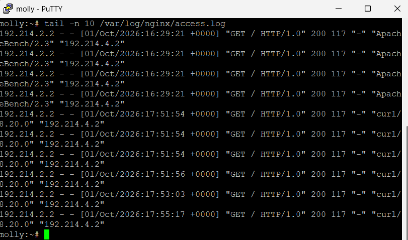

#### Persistensi

Agar konfigurasi access log tetap aktif setelah restart, konfigurasi dibungkus dalam `/root/soal14.sh` pada setiap backend. Script ini menulis konfigurasi `mod_remoteip` pada backend Apache, menambahkan format log `realip` pada backend Nginx, lalu memvalidasi dan me-restart service web.

##### Script pada obladi dan desmond

```sh
#!/bin/sh
# /root/soal14.sh - backend vault Apache

mkdir -p /etc/apache2/conf.d /var/log/apache2

cat > /etc/apache2/conf.d/real-ip.conf <<'EOF'
LoadModule remoteip_module modules/mod_remoteip.so
RemoteIPHeader X-Real-IP
RemoteIPTrustedProxy 192.214.3.2

LogFormat "%a - %u %t \"%r\" %>s %b \"%{Referer}i\" \"%{User-Agent}i\"" realip
EOF

sed -i 's#CustomLog /var/log/apache2/access.log combined#CustomLog /var/log/apache2/access.log realip#' \
/etc/apache2/conf.d/vault.conf

httpd -t || exit 1
pkill -9 httpd 2>/dev/null
sleep 1
httpd
```

##### Script pada oblada dan molly

```sh
#!/bin/sh
# /root/soal14.sh - backend core Nginx

mkdir -p /etc/nginx/http.d /var/log/nginx

cat > /etc/nginx/http.d/00-real-ip-log.conf <<'EOF'
log_format realip '$http_x_real_ip - $remote_addr - $remote_user [$time_local] "$request" '
                  '$status $body_bytes_sent "$http_referer" '
                  '"$http_user_agent"';
EOF

# Tambahkan access_log ke server block core satu kali.
if ! grep -q 'access_log /var/log/nginx/access.log realip;' /etc/nginx/http.d/core.conf; then
    sed -i '/server_name /a\    access_log /var/log/nginx/access.log realip;' /etc/nginx/http.d/core.conf
fi

nginx -t || exit 1
nginx -s reload 2>/dev/null || nginx
```

Pada setiap node, script dibuat executable:

```bash
# dijalankan di obladi, desmond, oblada, dan molly
chmod +x /root/soal14.sh
```

Script kemudian dipanggil dari `/root/init.sh` setelah service web dari soal sebelumnya aktif. Contoh pada backend vault:

```sh
#!/bin/sh
sh /root/soal9.sh >/tmp/soal9.log 2>&1
sh /root/soal14.sh >/tmp/soal14.log 2>&1
```

Contoh pada backend core:

```sh
#!/bin/sh
sh /root/soal10.sh >/tmp/soal10.log 2>&1
sh /root/soal14.sh >/tmp/soal14.log 2>&1
```

Pemanggilan script tidak ditambahkan lagi ke `/etc/network/interfaces`; file tersebut hanya mengatur IP, gateway, dan resolver. Dengan demikian access log tetap memakai IP asli klien setelah node di-restart.


### 15 - Jalur Proxy Khusus (/eternal di Penny, /orion di Abbey)

Rootkit menginstruksikan pembuatan jalur proxy khusus yang berdiri sendiri. Pada penny buat reverse proxy untuk path /eternal yang menyajikan directory /var/www/eternal, dan pastikan path ini dapat mengeksekusi (rendering) file php. Pada abbey, buat jalur /orion yang menyajikan directory /var/www/orion, secara murni statis tanpa perlu rendering php.


Pada soal ini dibuat dua jalur khusus yang berdiri sendiri pada masing-masing gerbang:

- Pada `penny` (Apache), path `/eternal` menyajikan direktori `/var/www/eternal` dan mampu mengeksekusi (rendering) file PHP.
- Pada `abbey` (Nginx), path `/orion` menyajikan direktori `/var/www/orion` secara murni statis tanpa rendering PHP.

Tujuannya agar kedua gerbang tidak hanya berfungsi sebagai reverse proxy ke backend, tetapi juga memiliki jalur lokal khusus. Pada Penny jalur tersebut dinamis (PHP dieksekusi), sedangkan pada Abbey jalur tersebut statis (file disajikan apa adanya).

#### A. Penny: Path /eternal dengan Eksekusi PHP

Dijalankan di node `penny`. Karena Penny menggunakan Apache, eksekusi PHP memerlukan PHP-FPM dan modul proxy FastCGI.

##### 1 - Instal PHP-FPM

```bash
# dijalankan di penny
apk update
apk add php84 php84-fpm apache2-proxy
php-fpm84
```

##### 2 - Membuat Direktori dan File PHP

```bash
# dijalankan di penny
mkdir -p /var/www/eternal

cat > /var/www/eternal/index.php <<'EOF'
<?php
echo "<h1>Eternal - Penny</h1>\n";
echo "<p>Jalur khusus /eternal dengan eksekusi PHP.</p>\n";
echo "<p>Waktu server: " . date("Y-m-d H:i:s") . "</p>\n";
EOF
```

##### 3 - Konfigurasi Apache untuk /eternal

Ditambahkan `Alias /eternal` ke direktori lokal, dengan pengecualian `ProxyPass "/eternal" "!"` agar jalur ini tidak diteruskan ke backend vault, lalu file PHP diteruskan ke PHP-FPM melalui `mod_proxy_fcgi`.

```bash
# dijalankan di penny
cat > /etc/apache2/conf.d/eternal.conf <<'EOF'
ProxyPass "/eternal" "!"
Alias "/eternal" "/var/www/eternal"

<Directory "/var/www/eternal">
    Options +Indexes
    AllowOverride None
    Require all granted
    DirectoryIndex index.php
</Directory>

<FilesMatch "\.php$">
    SetHandler "proxy:fcgi://127.0.0.1:9000"
</FilesMatch>
EOF

httpd -t
pkill -9 httpd 2>/dev/null
sleep 1
httpd
```

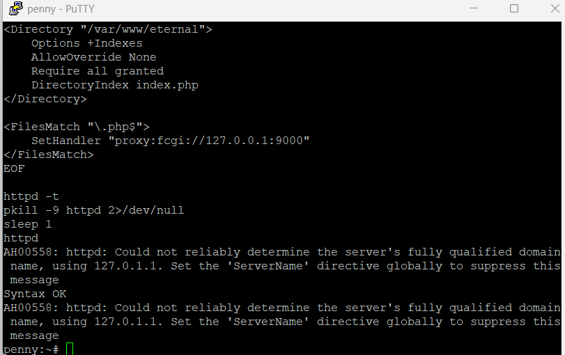

#### B. Abbey: Path /orion Statis

Karena jalur ini murni statis, cukup server block Nginx yang menyajikan file tanpa meneruskan ke PHP.

##### 1 - Membuat Direktori dan File Statis

```bash
# dijalankan di abbey
mkdir -p /var/www/orion

cat > /var/www/orion/index.html <<'EOF'
<!DOCTYPE html>
<html>
<head><title>Orion - Abbey</title></head>
<body>
    <h1>Orion - Abbey</h1>
    <p>Jalur khusus /orion yang disajikan secara statis.</p>
</body>
</html>
EOF

cat > /var/www/orion/data.txt <<'EOF'
File statis pada jalur /orion.
EOF
```

##### 2 - Konfigurasi Nginx untuk /orion

Ditambahkan block `location /orion` pada server block yang sudah ada. `alias` mengarahkan path ke direktori lokal, dan request tidak diteruskan ke backend core sehingga file disajikan apa adanya.

Karena Nginx tidak mengizinkan dua server block dengan `server_name static.k06.com` yang sama, blok `/orion` digabung ke dalam satu server block bersama reverse proxy core. File `orion.conf` ini menggantikan `proxy-core.conf` dari soal 11, dan sudah memuat kembali `upstream core` serta `location /` agar fungsi reverse proxy tetap berjalan.

```bash
# dijalankan di abbey
cat > /etc/nginx/http.d/orion.conf <<'EOF'
upstream core {
    server 192.214.1.21;
    server 192.214.1.22;
}

server {
    listen 80;
    server_name static.k06.com;

    location /orion/ {
        alias /var/www/orion/;
        autoindex on;
    }

    location / {
        proxy_pass http://core;
        proxy_set_header Host $host;
        proxy_set_header X-Real-IP $remote_addr;
        proxy_set_header X-Forwarded-For $proxy_add_x_forwarded_for;
    }
}
EOF

rm -f /etc/nginx/http.d/proxy-core.conf
nginx -t
nginx -s reload
```

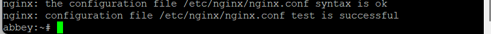

#### C. Verifikasi

Dijalankan dari klien, contoh `alpha`.

Uji jalur dinamis pada Penny (harus mengeksekusi PHP, bukan menampilkan kode):

```bash
# dijalankan di client
curl http://penny.k06.com/eternal/
```

Hasil yang diharapkan: HTML hasil eksekusi PHP, menampilkan "Eternal - Penny" dan waktu server, bukan kode `<?php`.

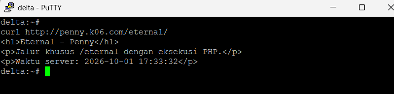

Uji jalur statis pada Abbey :

```bash
# dijalankan di client
curl http://static.k06.com/orion/
curl http://static.k06.com/orion/data.txt
```

Hasil yang diharapkan: halaman `index.html` "Orion - Abbey" dan isi `data.txt`, tanpa pemrosesan dinamis.

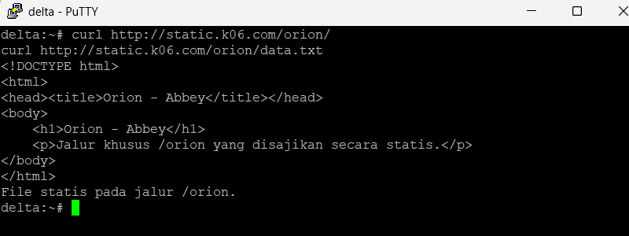


#### Persistensi

Konfigurasi soal 15 dibungkus dalam `/root/soal15.sh` pada Penny dan Abbey, dipanggil dari `/root/init.sh` setelah konfigurasi reverse proxy soal 11 aktif.

##### Script penny

```sh
#!/bin/sh
# /root/soal15.sh - penny (/eternal dengan PHP)

apk info -e php84-fpm >/dev/null 2>&1 || {
    apk update
    apk add php84 php84-fpm apache2-proxy
}

pgrep -x php-fpm84 >/dev/null 2>&1 || php-fpm84

mkdir -p /var/www/eternal
if [ ! -f /var/www/eternal/index.php ]; then
    cat > /var/www/eternal/index.php <<'PHP'
<?php
echo "<h1>Eternal - Penny</h1>\n";
echo "<p>Jalur khusus /eternal dengan eksekusi PHP.</p>\n";
echo "<p>Waktu server: " . date("Y-m-d H:i:s") . "</p>\n";
PHP
fi

cat > /etc/apache2/conf.d/eternal.conf <<'EOF'
ProxyPass "/eternal" "!"
Alias "/eternal" "/var/www/eternal"

<Directory "/var/www/eternal">
    Options +Indexes
    AllowOverride None
    Require all granted
    DirectoryIndex index.php
</Directory>

<FilesMatch "\.php$">
    SetHandler "proxy:fcgi://127.0.0.1:9000"
</FilesMatch>
EOF

httpd -t || exit 1
pkill -9 httpd 2>/dev/null
sleep 1
httpd
```

##### Script abbey

```sh
#!/bin/sh
# /root/soal15.sh - abbey (/orion statis)

mkdir -p /var/www/orion
if [ ! -f /var/www/orion/index.html ]; then
    cat > /var/www/orion/index.html <<'HTML'
<!DOCTYPE html>
<html>
<head><title>Orion - Abbey</title></head>
<body>
    <h1>Orion - Abbey</h1>
    <p>Jalur khusus /orion yang disajikan secara statis.</p>
</body>
</html>
HTML
    echo "File statis pada jalur /orion." > /var/www/orion/data.txt
fi

cat > /etc/nginx/http.d/orion.conf <<'EOF'
upstream core {
    server 192.214.1.21;
    server 192.214.1.22;
}

server {
    listen 80;
    server_name static.k06.com;

    location /orion/ {
        alias /var/www/orion/;
        autoindex on;
    }

    location / {
        proxy_pass http://core;
        proxy_set_header Host $host;
        proxy_set_header X-Real-IP $remote_addr;
        proxy_set_header X-Forwarded-For $proxy_add_x_forwarded_for;
    }
}
EOF

rm -f /etc/nginx/http.d/proxy-core.conf

nginx -t || exit 1
nginx -s reload 2>/dev/null || nginx
```

Script dibuat executable dan dipanggil setelah soal 11 pada masing-masing `init.sh`:

```sh
# penny
sh /root/soal11.sh >/tmp/soal11.log 2>&1
sh /root/soal12.sh >/tmp/soal12.log 2>&1
sh /root/soal13.sh >/tmp/soal13.log 2>&1
sh /root/soal15.sh >/tmp/soal15.log 2>&1

# abbey
sh /root/soal11.sh >/tmp/soal11.log 2>&1
sh /root/soal13.sh >/tmp/soal13.log 2>&1
sh /root/soal15.sh >/tmp/soal15.log 2>&1
```

### 16 - Stress Test Gerbang dengan ApacheBench

#### Requirement

Ketahanan gerbang The Mesh harus diuji untuk menghadapi bombardir permintaan. Salah satu klien, yaitu Alpha, bertugas melakukan stress test benchmark menggunakan ApacheBench dengan 250 requests dan tingkat konkurensi (concurrencies) 10 untuk masing-masing titik akhir `www.k06.com` dan `static.k06.com`.

Karena domain yang digunakan pada praktikum adalah `k06.com`, maka endpoint yang diuji adalah:

| No. | Endpoint | Jumlah Request | Concurrency |
|---|---|---:|---:|
| 1 | `www.k06.com` | 250 | 10 |
| 2 | `static.k06.com` | 250 | 10 |

#### Konsep yang Digunakan

##### ApacheBench

ApacheBench (AB) adalah tool benchmarking HTTP yang digunakan untuk menguji kemampuan suatu web server dalam menangani sejumlah request secara bersamaan.

Pada soal ini digunakan dua parameter utama:

- `-n 250` → mengirim 250 total HTTP requests.
- `-c 10` → menjalankan maksimal 10 requests secara bersamaan (concurrency level).

Dengan demikian, kedua endpoint diuji menggunakan beban yang sama sehingga hasil benchmark dapat dibandingkan.

#### Konfigurasi dan Persiapan

Pengujian dilakukan dari client Alpha.

Sebelum melakukan benchmark, dilakukan pengecekan resolusi DNS dan konektivitas HTTP terhadap kedua endpoint.

Hasil resolusi DNS:

- `www.k06.com` → `penny.k06.com` → `192.214.3.2`
- `static.k06.com` → `abbey.k06.com` → `192.214.2.2`

Kedua endpoint juga berhasil memberikan respons:

```text
HTTP/1.1 200 OK
```

ApacheBench kemudian dipastikan tersedia pada client Alpha.

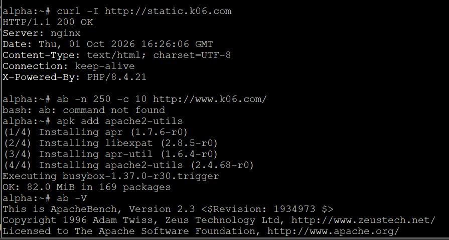

Pengecekan HTTP dan DNS dapat digunakan sebagai screenshot pendukung jika diperlukan.

#### Command yang Dieksekusi

Instalasi ApacheBench

```bash
apk add apache2-utils
```

Pengecekan versi

```bash
ab -V
```

Benchmark `www.k06.com`

```bash
ab -n 250 -c 10 http://www.k06.com/
```

Benchmark `static.k06.com`

```bash
ab -n 250 -c 10 http://static.k06.com/
```

#### Hasil Benchmark `www.k06.com`

Pengujian dilakukan menggunakan:

```bash
ab -n 250 -c 10 http://www.k06.com/
```

Hasil utama:

| Parameter | Hasil |
|---|---|
| Server Software | Apache/2.4.68 |
| Concurrency Level | 10 |
| Complete Requests | 250 |
| Failed Requests | 0 |
| Time Taken | 0.170 seconds |
| Requests per Second | 1469.27 req/s |
| Time per Request | 6.806 ms |
| Transfer Rate | 852.29 KB/s |
| Longest Request | 15 ms |


Hasil benchmark www.k06.com.

Hasil pengujian ApacheBench terhadap www.k06.com dengan 250 requests dan concurrency 10.

#### Hasil Benchmark `static.k06.com`

Pengujian dilakukan menggunakan:

```bash
ab -n 250 -c 10 http://static.k06.com/
```

Hasil utama:

| Parameter | Hasil |
|---|---|
| Server Software | nginx |
| Concurrency Level | 10 |
| Complete Requests | 250 |
| Failed Requests | 0 |
| Time Taken | 0.121 seconds |
| Requests per Second | 2063.22 req/s |
| Time per Request | 4.847 ms |
| Transfer Rate | 550.06 KB/s |
| Longest Request | 12 ms |


Hasil benchmark static.k06.com.

Hasil pengujian ApacheBench terhadap static.k06.com dengan 250 requests dan concurrency 10.

Hasil:

1469.27 req/s, failed 0.

#### Rangkuman Hasil

| Parameter | www.k06.com | static.k06.com |
|---|---:|---:|
| Server | Apache/2.4.68 | nginx |
| Requests | 250 | 250 |
| Concurrency | 10 | 10 |
| Failed Requests | 0 | 0 |
| Time Taken | 0.170 s | 0.121 s |
| Requests/sec | 1469.27 | 2063.22 |
| Time/request | 6.806 ms | 4.847 ms |
| Longest Request | 15 ms | 12 ms |

#### Analisis

Berdasarkan hasil pengujian, kedua endpoint berhasil menyelesaikan seluruh 250 requests dengan tingkat konkurensi 10 dan tidak terdapat failed requests.

Pada endpoint www.k06.com, ApacheBench mencatat rata-rata 1469.27 requests per second dengan waktu rata-rata 6.806 ms per request.

Sementara itu, static.k06.com mencatat rata-rata 2063.22 requests per second dengan waktu rata-rata 4.847 ms per request.

Perbedaan hasil benchmark juga berkaitan dengan karakteristik layanan yang digunakan. www.k06.com dilayani oleh Apache, sedangkan static.k06.com dilayani oleh nginx, serta ukuran respons yang diberikan kedua endpoint berbeda.

Hasil ini menunjukkan bahwa pada beban pengujian yang diberikan, yaitu 250 requests dengan concurrency 10, kedua endpoint dapat menangani seluruh permintaan tanpa kegagalan.

#### Evidence Utama Soal 16

##### Evidence 1 — www.k06.com

📸 Screenshot hasil:

```bash
ab -n 250 -c 10 http://www.k06.com/
```

Menunjukkan:

- Complete requests: 250
- Failed requests: 0
- Requests per second: 1469.27

Gambar X. Hasil benchmark ApacheBench pada www.k06.com.

##### Evidence 2 — static.k06.com

```bash
ab -n 250 -c 10 http://static.k06.com/
```

Menunjukkan:

- Complete requests: 250
- Failed requests: 0
- Requests per second: 2063.22


Gambar X. Hasil benchmark ApacheBench pada static.k06.com.

### 17 - TXT Record untuk Client (Alpha-Epsilon)

#### Requirement

Soal 17 meminta penambahan TXT record pada DNS untuk seluruh client pada sayap kiri dan sayap kanan, yaitu Alpha, Beta, Gamma, Delta, dan Epsilon. Setiap hostname harus memiliki TXT record yang mengembalikan teks berupa nama hostname tersebut ketika dilakukan query DNS terhadap domainnya.

Mapping-nya:

| Hostname | TXT Record |
|---|---|
| `alpha.k06.com` | `"alpha"` |
| `beta.k06.com` | `"beta"` |
| `gamma.k06.com` | `"gamma"` |
| `delta.k06.com` | `"delta"` |
| `epsilon.k06.com` | `"epsilon"` |

#### Konsep yang Digunakan

##### Apa itu TXT record?

TXT (Text) record adalah tipe DNS record yang menyimpan teks sebagai informasi tambahan pada suatu domain/hostname.

Dalam soal ini, TXT record digunakan supaya:

- `alpha.k06.com` → `"alpha"`
- `beta.k06.com` → `"beta"`
- `gamma.k06.com` → `"gamma"`
- `delta.k06.com` → `"delta"`
- `epsilon.k06.com` → `"epsilon"`

Jadi ketika client melakukan:

```bash
dig @127.0.0.1 alpha.k06.com TXT
```

DNS harus mengembalikan:

```text
"alpha"
```

#### Konfigurasi yang Dilakukan

Kita menambahkan record berikut ke:

```text
/etc/bind/zones/k06.com.db
```

Konfigurasinya:

```text
alpha IN TXT "alpha"
beta IN TXT "beta"
gamma IN TXT "gamma"
delta IN TXT "delta"
epsilon IN TXT "epsilon"
```

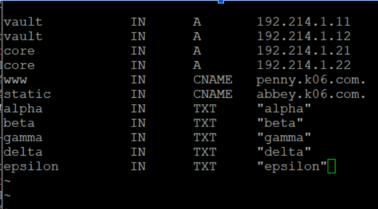

Gambar X. Penambahan TXT record untuk seluruh client pada DNS zone k06.com.

#### Command yang Dieksekusi

Kita masuk ke zone file dengan:

```bash
vi /etc/bind/zones/k06.com.db
```

Kemudian menambahkan:

```text
alpha IN TXT "alpha"
beta IN TXT "beta"
gamma IN TXT "gamma"
delta IN TXT "delta"
epsilon IN TXT "epsilon"
```

Setelah selesai, kita keluar dari vi menggunakan:

```text
ESC
:wq
ENTER
```

Kemudian dilakukan validasi menggunakan:

```bash
/usr/bin/named-checkzone k06.com /etc/bind/zones/k06.com.db
```

#### Hasil Validasi

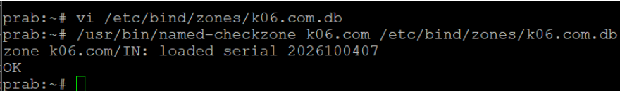

Gambar X. Hasil validasi zone file menggunakan named-checkzone.

Berdasarkan hasil validasi, zone `k06.com` berhasil dimuat dengan serial `2026100407` dan memperoleh status `OK`. Hal ini menunjukkan bahwa konfigurasi TXT record yang ditambahkan memiliki sintaks DNS yang valid.

Output-nya:

```text
zone k06.com/IN: loaded serial 2026100407
OK
```

Ini membuktikan bahwa zone file berhasil diparse oleh BIND dan tidak memiliki kesalahan sintaks.

#### Evidence Utama Soal 17

Untuk membuktikan DNS server benar-benar mengembalikan TXT record ketika ditanya. Kita melakukan DNS query menggunakan `dig`.

Kita lakukan:

```bash
dig @127.0.0.1 alpha.k06.com TXT
```

Lalu:

```bash
dig @127.0.0.1 beta.k06.com TXT
```

Lalu:

```bash
dig @127.0.0.1 gamma.k06.com TXT
```

Lalu:

```bash
dig @127.0.0.1 delta.k06.com TXT
```

Lalu:

```bash
dig @127.0.0.1 epsilon.k06.com TXT
```

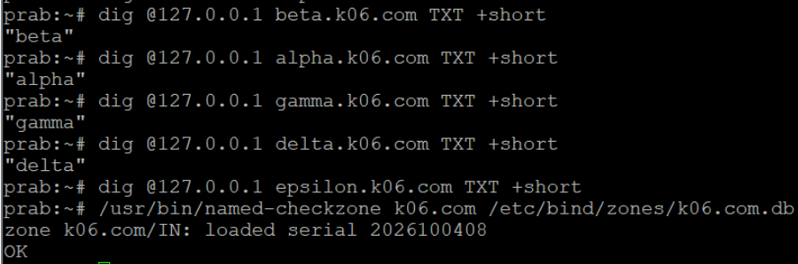

Gambar X. Hasil query TXT record seluruh client.

### 18 - Perubahan A Record abbey dengan TTL 15 Detik

#### Requirement

Soal 18 meminta perubahan A record DNS milik `abbey.k06.com` menjadi alamat IP fiktif dengan format yang valid. Setelah perubahan dilakukan, serial SOA pada DNS primary (PRAB) harus dinaikkan dan perubahan tersebut harus tersinkronisasi ke DNS secondary (TEDD).

Selain itu, TTL pada record yang relevan ditetapkan sebesar 15 detik. Verifikasi dilakukan dalam tiga fase, yaitu sebelum perubahan, ketika cache masih menyimpan IP lama dalam periode TTL, dan setelah TTL expired ketika cache telah memperoleh IP baru.

Mapping perubahan:

| Hostname | IP Awal | IP Baru | TTL |
|---|---|---|---|
| `abbey.k06.com` | `192.214.2.2` | `192.214.2.99` | 15 detik |

IP `192.214.2.99` digunakan sebagai IP fiktif yang tetap valid secara format IPv4.

#### Konsep yang Digunakan

##### Apa itu A record?

A (Address) record adalah DNS record yang digunakan untuk memetakan sebuah hostname/domain ke alamat IPv4.

Dalam soal ini:

```text
abbey.k06.com → 192.214.2.99
```

Jadi ketika client melakukan:

```bash
dig @127.0.0.1 abbey.k06.com A
```

DNS harus mengembalikan alamat:

```text
192.214.2.99
```

##### Apa itu TTL?

TTL (Time To Live) menentukan berapa lama hasil DNS dapat disimpan oleh resolver dalam cache.

Pada soal ini TTL ditetapkan:

```text
15 detik
```

Artinya, resolver yang sudah memiliki record lama dapat tetap memberikan IP lama sampai masa cache tersebut habis. Setelah TTL expired, resolver akan melakukan query kembali dan memperoleh data terbaru.

#### Konfigurasi yang Dilakukan

Perubahan dilakukan pada zone file:

```text
/etc/bind/zones/k06.com.db
```

A record `abbey` awalnya:

```text
abbey IN A 192.214.2.2
```

Kemudian diubah menjadi:

```text
abbey 15 IN A 192.214.2.99
```

Serial SOA juga dinaikkan untuk menandakan bahwa terdapat perubahan pada zone.

Konfigurasi akhirnya:

```text
abbey 15 IN A 192.214.2.99
```

#### Command yang Dieksekusi

Kita masuk ke zone file menggunakan:

```bash
vi /etc/bind/zones/k06.com.db
```

Kemudian A record `abbey` diubah menjadi:

```text
abbey 15 IN A 192.214.2.99
```

Serial SOA dinaikkan agar perubahan zone dikenali oleh BIND.

Setelah selesai, dilakukan validasi menggunakan:

```bash
/usr/bin/named-checkzone k06.com /etc/bind/zones/k06.com.db
```

Kemudian zone di-reload menggunakan:

```bash
rndc reload k06.com
```

#### Hasil Validasi


Gambar X. Hasil validasi zone file dan reload zone.

Berdasarkan hasil validasi, zone `k06.com` berhasil dimuat oleh BIND dengan serial yang telah dinaikkan. Status `OK` menunjukkan bahwa konfigurasi zone file memiliki sintaks DNS yang valid dan dapat digunakan oleh DNS server.

Output validasi menunjukkan:

```text
zone k06.com/IN: loaded serial 20261004XX
OK
```

Hal ini membuktikan bahwa perubahan A record berhasil diparse oleh BIND dan zone file tidak memiliki kesalahan sintaks.

#### Evidence Utama Soal 18

Untuk membuktikan pengaruh TTL terhadap DNS cache, dilakukan pengujian dalam tiga fase.

##### Fase 1 — Before Change

Sebelum perubahan dilakukan, query terhadap `abbey.k06.com` menghasilkan IP lama:

```text
abbey.k06.com. 604800 IN A 192.214.2.2
```


Gambar X. Kondisi awal A record `abbey.k06.com` sebelum perubahan.

Hasil tersebut menunjukkan bahwa `abbey.k06.com` masih mengarah ke:

```text
192.214.2.2
```

##### Fase 2 — Selama TTL Belum Expired

Setelah A record pada authoritative DNS diubah menjadi:

```text
192.214.2.99
```

cache DNS sebelumnya masih menyimpan alamat IP lama.

Query dilakukan melalui DNS cache:

```bash
dig @127.0.0.1 -p 5353 abbey.k06.com A +noall +answer
```

Hasil:

```text
abbey.k06.com. 9 IN A 192.214.2.2
```

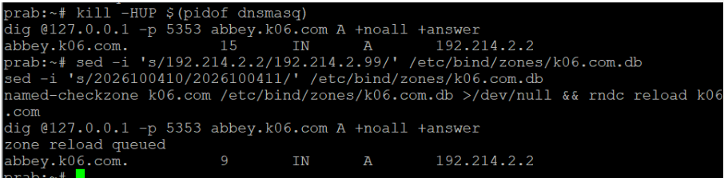

Gambar X. Kondisi DNS cache ketika TTL belum expired.

DNS cache masih mengembalikan IP lama `192.214.2.2` karena TTL record sebelumnya belum habis.

Meskipun authoritative DNS sudah memiliki IP baru `192.214.2.99`, cache masih memberikan IP lama karena record tersebut masih berada dalam masa TTL.

##### Fase 3 — Setelah TTL Expired

Setelah menunggu lebih dari 15 detik:

```bash
sleep 16
```


Gambar X. Proses menunggu hingga TTL expired.

Setelah lebih dari 15 detik, query dilakukan kembali:

```bash
dig @127.0.0.1 -p 5353 abbey.k06.com A +noall +answer
```

Hasil:

```text
abbey.k06.com. 15 IN A 192.214.2.99
```


Gambar X. Hasil query setelah TTL expired.

DNS cache telah memperbarui data dan mengembalikan IP baru `192.214.2.99` setelah TTL expired.

Hasil ini membuktikan bahwa setelah cache lama expired, resolver memperoleh data terbaru dari authoritative DNS.

#### Verifikasi Sinkronisasi TEDD

Setelah perubahan dilakukan pada PRAB, dilakukan pengecekan terhadap DNS secondary TEDD menggunakan:

```bash
dig @192.214.1.3 abbey.k06.com A +noall +answer
```

Hasil:

```text
abbey.k06.com. 15 IN A 192.214.2.99
```

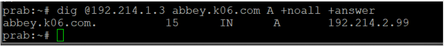

Gambar X. Verifikasi sinkronisasi A record pada DNS secondary TEDD.

TEDD berhasil menerima perubahan A record dari PRAB.

Hasil tersebut menunjukkan bahwa A record pada TEDD telah tersinkronisasi dengan PRAB, yaitu:

```text
abbey.k06.com → 192.214.2.99
```

dengan TTL:

```text
15 detik
```

#### Analisis

Percobaan menunjukkan bahwa perubahan pada authoritative DNS dapat langsung mengubah data yang diberikan oleh server authoritative, tetapi resolver yang memiliki cache masih dapat memberikan data lama selama TTL belum habis.

Pada pengujian ini, record awal `abbey.k06.com` mengarah ke `192.214.2.2`.

Setelah diubah menjadi `192.214.2.99` dengan TTL 15 detik, cache masih mengembalikan `192.214.2.2` ketika TTL belum expired. Setelah lebih dari 15 detik, cache diperbarui dan menghasilkan `192.214.2.99`.

Selain itu, perubahan zone pada PRAB berhasil tersinkronisasi ke TEDD sehingga kedua DNS server memiliki A record terbaru.

### 19 - CNAME outbound.k06.com ke http.badssl.com

#### Requirement

Soal 19 meminta pembuatan CNAME record yang melakukan binding dari domain internal `outbound.k06.com` menuju domain eksternal `http.badssl.com`. Setelah konfigurasi dilakukan, dilakukan perintah `curl` terhadap `http://outbound.k06.com` untuk memastikan koneksi menuju domain eksternal tersebut dapat dilakukan dan membandingkan hasil konten yang diperoleh dengan halaman `http.badssl.com`.

Mapping-nya:

| Domain Internal | CNAME | Domain Eksternal |
|---|---|---|
| `outbound.k06.com` | CNAME | `http.badssl.com` |

#### Konsep yang Digunakan

##### CNAME record

CNAME (Canonical Name) record adalah DNS record yang digunakan untuk membuat alias dari suatu hostname menuju hostname lain.

Dalam soal ini:

```text
outbound.k06.com → http.badssl.com
```

Artinya ketika DNS ditanyakan mengenai:

```text
outbound.k06.com
```

DNS akan menunjukkan bahwa hostname tersebut merupakan alias dari:

```text
http.badssl.com
```

CNAME tidak secara langsung melakukan HTTP redirect. CNAME bekerja pada level DNS, sehingga hostname tujuan tetap menjadi `http.badssl.com`.

#### Konfigurasi yang Dilakukan

Kita menambahkan CNAME record pada zone file:

```text
/etc/bind/zones/k06.com.db
```

Konfigurasinya:

```text
outbound IN CNAME http.badssl.com.
```

Titik (`.`) pada bagian akhir `http.badssl.com.` digunakan untuk menunjukkan bahwa nama tersebut merupakan FQDN (Fully Qualified Domain Name) dan bukan nama relatif terhadap zone `k06.com`.


Gambar X. Konfigurasi CNAME `outbound.k06.com` menuju `http.badssl.com`.

#### Command yang Dieksekusi

Kita masuk ke zone file menggunakan:

```bash
vi /etc/bind/zones/k06.com.db
```

Kemudian menambahkan:

```text
outbound IN CNAME http.badssl.com.
```

Setelah konfigurasi selesai, dilakukan validasi zone menggunakan:

```bash
named-checkzone k06.com /etc/bind/zones/k06.com.db
```

Kemudian zone di-reload menggunakan:

```bash
rndc reload k06.com
```

Hasil validasi menunjukkan:

```text
zone k06.com/IN: loaded serial 2026100407
OK
zone reload queued
```

Hal ini menunjukkan bahwa konfigurasi CNAME berhasil diproses oleh BIND.

#### Hasil Validasi CNAME

Untuk memastikan CNAME berhasil dikonfigurasi, dilakukan query DNS menggunakan:

```bash
dig @127.0.0.1 outbound.k06.com CNAME +noall +answer
```

Hasilnya:

```text
outbound.k06.com. 604800 IN CNAME http.badssl.com.
```


Gambar X. Hasil query DNS yang menunjukkan `outbound.k06.com` merupakan alias dari `http.badssl.com`.

Berdasarkan hasil tersebut, DNS server berhasil memberikan CNAME record:

```text
outbound.k06.com → http.badssl.com
```

#### Evidence Utama Soal 19

Untuk membuktikan bahwa hostname internal dapat digunakan untuk melakukan koneksi HTTP, dilakukan perintah:

```bash
curl http://outbound.k06.com
```

Hasil koneksi berhasil dan menghasilkan:

```text
HTTP/1.1 200 OK
Server: nginx/1.10.3 (Ubuntu)
```

Namun, konten yang diterima berupa halaman default nginx:

```html
<title>Welcome to nginx!</title>
```


Gambar X. Hasil akses HTTP melalui `outbound.k06.com` yang berhasil menghasilkan HTTP response `200 OK`.

Hal ini menunjukkan bahwa koneksi HTTP melalui hostname `outbound.k06.com` berhasil dilakukan. Namun, halaman yang dikembalikan berbeda dengan halaman `http.badssl.com`.

#### Verifikasi terhadap Domain Eksternal

Untuk membandingkan hasil tersebut dengan domain tujuan secara langsung, dilakukan:

```bash
curl -v http://http.badssl.com
```

Hasilnya memberikan:

```text
HTTP/1.1 200 OK
```

dan konten halaman:

```html
<title>http.badssl.com</title>
```


Gambar X. Hasil `curl -v http://http.badssl.com`.

Hasil akses langsung terhadap halaman `http.badssl.com` digunakan sebagai pembanding.

#### Verifikasi CNAME terhadap HTTP Host

Perbedaan hasil sebelumnya terjadi karena CNAME hanya bekerja pada resolusi DNS, sedangkan HTTP request tetap menggunakan hostname yang diminta sebagai nilai `Host`.

Pada:

```bash
curl http://outbound.k06.com
```

HTTP request menggunakan:

```text
Host: outbound.k06.com
```

Untuk menguji apakah server tujuan dapat memberikan halaman `http.badssl.com` ketika Host diarahkan ke domain tujuan, dilakukan:

```bash
curl http://outbound.k06.com -H "Host: http.badssl.com"
```

Hasilnya memberikan konten:

```html
<title>http.badssl.com</title>
```

dan:

```html
<h1 style="font-size: 8vw;">
 http.badssl.com
</h1>
```


Gambar X. Hasil request melalui `outbound.k06.com` dengan HTTP Host diarahkan ke `http.badssl.com`.

Hasil request melalui `outbound.k06.com` dengan HTTP Host diarahkan ke `http.badssl.com`, menghasilkan konten halaman `http.badssl.com`.

Hasil tersebut menunjukkan bahwa koneksi dari `outbound.k06.com` menuju server tujuan berhasil dan server memberikan halaman `http.badssl.com` ketika HTTP Host header sesuai dengan domain tujuan.

#### Analisis

Percobaan menunjukkan bahwa konfigurasi CNAME berhasil dilakukan. DNS server memberikan informasi bahwa:

```text
outbound.k06.com → http.badssl.com
```

Query menggunakan `dig` juga membuktikan bahwa CNAME record telah terpasang dengan benar.

Ketika dilakukan:

```bash
curl http://outbound.k06.com
```

koneksi HTTP berhasil dengan status `200 OK`, tetapi server mengembalikan halaman default nginx. Hal tersebut terjadi karena request HTTP menggunakan:

```text
Host: outbound.k06.com
```

sedangkan server tujuan memiliki konfigurasi berdasarkan hostname yang diberikan melalui HTTP Host header.

Ketika dilakukan request dengan:

```bash
curl http://outbound.k06.com -H "Host: http.badssl.com"
```

server mengembalikan konten halaman `http.badssl.com`. Hal ini menunjukkan perbedaan antara DNS CNAME resolution dan HTTP Host-based routing.

Dengan demikian, CNAME berhasil melakukan binding pada level DNS, tetapi CNAME sendiri tidak mengubah nilai HTTP Host header.
