# JARKOM MODUL 2-2026-K-06

## Anggota Kelompok
|Nama|NRP|
|---|---|
|Dewa Ngakan Gede Wira Adhimukti|5027251063|
|Razana Aulia|5027251127|

### 1 - Topologi The Mesh
Sebagai pusat kesadaran The Mesh, `rootkit` harus merentangkan koneksinya ke lima gerbang utama (Switch). Tetapkan alamat IP dan default gateway untuk seluruh Entitas, mulai dari para operator (`alpha`, `beta`, `gamma`), penjaga directory (`prab`, `tedd`), gerbang penyaring (`abbey`, `penny`), hingga repository (`obladi`, `desmond`, `oblada`, `molly`) sesuai dengan topologi pembagian switch yang dirancang.


Gambar di atas merupakan gambaran topologi jaringan The Mesh.

Berikut adalah konfiguari IP dan default gateway pada topologi The Mesh.

#### rootkit (router)
 
```
auto eth1
iface eth1 inet static
    address 192.214.1.1
    netmask 255.255.255.0

auto eth2
iface eth2 inet static
    address 192.214.2.1
    netmask 255.255.255.0

auto eth3
iface eth3 inet static
    address 192.214.3.1
    netmask 255.255.255.0

auto eth4
iface eth4 inet static
    address 192.214.4.1
    netmask 255.255.255.0

auto eth5
iface eth5 inet static
    address 192.214.5.1
    netmask 255.255.255.0
    post-up echo 1 > /proc/sys/net/ipv4/ip_forward
```
 
 
 
#### alpha
```
auto eth0
iface eth0 inet static
    address 192.214.4.2
    netmask 255.255.255.0
    gateway 192.214.4.1
```
 
#### beta
```
auto eth0
iface eth0 inet static
    address 192.214.4.3
    netmask 255.255.255.0
    gateway 192.214.4.1
```
 
#### gamma
```
auto eth0
iface eth0 inet static
    address 192.214.4.4
    netmask 255.255.255.0
    gateway 192.214.4.1
```
 
#### delta
```
auto eth0
iface eth0 inet static
    address 192.214.5.2
    netmask 255.255.255.0
    gateway 192.214.5.1
```
 
#### epsilon
```
auto eth0
iface eth0 inet static
    address 192.214.5.3
    netmask 255.255.255.0
    gateway 192.214.5.1
```
 
#### abbey
```
auto eth0
iface eth0 inet static
    address 192.214.2.2
    netmask 255.255.255.0
    gateway 192.214.2.1
```
 
#### penny
```
auto eth0
iface eth0 inet static
    address 192.214.3.2
    netmask 255.255.255.0
    gateway 192.214.3.1
```
 
#### prab
```
auto eth0
iface eth0 inet static
    address 192.214.1.2
    netmask 255.255.255.0
    gateway 192.214.1.1
```
 
#### tedd
```
auto eth0
iface eth0 inet static
    address 192.214.1.3
    netmask 255.255.255.0
    gateway 192.214.1.1
```
 
#### obladi
```
auto eth0
iface eth0 inet static
    address 192.214.1.11
    netmask 255.255.255.0
    gateway 192.214.1.1
```
 
#### desmond
```
auto eth0
iface eth0 inet static
    address 192.214.1.12
    netmask 255.255.255.0
    gateway 192.214.1.1
```
 
#### oblada 
```
auto eth0
iface eth0 inet static
    address 192.214.1.21
    netmask 255.255.255.0
    gateway 192.214.1.1
```
 
#### molly
```
auto eth0
iface eth0 inet static
    address 192.214.1.22
    netmask 255.255.255.0
    gateway 192.214.1.1
```

### 2 - Jalur NAT The Mesh

Meskipun The Mesh beroperasi dalam bayang-bayang, Rootkit menyadari bahwa Entitas di dalamnya masih membutuhkan asupan paket dari dunia luar. Buka jalur menuju NAT dengan memastikan antarmuka WAN di router rootkit aktif. Konfigurasikan NAT agar dapat meneruskan lalu lintas keluar bagi seluruh alamat internal, sehingga semua host di dalam jaringan dapat menjangkau internet publik menggunakan IP address.

Untuk membuka jalur dari rootkit menuju NAT, ditambahkan konfigurasi berikut pada `/etc/network/interfaces` milik rootkit:

```
auto eth0
iface eth0 inet dhcp
```

Selanjutnya dilakukan tes untuk melihat apakah rootkit sudah bisa terhubung ke internet, menggunakan ping ke alamat publik (8.8.8.8).

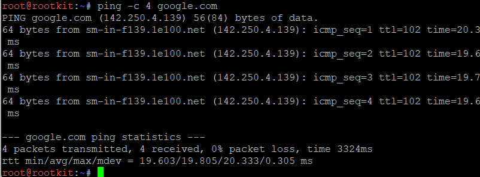

Berhasil terhubung ke internet, dibuktikan dengan berhasilnya ping ke 8.8.8.8 dari rootkit.

Setelah antarmuka WAN aktif, langkah selanjutnya adalah mengonfigurasi NAT agar seluruh alamat internal dapat menjangkau internet publik. Pertama, diaktifkan IP forwarding agar rootkit bersedia meneruskan paket antar interface:

```sh
echo 1 > /proc/sys/net/ipv4/ip_forward
```

Kemudian ditambahkan aturan NAT (masquerade) menggunakan iptables, agar paket yang keluar dari jaringan internal (192.214.0.0/16) melalui eth0 diterjemahkan menggunakan alamat IP WAN rootkit:

```sh
iptables -t nat -A POSTROUTING -o eth0 -s 192.214.0.0/16 -j MASQUERADE
```

Kedua command di atas dituliskan ke dalam script `/root/nat.sh` agar dapat dijalankan ulang setelah restart.

```sh
#!/bin/sh
echo 1 > /proc/sys/net/ipv4/ip_forward
iptables -t nat -C POSTROUTING -o eth0 -s 192.214.0.0/16 -j MASQUERADE 2>/dev/null || \
iptables -t nat -A POSTROUTING -o eth0 -s 192.214.0.0/16 -j MASQUERADE
```

Selanjutnya dilakukan tes dari salah satu client internal (prab) untuk melihat apakah host tersebut sudah dapat menjangkau internet publik menggunakan alamat IP.


Dari gambar di atas dapat dilihat bahwa prab berhasil melakukan ping ke 8.8.8.8, yang membuktikan bahwa NAT pada rootkit telah berhasil meneruskan lalu lintas dari jaringan internal menuju internet publik.

### 3 - Konfigurasi Routing Internal dan DNS Server

Jaringan rahasia tidak akan berfungsi tanpa sinkronisasi antar divisi. Pastikan seluruh Entitas dapat saling terhubung dan berkomunikasi lintas jalur (routing internal via rootkit berfungsi). Untuk menghindari fragmentasi saat persiapan, pastikan setiap host non-router menambahkan resolver 192.168.122.1 saat antarmukanya aktif agar akses untuk mengunduh paket instalasi dari internet tersedia sejak awal beroperasi.

Pada soal 2 sebelumnya, `ip_forward` sudah diaktifkan di rootkit sehingga routing antar segmen sudah berjalan secara otomatis, karena rootkit merupakan default gateway bagi seluruh segmen yang terhubung langsung padanya. Selanjutnya dilakukan tes komunikasi lintas segmen untuk membuktikan hal tersebut.

- alpha ke delta
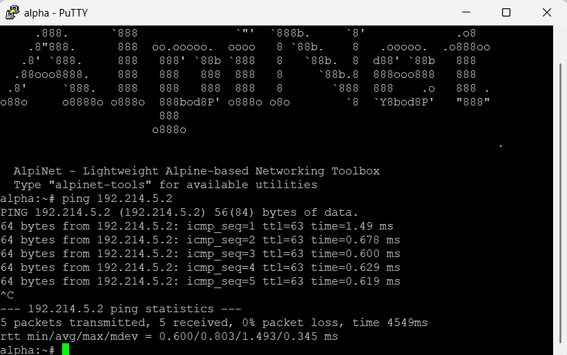

- abbey ke obladi
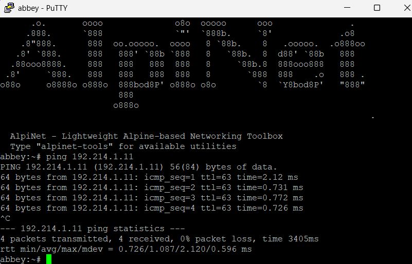

- epsilon ke penny


- gamma ke abbey
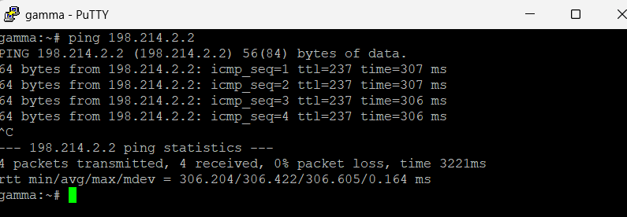

Dari hasil tes yang sudah dilakukan, terlihat bahwa komunikasi antar segmen berhasil dilakukan, yang membuktikan bahwa routing internal via rootkit telah berfungsi dengan baik untuk seluruh segmen jaringan.

Selanjutnya adalah pemasangan resolver awal untuk setiap host non-router. Agar resolver ini otomatis ditambahkan kembali setiap kali antarmuka jaringan host aktif (termasuk setelah restart), baris resolver dituliskan sebagai perintah `post-up` pada konfigurasi `/etc/network/interfaces` masing-masing host, bukan diedit langsung satu kali ke `/etc/resolv.conf`. Berikut contoh konfigurasi pada alpha:

```
auto eth0
iface eth0 inet static
    address 192.214.4.2
    netmask 255.255.255.0
    gateway 192.214.4.1
    echo "nameserver 192.168.122.1" > /etc/resolv.conf
```

Konfigurasi serupa diterapkan pada seluruh host non-router lainnya (`beta, gamma, delta, epsilon, abbey, penny, prab, tedd, obladi, desmond, oblada, molly`), menyesuaikan alamat IP dan gateway masing-masing.

Selanjutnya dilakukan tes untuk melihat apakah host tersebut sudah dapat menjangkau internet publik menggunakan alamat domain (google.com), yang membuktikan resolver telah berfungsi dengan benar.

- alpha
  

- delta
  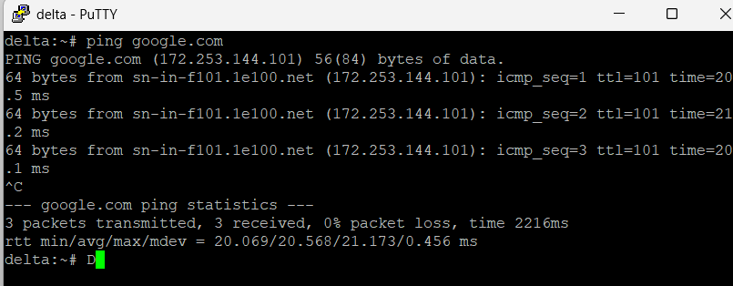

- abbey
  

- penny
  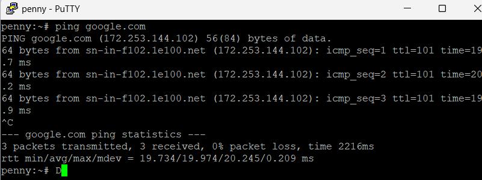

- prab
  

Dari hasil tes yang sudah dilakukan, terlihat bahwa seluruh host non-router yang diuji berhasil melakukan ping ke google.com. Hal ini membuktikan bahwa resolver 192.168.122.1 telah aktif dan berfungsi dengan benar pada setiap host, sehingga host-host tersebut dapat melakukan resolusi nama domain sekaligus menjangkau internet publik melalui NAT yang telah dikonfigurasi pada `rootkit`.

### 4 - DNS Authoritative (Master di prab, Slave di tedd)

Penjaga Direktori mulai menuliskan hukum The Mesh. Pada node prab, dibangun zona k06.com sebagai authoritative dengan SOA yang menunjuk ke prab.k06.com, catatan NS untuk prab.k06.com dan tedd.k06.com, A record untuk prab dan tedd yang mengarah ke IP masing-masing, serta A record apex k06.com yang mengarah ke gerbang aplikasi dinamis (penny). Diaktifkan fitur notify dan allow-transfer ke tedd, serta forwarders ke 192.168.122.1. Node tedd menarik zona dari master dan menjawab secara authoritative. Setelah itu urutan resolver pada seluruh host non-router diubah menjadi prab, tedd, lalu 192.168.122.1.

Di soal ini akan dibangun DNS authoritative untuk domain k06.com menggunakan BIND9 dengan node prab sebagai master dan tedd sebagai slave, agar The Mesh memiliki sistem resolusi nama internal sendiri yang tetap konsisten dan tersedia meskipun salah satu name server bermasalah.

Perlu dicatat bahwa image docker yang digunakan bersifat ephemeral: setiap kali node di-restart, seluruh paket yang diinstal lewat `apk` (termasuk BIND9 beserta binary `/usr/sbin/named`) dan konfigurasi di luar direktori persisten akan hilang. Karena image juga tidak menyertakan OpenRC (`rc-service` / `rc-update` tidak tersedia), seluruh instalasi dan konfigurasi tidak dijalankan manual sekali saja, melainkan dibungkus dalam script `/root/soal4.sh` yang dipanggil otomatis dari `post-up` pada `/etc/network/interfaces` saat node boot. Penjelasan mekanisme persistensi ada pada bagian akhir soal.

#### Konfigurasi di prab (Master)

BIND9 dipasang di prab karena node ini berperan sebagai name server utama (master) untuk zona k06.com, yang bertugas menyimpan dan menjawab query DNS secara authoritative.

Seluruh langkah (instalasi BIND9, penulisan `named.conf`, penulisan file zona, penetapan kepemilikan, dan start named) ditulis ke dalam script `/root/soal4.sh` berikut:

```sh
#!/bin/sh
# /root/soal4.sh - prab (DNS Master untuk zona k06.com)

# Berhenti kalau named sudah jalan (hindari install/start ganda)
pgrep -x named >/dev/null 2>&1 && exit 0

# Tunggu koneksi internet siap (NAT rootkit), karena apk butuh akses mirror.
i=0
while [ $i -lt 30 ]; do
    ping -c1 -W1 192.168.122.1 >/dev/null 2>&1 && break
    i=$((i+1))
    sleep 1
done

# 1. Install BIND9
apk update
apk add bind bind-tools

# 2. named.conf (options + zone master)
cat > /etc/bind/named.conf <<'EOF'
options {
    directory "/var/bind";

    forwarders {
        192.168.122.1;
    };

    allow-query { any; };
    auth-nxdomain no;
    listen-on { any; };
    listen-on-v6 { any; };
};

zone "k06.com" {
    type master;
    file "/etc/bind/zones/k06.com.db";
    notify yes;
    allow-transfer { 192.214.1.3; };
};
EOF

# 3. File zone
mkdir -p /etc/bind/zones
cat > /etc/bind/zones/k06.com.db <<'EOF'
$TTL    604800
@       IN      SOA     prab.k06.com. root.k06.com. (
                        2026100401 ; Serial
                        604800     ; Refresh
                        86400      ; Retry
                        2419200    ; Expire
                        604800 )   ; Negative Cache TTL

@               IN      NS      prab.k06.com.
@               IN      NS      tedd.k06.com.

prab            IN      A       192.214.1.2
tedd            IN      A       192.214.1.3

@               IN      A       192.214.3.2
EOF

# 4. Kepemilikan + start
chown -R named:named /etc/bind/zones
named -c /etc/bind/named.conf -u named
```

Penjelasan bagian penting:
- Block `options` mengatur `forwarders` ke `192.168.122.1` agar query untuk domain di luar zona k06.com (misalnya google.com) tetap dapat diteruskan ke resolver luar, bukan langsung gagal dijawab.
- Block `zone` mendefinisikan k06.com sebagai master dengan `notify yes` dan `allow-transfer` ke IP tedd (192.214.1.3) agar setiap perubahan zona langsung diberitahukan dan dapat ditarik oleh slave.
- File zona berisi record SOA (prab sebagai otoritas utama, email admin `root.k06.com.`), NS untuk prab dan tedd, A record prab (192.214.1.2) dan tedd (192.214.1.3), serta A record apex `@` (k06.com) yang mengarah ke 192.214.3.2 yaitu IP penny sebagai gerbang aplikasi dinamis.
- Pada Alpine, paket `bind` tidak menyediakan `/etc/bind/named.conf` utama dan tidak melakukan include otomatis seperti Debian, sehingga seluruh konfigurasi (options + zone) ditulis dalam satu file. named dijalankan langsung lewat binary-nya dengan `-c` (file konfigurasi) dan `-u named` (user proses).

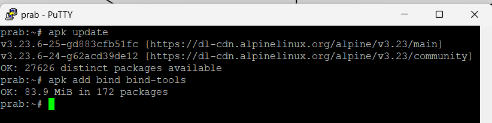

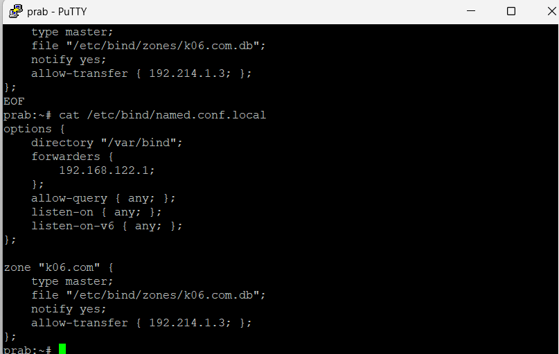


Agar script dipanggil otomatis saat node boot, ditambahkan baris `post-up` pada `/etc/network/interfaces` prab. Baris penulisan `/etc/resolv.conf` diletakkan lebih dahulu karena `apk` membutuhkan resolver aktif, dan script dijalankan dengan `nohup ... &` agar kebal SIGHUP serta tidak membuat proses boot (ifup) menggantung menunggu instalasi selesai:

```
auto eth0
iface eth0 inet static
    address 192.214.1.2
    netmask 255.255.255.0
    gateway 192.214.1.1
    post-up printf "nameserver 192.214.1.2\nnameserver 192.214.1.3\nnameserver 192.168.122.1\n" > /etc/resolv.conf
    post-up nohup sh /root/soal4.sh >/tmp/soal4.log 2>&1 &
```

##### Verifikasi Master

Verifikasi dilakukan dengan memastikan proses named berjalan, lalu melakukan query langsung ke server lokal (127.0.0.1) untuk apex domain dan hostname di dalam zona.

```bash
ps aux | grep [n]amed
dig @127.0.0.1 k06.com +short
dig @127.0.0.1 prab.k06.com +short
dig @127.0.0.1 tedd.k06.com +short
```

Hasil yang diharapkan:
- `k06.com` -> 192.214.3.2 (IP penny)
- `prab.k06.com` -> 192.214.1.2
- `tedd.k06.com` -> 192.214.1.3

Ketiga query dijawab dengan benar oleh prab, membuktikan zona k06.com aktif dan dijawab secara authoritative oleh master.


#### Konfigurasi di tedd (Slave)

tedd dikonfigurasi sebagai name server slave (secondary) yang menarik salinan zona k06.com dari master prab melalui zone transfer, sehingga tedd juga dapat menjawab query secara authoritative tanpa perlu mendefinisikan record zona secara manual. Isi `/root/soal4.sh` pada tedd sama polanya dengan prab, hanya berbeda pada block `zone`:

```sh
#!/bin/sh
# /root/soal4.sh - tedd (DNS Slave untuk zona k06.com)

pgrep -x named >/dev/null 2>&1 && exit 0

i=0
while [ $i -lt 30 ]; do
    ping -c1 -W1 192.168.122.1 >/dev/null 2>&1 && break
    i=$((i+1))
    sleep 1
done

# 1. Install BIND9
apk update
apk add bind bind-tools

# 2. named.conf (options + zone slave)
cat > /etc/bind/named.conf <<'EOF'
options {
    directory "/var/bind";

    forwarders {
        192.168.122.1;
    };

    allow-query { any; };
    auth-nxdomain no;
    listen-on { any; };
    listen-on-v6 { any; };
};

zone "k06.com" {
    type slave;
    masters { 192.214.1.2; };
    file "/var/bind/slave/k06.com.db";
};
EOF

# 3. Direktori slave (writable oleh named untuk salinan zona)
mkdir -p /var/bind/slave
chown -R named:named /var/bind/slave

# 4. Start
named -c /etc/bind/named.conf -u named
```

Penjelasan bagian penting:
- Pada block `zone`, tipe diubah menjadi `slave`, `masters { 192.214.1.2; }` menunjuk ke prab sebagai sumber zona, dan `file` diarahkan ke `/var/bind/slave/k06.com.db` sebagai lokasi salinan zona.
- Direktori `/var/bind/slave` harus dapat ditulis oleh user `named`, karena file zona dibuat dan diperbarui otomatis oleh BIND setiap kali zone transfer terjadi.

Baris `post-up` pada `/etc/network/interfaces` tedd sama polanya dengan prab:

```
auto eth0
iface eth0 inet static
    address 192.214.1.3
    netmask 255.255.255.0
    gateway 192.214.1.1
    post-up printf "nameserver 192.214.1.2\nnameserver 192.214.1.3\nnameserver 192.168.122.1\n" > /etc/resolv.conf
    post-up nohup sh /root/soal4.sh >/tmp/soal4.log 2>&1 &
```

##### Verifikasi Slave dan Zone Transfer

Keberhasilan zone transfer dibuktikan dengan munculnya file salinan zona di `/var/bind/slave/`, lalu tedd melakukan query lokal dan mengembalikan jawaban yang sama seperti master.

```bash
ps aux | grep [n]amed
ls -la /var/bind/slave/
dig @127.0.0.1 k06.com +short
dig @127.0.0.1 prab.k06.com +short
dig @127.0.0.1 tedd.k06.com +short
```

Hasil yang diharapkan:
- File `k06.com.db` muncul di `/var/bind/slave/` sebagai bukti zone transfer dari prab berhasil.
- Ketiga query mengembalikan IP yang sama seperti pada master (192.214.3.2, 192.214.1.2, 192.214.1.3), membuktikan tedd menjawab secara authoritative dari salinan zonanya sendiri.

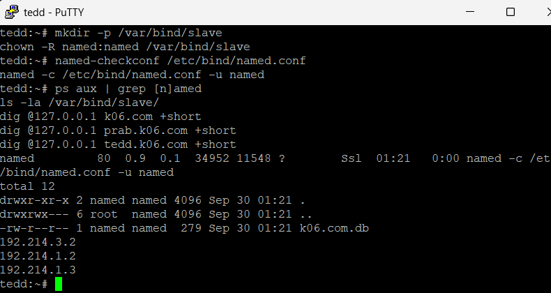

#### Penataan Ulang Resolver (Semua Host Non-Router)

Setelah DNS internal berdiri, urutan resolver pada seluruh host non-router (alpha, beta, gamma, delta, epsilon, abbey, penny, prab, tedd, obladi, desmond, oblada, molly) diperbarui menjadi prab, tedd, lalu 192.168.122.1. Tujuannya agar resolusi nama internal The Mesh diprioritaskan ke prab dan tedd terlebih dahulu, dan hanya diteruskan ke resolver luar (192.168.122.1) bila nama yang dicari berada di luar zona k06.com.

Karena resolver harus tetap aktif setiap kali antarmuka jaringan naik (termasuk setelah restart), penataan ini dituliskan sebagai perintah `post-up` pada `/etc/network/interfaces` masing-masing host, menggantikan baris resolver awal (192.168.122.1 tunggal) dari soal 3. Berikut contoh pada alpha:

```
auto eth0
iface eth0 inet static
    address 192.214.4.2
    netmask 255.255.255.0
    gateway 192.214.4.1
    post-up printf "nameserver 192.214.1.2\nnameserver 192.214.1.3\nnameserver 192.168.122.1\n" > /etc/resolv.conf
```

Perubahan serupa diterapkan pada seluruh host non-router lainnya (menyesuaikan alamat IP dan gateway masing-masing).

##### Verifikasi Akhir dari Klien

Verifikasi dilakukan dari dua klien berbeda (alpha dan delta) untuk memastikan query apex maupun hostname di dalam zona dijawab dengan benar melalui prab atau tedd, bukan lagi lewat resolver luar.

```bash
cat /etc/resolv.conf
dig k06.com +short
dig prab.k06.com +short
dig tedd.k06.com +short
```

Hasil yang diharapkan: resolver teratas adalah 192.214.1.2 (prab) dan 192.214.1.3 (tedd), serta seluruh query mengembalikan IP yang benar, membuktikan resolusi nama internal telah diprioritaskan ke DNS milik The Mesh.

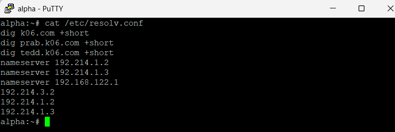

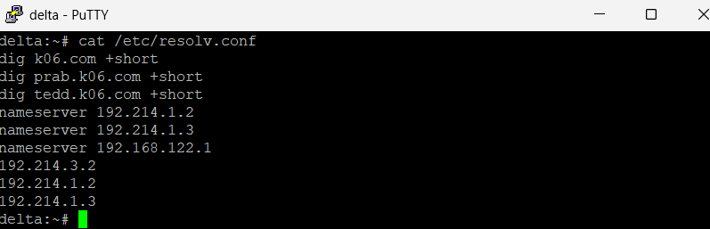

Hasil tes berhasil.

### 5 - Penamaan Hostname dan Domain per Node

"Entitas tanpa identitas adalah anomali," pesan Rootkit. Namai semua Entitas (hostname) sesuai glosarium: rootkit, alpha, beta, gamma, delta, epsilon, prab, tedd, abbey, penny, obladi, desmond, oblada, molly, dan verifikasi bahwa setiap host mengenali hostname tersebut secara system-wide. Buat setiap domain untuk masing-masing node sesuai dengan namanya (contoh: alpha.<xxxx>.com) dan assign IP masing-masing juga. Lakukan pengecualian untuk node yang bertanggung jawab atas prab dan tedd.

Pada soal ini dilakukan dua hal. Pertama, seluruh entitas (host) diberi nama (hostname) sesuai glosarium dan dipastikan dikenali secara system-wide. Kedua, dibuat domain untuk masing-masing node sesuai namanya (contoh: alpha.k06.com) dengan A record yang mengarah ke IP masing-masing pada zona k06.com. Node prab dan tedd dikecualikan dari pembuatan A record baru karena keduanya sudah didaftarkan pada soal 4.

Tujuannya agar setiap host tidak hanya dapat dihubungi melalui alamat IP, tetapi juga melalui nama domain yang lebih mudah diingat, dan setiap host mengenali identitas namanya sendiri secara konsisten di seluruh sistem.

#### 1 - Penamaan Hostname (Semua Node)

Setiap node diberi hostname sesuai glosarium: rootkit, alpha, beta, gamma, delta, epsilon, prab, tedd, abbey, penny, obladi, desmond, oblada, molly. Pada topologi GNS3, hostname sudah otomatis diset sesuai nama node (terlihat dari prompt shell, misalnya `alpha:~#`), sehingga setiap host telah mengenali namanya secara system-wide.

Verifikasi hostname pada salah satu node:

```bash
hostname
cat /etc/hostname
```

Hasil yang diharapkan: perintah `hostname` mengembalikan nama node yang benar (misalnya `alpha`), dan prompt shell menampilkan nama yang sama.

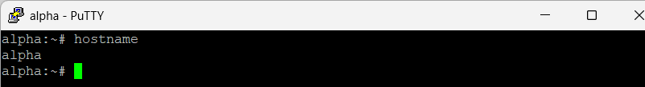
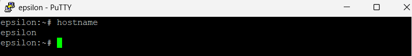

#### 2 - Menambahkan A Record per Node

Seluruh perubahan DNS dilakukan pada master (prab). Ditambahkan A record baru ke file zona k06.com yang memetakan tiap hostname ke IP statis yang telah ditetapkan pada soal 1. Node prab dan tedd tidak ditambahkan lagi karena sudah ada sejak soal 4. Node rootkit adalah router dengan banyak interface (192.214.1.1 hingga 192.214.5.1) sehingga tidak diberi satu A record tunggal.

A record ditambahkan ke akhir file zona `/etc/bind/zones/k06.com.db`:

```bash
cat >> /etc/bind/zones/k06.com.db <<'EOF'

alpha           IN      A       192.214.4.2
beta            IN      A       192.214.4.3
gamma           IN      A       192.214.4.4
delta           IN      A       192.214.5.2
epsilon         IN      A       192.214.5.3
abbey           IN      A       192.214.2.2
penny           IN      A       192.214.3.2
obladi          IN      A       192.214.1.11
desmond         IN      A       192.214.1.12
oblada          IN      A       192.214.1.21
molly           IN      A       192.214.1.22
EOF
```

#### 3 - Menaikkan Serial SOA

Agar slave (tedd) mendeteksi versi zona lebih baru dan menarik ulang salinannya, nilai serial SOA dinaikkan dari `2026100401` menjadi `2026100402`:

```bash
sed -i 's/2026100401 ; Serial/2026100402 ; Serial/' /etc/bind/zones/k06.com.db
```

#### 4 - Menerapkan Perubahan

File zona divalidasi terlebih dahulu, lalu named di-reload agar record baru aktif tanpa perlu mematikan proses:

```bash
chown named:named /etc/bind/zones/k06.com.db
named-checkzone k06.com /etc/bind/zones/k06.com.db
rndc reload k06.com
```

Hasil yang diharapkan: `named-checkzone` menampilkan `loaded serial 2026100402` dan `OK`.

#### 5 - Verifikasi

Verifikasi dari prab bahwa A record baru terjawab dengan benar:

```bash
dig @127.0.0.1 alpha.k06.com +short
dig @127.0.0.1 molly.k06.com +short
dig @127.0.0.1 abbey.k06.com +short
```

Hasil yang diharapkan: alpha -> 192.214.4.2, molly -> 192.214.1.22, abbey -> 192.214.2.2.

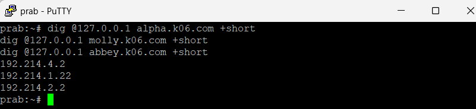

Karena serial dinaikkan dan `notify yes` aktif, tedd otomatis menarik salinan zona terbaru. Verifikasi zona di tedd sudah ikut terbarui:

```bash
dig @127.0.0.1 alpha.k06.com +short
dig @127.0.0.1 obladi.k06.com +short
```

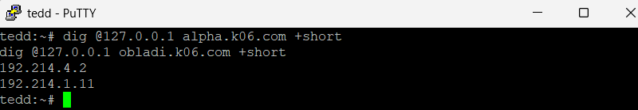

Terakhir, verifikasi dari salah satu klien dengan ping ke beberapa hostname pada segmen berbeda untuk membuktikan resolusi nama dan konektivitas berjalan benar di seluruh jaringan:

```bash
ping -c3 beta.k06.com
ping -c3 molly.k06.com
ping -c3 abbey.k06.com
```

Hasil yang diharapkan: setiap nama domain diterjemahkan ke IP yang benar (beta -> 192.214.4.3, molly -> 192.214.1.22, abbey -> 192.214.2.2) dan klien menerima balasan reply. Keberhasilan ping ke host di segmen berbeda (sayap kiri, area core, dan gerbang) membuktikan seluruh A record berfungsi dengan benar.

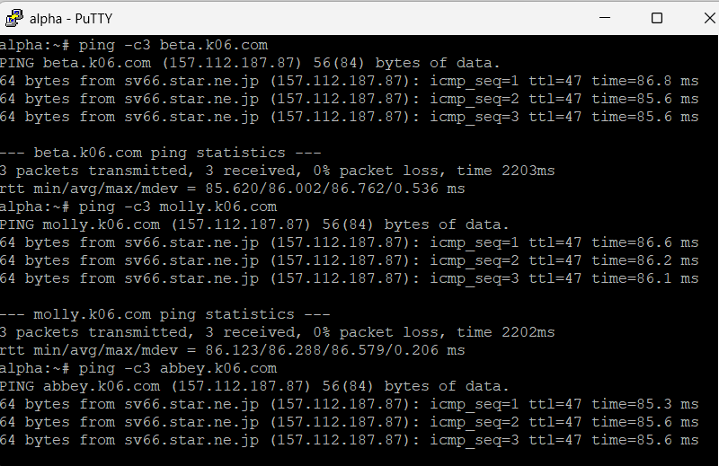

#### Persistensi

Karena file zona di-generate ulang oleh `/root/soal4.sh` setiap kali node prab boot, penambahan A record di atas akan hilang saat restart bila dilakukan manual. Oleh karena itu seluruh langkah 2 sampai 4 dibungkus dalam script terpisah `/root/soal5.sh`. Script ini menunggu `soal4.sh` selesai, lalu menambahkan A record per-node, menaikkan serial, dan me-reload named.

```sh
#!/bin/sh
# /root/soal5.sh 

ZONE=/etc/bind/zones/k06.com.db

# Tunggu soal4.sh selesai membuat file zona dan menjalankan named.
i=0
while [ $i -lt 90 ]; do
    if [ -f "$ZONE" ] && pgrep -x named >/dev/null 2>&1; then
        break
    fi
    i=$((i+1))
    sleep 1
done

# Idempoten: kalau record node sudah ada, tidak usah menambah lagi.
grep -q '^alpha' "$ZONE" && exit 0

# Tambahkan A record per-node (prab & tedd sudah ada dari soal4, tidak diulang).
cat >> "$ZONE" <<'EOF'

alpha           IN      A       192.214.4.2
beta            IN      A       192.214.4.3
gamma           IN      A       192.214.4.4
delta           IN      A       192.214.5.2
epsilon         IN      A       192.214.5.3
abbey           IN      A       192.214.2.2
penny           IN      A       192.214.3.2
obladi          IN      A       192.214.1.11
desmond         IN      A       192.214.1.12
oblada          IN      A       192.214.1.21
molly           IN      A       192.214.1.22
EOF

# Naikkan serial agar tedd (slave) menarik ulang salinan zona.
sed -i 's/2026100401 ; Serial/2026100402 ; Serial/' "$ZONE"

# Terapkan perubahan: reload lewat rndc, fallback restart named.
chown named:named "$ZONE"
rndc reload k06.com 2>/dev/null || { pkill named; named -c /etc/bind/named.conf -u named; }
```

Agar script dijalankan otomatis saat boot, ditambahkan baris `post-up` pada `/etc/network/interfaces` prab, setelah baris pemanggilan `soal4.sh`:

```
    post-up nohup sh /root/soal4.sh >/tmp/soal4.log 2>&1 &
    post-up nohup sh /root/soal5.sh >/tmp/soal5.log 2>&1 &
```

### 6 - Verifikasi Zone Transfer 

Pastikan zone transfer berjalan, pastikan tedd telah menerima salinan zona terbaru dari prab. Nilai serial SOA di keduanya harus sama karena keduanya tidak bisa dipisahkan dan saling melengkapi.

Pada soal ini dipastikan bahwa zone transfer antara master (prab) dan slave (tedd) berjalan dengan benar, yaitu tedd telah menerima salinan zona k06.com terbaru dari prab, dan nilai serial SOA pada keduanya identik. Serial yang sama menjadi bukti bahwa kedua name server memegang versi zona yang persis sama dan saling melengkapi.

Mekanisme zone transfer sendiri sudah dibangun pada soal 4 (`notify yes` dan `allow-transfer` ke tedd pada prab, serta `type slave` dengan `masters` menunjuk prab pada tedd), sehingga pada soal ini tidak ada konfigurasi baru yang ditambahkan; yang dilakukan adalah verifikasi bahwa sinkronisasi benar-benar terjadi.

#### 1 - Cek Serial SOA di prab (Master)

Serial SOA pada master diperiksa dengan query langsung ke prab:

```bash
dig @127.0.0.1 k06.com SOA +short
```

Hasil yang diharapkan: baris SOA menampilkan serial terbaru, yaitu `2026100402` (nilai setelah dinaikkan pada soal 5).


#### 2 - Cek Serial SOA di tedd (Slave)

Serial SOA pada slave diperiksa dengan cara yang sama di tedd:

```bash
dig @127.0.0.1 k06.com SOA +short
```

Hasil yang diharapkan: serial yang ditampilkan sama persis dengan di prab, yaitu `2026100402`, membuktikan tedd telah menarik versi zona terbaru.

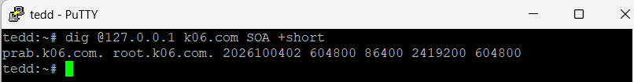

#### 3 - Bukti Salinan Zona di tedd

Keberhasilan zone transfer juga dibuktikan dengan keberadaan file salinan zona yang ditulis otomatis oleh BIND di direktori slave:

```bash
ls -la /var/bind/slave/
```

Hasil yang diharapkan: file `k06.com.db` ada di `/var/bind/slave/`, yang berarti tedd berhasil menerima dan menyimpan salinan zona dari prab.

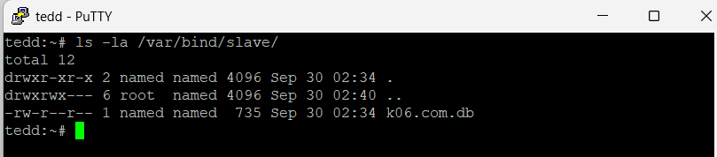

#### 4 - Verifikasi Konsistensi Record

Untuk memastikan isi zona  konsisten, beberapa record di-query dari kedua name server dan hasilnya dibandingkan:

```bash
# dari prab
dig @192.214.1.2 alpha.k06.com +short
dig @192.214.1.2 molly.k06.com +short

# dari tedd
dig @192.214.1.3 alpha.k06.com +short
dig @192.214.1.3 molly.k06.com +short
```

Hasil yang diharapkan: kedua name server mengembalikan IP yang identik untuk setiap record (alpha -> 192.214.4.2, molly -> 192.214.1.22), membuktikan prab dan tedd memegang zona yang benar-benar sama dan menjawab secara authoritative.

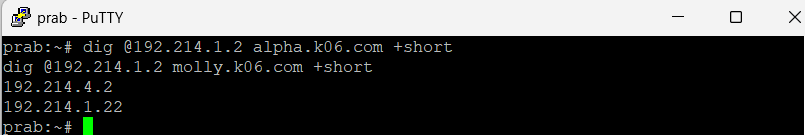


Hasil tes identik.

### 7 - A Record vault/core dan CNAME www/static

abbey dan penny sebagai gerbang utama, obladi dan desmond sebagai web statis, oblada dan molly sebagai web dinamis. Tambahkan pada zona <xxxx>.com A record untuk vault.<xxxx>.com (IP obladi & desmond), dan core.<xxxx>.com (IP oblada & molly). Tetapkan CNAME:

- www.<xxxx>.com → penny.<xxxx>.com
- static.<xxxx>.com → abbey.<xxxx>.com
  
Verifikasi dari dua klien berbeda bahwa seluruh hostname tersebut ter-resolve ke tujuan yang benar dan konsisten.


Pada soal ini ditambahkan record DNS untuk mengelompokkan layanan sesuai perannya: abbey dan penny sebagai gerbang utama, obladi dan desmond sebagai web statis (area vault), serta oblada dan molly sebagai web dinamis (area core). Ditambahkan A record untuk `vault.k06.com` (mengarah ke IP obladi dan desmond) dan `core.k06.com` (mengarah ke IP oblada dan molly), serta dua CNAME: `www.k06.com` menuju penny.k06.com dan `static.k06.com` menuju abbey.k06.com.

Tujuannya agar layanan dapat diakses lewat nama kanonik yang merepresentasikan fungsinya (vault untuk arsip statis, core untuk aplikasi dinamis, www dan static sebagai pintu masuk publik). Karena vault dan core masing-masing memiliki dua A record, DNS akan menjawab keduanya sehingga permintaan dapat tersebar antar node dalam satu area.

Seluruh perubahan dilakukan pada master (prab), lalu tedd menariknya otomatis lewat zone transfer.

#### 1 - Menambahkan A Record vault dan core (di prab)

Ditambahkan A record ke file zona `/etc/bind/zones/k06.com.db`. `vault.k06.com` diarahkan ke dua IP (obladi 192.214.1.11 dan desmond 192.214.1.12), dan `core.k06.com` ke dua IP (oblada 192.214.1.21 dan molly 192.214.1.22):

```bash
cat >> /etc/bind/zones/k06.com.db <<'EOF'

vault           IN      A       192.214.1.11
vault           IN      A       192.214.1.12
core            IN      A       192.214.1.21
core            IN      A       192.214.1.22
EOF
```

#### 2 - Menambahkan CNAME www dan static

Ditambahkan dua CNAME. `www` menunjuk ke penny.k06.com (gerbang aplikasi dinamis) dan `static` menunjuk ke abbey.k06.com (gerbang web statis):

```bash
cat >> /etc/bind/zones/k06.com.db <<'EOF'
www             IN      CNAME   penny.k06.com.
static          IN      CNAME   abbey.k06.com.
EOF
```

Catatan: target CNAME ditulis dengan tanda titik di akhir (FQDN) agar tidak ditambahi nama zona secara otomatis.

#### 3 - Menaikkan Serial SOA dan Menerapkan Perubahan

Serial SOA diset ke nilai baru agar tedd menarik ulang zona, lalu file zona divalidasi dan named di-reload. Serial memakai konvensi 2 digit terakhir sesuai nomor soal (soal 7 -> `2026100407`) agar setiap soal punya serial unik dan selalu naik tanpa bergantung pada nilai serial soal sebelumnya:

```bash
sed -i 's/[0-9]\{10\} ; Serial/2026100407 ; Serial/' /etc/bind/zones/k06.com.db
chown named:named /etc/bind/zones/k06.com.db
named-checkzone k06.com /etc/bind/zones/k06.com.db
rndc reload k06.com
```

Hasil yang diharapkan: `named-checkzone` menampilkan `loaded serial 2026100407` dan `OK`.

[SS hasil named-checkzone (loaded serial 2026100407) di prab]

#### 4 - Verifikasi dari Dua Klien Berbeda

Verifikasi dilakukan dari dua klien berbeda untuk memastikan seluruh nama ter-resolve ke tujuan yang benar dan konsisten.

```bash
dig vault.k06.com +short
dig core.k06.com +short
dig www.k06.com +short
dig static.k06.com +short
```

Hasil yang diharapkan:
- `vault.k06.com` -> 192.214.1.11 dan 192.214.1.12 (dua IP)
- `core.k06.com` -> 192.214.1.21 dan 192.214.1.22 (dua IP)
- `www.k06.com` -> penny.k06.com lalu 192.214.3.2 (CNAME diikuti A record penny)
- `static.k06.com` -> abbey.k06.com lalu 192.214.2.2 (CNAME diikuti A record abbey)

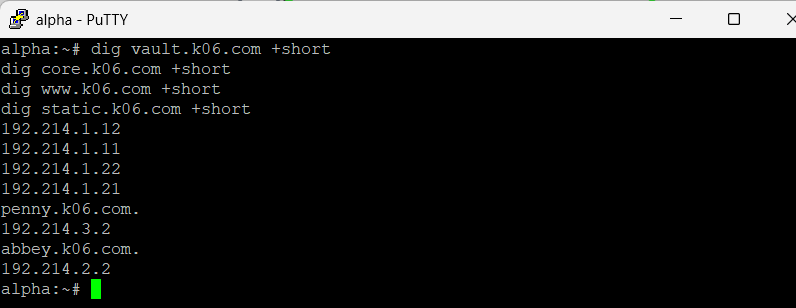


Hasil dari kedua klien  identik yang membuktikan resolusi konsisten di seluruh jaringan.

#### Persistensi

Sama seperti soal 5, penambahan record ini akan hilang saat prab restart karena file zona di-generate ulang oleh `/root/soal4.sh`. Oleh karena itu langkah 1 sampai 3 dibungkus dalam script `/root/soal7.sh` yang menunggu record soal 5 sudah terpasang, lalu menambahkan record vault/core dan CNAME, menetapkan serial, dan me-reload named.

```sh
#!/bin/sh
# /root/soal7.sh - prab

ZONE=/etc/bind/zones/k06.com.db

# Tunggu record soal5 (alpha) sudah terpasang agar urutan record konsisten.
i=0
while [ $i -lt 120 ]; do
    if [ -f "$ZONE" ] && grep -q '^alpha' "$ZONE" && pgrep -x named >/dev/null 2>&1; then
        break
    fi
    i=$((i+1))
    sleep 1
done

# Idempoten: kalau record vault sudah ada, tidak usah menambah lagi.
grep -q '^vault' "$ZONE" && exit 0

# Tambahkan A record vault/core dan CNAME www/static.
cat >> "$ZONE" <<'EOF'

vault           IN      A       192.214.1.11
vault           IN      A       192.214.1.12
core            IN      A       192.214.1.21
core            IN      A       192.214.1.22
www             IN      CNAME   penny.k06.com.
static          IN      CNAME   abbey.k06.com.
EOF

# Set serial absolut untuk soal 7 (selalu lebih besar dari soal sebelumnya).
sed -i 's/[0-9]\{10\} ; Serial/2026100407 ; Serial/' "$ZONE"

# Terapkan perubahan.
chown named:named "$ZONE"
rndc reload k06.com 2>/dev/null || { pkill named; named -c /etc/bind/named.conf -u named; }
```

Baris `post-up` pada `/etc/network/interfaces` prab ditambahkan setelah pemanggilan `soal5.sh`:

```
    post-up nohup sh /root/soal4.sh >/tmp/soal4.log 2>&1 &
    post-up nohup sh /root/soal5.sh >/tmp/soal5.log 2>&1 &
    post-up nohup sh /root/soal7.sh >/tmp/soal7.log 2>&1 &
```

### 8 - Reverse Zone dan PTR Record

Di prab (ns1) deklarasikan reverse zone untuk segmen jaringan  tempat abbey, penny, area vault, dan area core berada. Di tedd (ns2) tarik reverse zone tersebut sebagai slave, isi PTR untuk keempat hostname itu agar pencarian balik IP address mengembalikan hostname yang benar, lalu pastikan query reverse untuk alamat abbey, penny, area vault, dan area core dijawab authoritative.

Pada soal ini dibuat reverse zone (pencarian balik: dari IP address ke hostname) untuk segmen jaringan tempat abbey, penny, area vault (obladi, desmond), dan area core (oblada, molly) berada. prab (ns1) menjadi master reverse zone, dan tedd (ns2) menariknya sebagai slave. Diisi PTR record untuk keempat kelompok host tersebut agar query reverse mengembalikan hostname yang benar, dan dijawab secara authoritative oleh kedua name server.

Tujuannya agar tidak hanya pencarian maju (hostname -> IP) yang berfungsi, tetapi juga pencarian balik (IP -> hostname), yang penting untuk logging, verifikasi identitas server, dan validasi lalu lintas.

#### Pembagian Reverse Zone

Keempat kelompok host berada di tiga segmen /24 yang berbeda, sehingga diperlukan tiga reverse zone (satu per segmen /24), karena reverse DNS di BIND dideklarasikan per /24:

| Host | IP | Segmen /24 | Reverse zone |
|---|---|---|---|
| obladi, desmond (vault) | 192.214.1.11, .12 | 192.214.1.0 | 1.214.192.in-addr.arpa |
| oblada, molly (core) | 192.214.1.21, .22 | 192.214.1.0 | 1.214.192.in-addr.arpa |
| abbey | 192.214.2.2 | 192.214.2.0 | 2.214.192.in-addr.arpa |
| penny | 192.214.3.2 | 192.214.3.0 | 3.214.192.in-addr.arpa |

Catatan: prab dan tedd sendiri (192.214.1.2 dan .3) juga berada di segmen 192.214.1.0, sehingga bisa sekalian diberi PTR pada reverse zone segmen 1; namun sesuai fokus soal, PTR wajib diisi untuk abbey, penny, vault, dan core.

#### 1 - Deklarasi Reverse Zone di prab (Master)

Ditambahkan tiga blok zone reverse ke `/etc/bind/named.conf` prab, masing-masing bertipe master dengan notify dan allow-transfer ke tedd (192.214.1.3):

```bash
cat >> /etc/bind/named.conf <<'EOF'

zone "1.214.192.in-addr.arpa" {
    type master;
    file "/etc/bind/zones/db.192.214.1";
    notify yes;
    allow-transfer { 192.214.1.3; };
};

zone "2.214.192.in-addr.arpa" {
    type master;
    file "/etc/bind/zones/db.192.214.2";
    notify yes;
    allow-transfer { 192.214.1.3; };
};

zone "3.214.192.in-addr.arpa" {
    type master;
    file "/etc/bind/zones/db.192.214.3";
    notify yes;
    allow-transfer { 192.214.1.3; };
};
EOF
```

#### 2 - Membuat File Reverse Zone / PTR (di prab)

File PTR hanya dibuat di master, tedd tidak menulis PTR manual melainkan menarik salinannya otomatis dari prab. Reverse zone segmen 1 (vault dan core) berisi PTR untuk obladi, desmond, oblada, molly. Angka paling depan pada nama PTR adalah oktet terakhir IP (misalnya 11 untuk 192.214.1.11):

```bash
cat > /etc/bind/zones/db.192.214.1 <<'EOF'
$TTL    604800
@       IN      SOA     prab.k06.com. root.k06.com. (
                        2026100408 ; Serial
                        604800     ; Refresh
                        86400      ; Retry
                        2419200    ; Expire
                        604800 )   ; Negative Cache TTL

@       IN      NS      prab.k06.com.
@       IN      NS      tedd.k06.com.

11      IN      PTR     obladi.k06.com.
12      IN      PTR     desmond.k06.com.
21      IN      PTR     oblada.k06.com.
22      IN      PTR     molly.k06.com.
EOF
```

Reverse zone segmen 2 (abbey):

```bash
cat > /etc/bind/zones/db.192.214.2 <<'EOF'
$TTL    604800
@       IN      SOA     prab.k06.com. root.k06.com. (
                        2026100408 ; Serial
                        604800     ; Refresh
                        86400      ; Retry
                        2419200    ; Expire
                        604800 )   ; Negative Cache TTL

@       IN      NS      prab.k06.com.
@       IN      NS      tedd.k06.com.

2       IN      PTR     abbey.k06.com.
EOF
```

Reverse zone segmen 3 (penny):

```bash
cat > /etc/bind/zones/db.192.214.3 <<'EOF'
$TTL    604800
@       IN      SOA     prab.k06.com. root.k06.com. (
                        2026100408 ; Serial
                        604800     ; Refresh
                        86400      ; Retry
                        2419200    ; Expire
                        604800 )   ; Negative Cache TTL

@       IN      NS      prab.k06.com.
@       IN      NS      tedd.k06.com.

2       IN      PTR     penny.k06.com.
EOF
```

#### 3 - Validasi dan Menerapkan Perubahan

Setiap file reverse zone divalidasi, lalu named di-reload:

```bash
chown -R named:named /etc/bind/zones
named-checkconf /etc/bind/named.conf
named-checkzone 1.214.192.in-addr.arpa /etc/bind/zones/db.192.214.1
named-checkzone 2.214.192.in-addr.arpa /etc/bind/zones/db.192.214.2
named-checkzone 3.214.192.in-addr.arpa /etc/bind/zones/db.192.214.3
rndc reload
```

Hasil yang diharapkan: `named-checkconf` bersih (tanpa output error) dan ketiga `named-checkzone` menampilkan `loaded serial 2026100408` dan `OK`.


#### 4 - Konfigurasi Slave di tedd

Di tedd ditambahkan tiga blok zone reverse bertipe slave yang menarik dari prab (192.214.1.2), dengan file disimpan di direktori slave:

```bash
cat >> /etc/bind/named.conf <<'EOF'

zone "1.214.192.in-addr.arpa" {
    type slave;
    masters { 192.214.1.2; };
    file "/var/bind/slave/db.192.214.1";
};

zone "2.214.192.in-addr.arpa" {
    type slave;
    masters { 192.214.1.2; };
    file "/var/bind/slave/db.192.214.2";
};

zone "3.214.192.in-addr.arpa" {
    type slave;
    masters { 192.214.1.2; };
    file "/var/bind/slave/db.192.214.3";
};
EOF

named-checkconf /etc/bind/named.conf
rndc reload
```

#### 5 - Verifikasi

Query reverse (pencarian balik IP ke hostname) dilakukan dari salah satu klien menggunakan `host -t ptr` untuk memastikan keempat kelompok host mengembalikan hostname yang benar.

```bash
host -t ptr 192.214.2.2
host -t ptr 192.214.3.2
host -t ptr 192.214.1.11
host -t ptr 192.214.1.12
host -t ptr 192.214.1.21
host -t ptr 192.214.1.22
```

Hasil yang diharapkan:
- 192.214.2.2 -> abbey.k06.com.
- 192.214.3.2 -> penny.k06.com.
- 192.214.1.11 -> obladi.k06.com.
- 192.214.1.12 -> desmond.k06.com.
- 192.214.1.21 -> oblada.k06.com.
- 192.214.1.22 -> molly.k06.com.


Untuk membuktikan bahwa kedua name server menjawab secara authoritative (bukan hanya prab), query reverse yang sama dapat diarahkan langsung ke prab (ns1) dan tedd (ns2) dengan `dig -x`, dan hasilnya harus identik:

```bash
# prab 
dig -x 192.214.2.2 @192.214.1.2 +short
dig -x 192.214.1.11 @192.214.1.2 +short

# tedd 
dig -x 192.214.2.2 @192.214.1.3 +short
dig -x 192.214.1.11 @192.214.1.3 +short
```

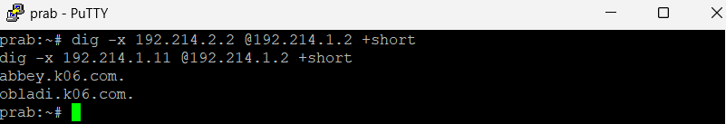

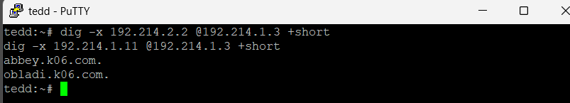

#### Persistensi

Karena `/etc/bind/named.conf` dan file zona di-generate ulang oleh `/root/soal4.sh` setiap kali node boot, blok reverse zone di atas akan hilang saat restart. Oleh karena itu langkah reverse zone dibungkus dalam script terpisah yakni `/root/soal8.sh` di prab dan `/root/soal8.sh` di tedd.

Script prab menunggu named siap, lalu menambahkan tiga blok zone reverse ke named.conf, menulis ketiga file PTR, dan me-reload named:

```sh
#!/bin/sh
# /root/soal8.sh

CONF=/etc/bind/named.conf

# Tunggu named siap (soal4 sudah jalan).
i=0
while [ $i -lt 120 ]; do
    pgrep -x named >/dev/null 2>&1 && [ -f "$CONF" ] && break
    i=$((i+1))
    sleep 1
done

# Idempoten: kalau reverse zone sudah ada di named.conf, berhenti.
grep -q 'in-addr.arpa' "$CONF" && exit 0

# Tambahkan deklarasi tiga reverse zone (master).
cat >> "$CONF" <<'EOF'

zone "1.214.192.in-addr.arpa" {
    type master;
    file "/etc/bind/zones/db.192.214.1";
    notify yes;
    allow-transfer { 192.214.1.3; };
};

zone "2.214.192.in-addr.arpa" {
    type master;
    file "/etc/bind/zones/db.192.214.2";
    notify yes;
    allow-transfer { 192.214.1.3; };
};

zone "3.214.192.in-addr.arpa" {
    type master;
    file "/etc/bind/zones/db.192.214.3";
    notify yes;
    allow-transfer { 192.214.1.3; };
};
EOF

# File PTR segmen 1 (vault + core).
cat > /etc/bind/zones/db.192.214.1 <<'EOF'
$TTL    604800
@       IN      SOA     prab.k06.com. root.k06.com. (
                        2026100408 ; Serial
                        604800     ; Refresh
                        86400      ; Retry
                        2419200    ; Expire
                        604800 )   ; Negative Cache TTL

@       IN      NS      prab.k06.com.
@       IN      NS      tedd.k06.com.

11      IN      PTR     obladi.k06.com.
12      IN      PTR     desmond.k06.com.
21      IN      PTR     oblada.k06.com.
22      IN      PTR     molly.k06.com.
EOF

# File PTR segmen 2 (abbey).
cat > /etc/bind/zones/db.192.214.2 <<'EOF'
$TTL    604800
@       IN      SOA     prab.k06.com. root.k06.com. (
                        2026100408 ; Serial
                        604800     ; Refresh
                        86400      ; Retry
                        2419200    ; Expire
                        604800 )   ; Negative Cache TTL

@       IN      NS      prab.k06.com.
@       IN      NS      tedd.k06.com.

2       IN      PTR     abbey.k06.com.
EOF

# File PTR segmen 3 (penny).
cat > /etc/bind/zones/db.192.214.3 <<'EOF'
$TTL    604800
@       IN      SOA     prab.k06.com. root.k06.com. (
                        2026100408 ; Serial
                        604800     ; Refresh
                        86400      ; Retry
                        2419200    ; Expire
                        604800 )   ; Negative Cache TTL

@       IN      NS      prab.k06.com.
@       IN      NS      tedd.k06.com.

2       IN      PTR     penny.k06.com.
EOF

chown -R named:named /etc/bind/zones
rndc reload 2>/dev/null || { pkill named; named -c /etc/bind/named.conf -u named; }
```

Script tedd menambahkan tiga blok reverse zone slave, lalu me-reload named:

```sh
#!/bin/sh
# /root/soal8.sh

CONF=/etc/bind/named.conf

i=0
while [ $i -lt 120 ]; do
    pgrep -x named >/dev/null 2>&1 && [ -f "$CONF" ] && break
    i=$((i+1))
    sleep 1
done

grep -q 'in-addr.arpa' "$CONF" && exit 0

cat >> "$CONF" <<'EOF'

zone "1.214.192.in-addr.arpa" {
    type slave;
    masters { 192.214.1.2; };
    file "/var/bind/slave/db.192.214.1";
};

zone "2.214.192.in-addr.arpa" {
    type slave;
    masters { 192.214.1.2; };
    file "/var/bind/slave/db.192.214.2";
};

zone "3.214.192.in-addr.arpa" {
    type slave;
    masters { 192.214.1.2; };
    file "/var/bind/slave/db.192.214.3";
};
EOF

rndc reload 2>/dev/null || { pkill named; named -c /etc/bind/named.conf -u named; }
```

Penjelasan bagian penting:
- Guard `grep -q 'in-addr.arpa'` membuat kedua script idempoten (blok reverse zone hanya ditambahkan bila belum ada).
- Loop `while` memastikan reverse zone ditambahkan setelah named dari soal4 berjalan.
- Reverse zone slave di tedd tidak berisi PTR manual; file di `/var/bind/slave/` diisi otomatis oleh BIND saat menarik dari prab.

Baris `post-up` ditambahkan pada `/etc/network/interfaces` masing-masing node setelah pemanggilan script soal sebelumnya:

```
# prab
    post-up nohup sh /root/soal8.sh >/tmp/soal8.log 2>&1 &

# tedd
    post-up nohup sh /root/soal8.sh >/tmp/soal8.log 2>&1 &
```

### 9 - Web Statis dengan Autoindex (Area Vault)

Pada soal ini dijalankan layanan web statis pada node area vault, yaitu `obladi` dan `desmond`, menggunakan Apache. Server menyajikan isi direktori `/arsip/` dengan fitur autoindex (directory listing) aktif, sehingga seluruh daftar file di dalamnya dapat ditelusuri langsung dari browser. Akses pengujian dilakukan melalui hostname (`obladi.k06.com` dan `desmond.k06.com`), bukan melalui alamat IP.

Tujuannya agar area vault berfungsi sebagai repositori arsip statis yang dapat dijelajahi isinya tanpa perlu halaman indeks manual, cukup mengandalkan directory listing bawaan Apache.

Konfigurasi berikut dijalankan pada kedua node vault (`obladi` dan `desmond`) dengan langkah yang sama. Perbedaan utama terdapat pada `ServerName` yang disesuaikan dengan hostname masing-masing node.

#### 1 - Instal Apache

Pada Alpine, web server Apache disediakan oleh paket `apache2`, sedangkan binary yang digunakan untuk menjalankan Apache bernama `httpd`.

```bash
# dijalankan di obladi dan desmond
apk update
apk add apache2
```

Setelah instalasi, keberadaan Apache dapat diperiksa menggunakan:

```bash
# dijalankan di obladi dan desmond
apk info -e apache2
httpd -v
```


#### 2 - Membuat Direktori Arsip dan Isi Contoh

Dijalankan di node `obladi` dan `desmond`. Dibuat direktori `/arsip/` sebagai folder yang akan ditampilkan oleh Apache, lalu diisi beberapa file contoh agar directory listing memiliki isi untuk ditelusuri.

```bash
# dijalankan di obladi dan desmond
mkdir -p /arsip

echo "Arsip rahasia The Mesh - node vault" > /arsip/readme.txt
echo "data operasi 001" > /arsip/operasi-001.txt
echo "data operasi 002" > /arsip/operasi-002.txt
```

Isi direktori kemudian dapat diperiksa menggunakan:

```bash
# dijalankan di obladi dan desmond
ls -la /arsip
```

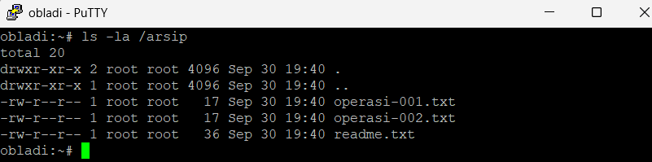


#### 3 - Konfigurasi Virtual Host

Dibuat file konfigurasi virtual host yang mengarahkan `DocumentRoot` ke `/arsip` dan mengaktifkan `Options +Indexes` untuk mengizinkan directory listing. `ServerName` diisi hostname masing-masing node agar akses berbasis nama dapat dikenali.

Pada `obladi`, konfigurasi dibuat sebagai berikut:

```bash
# dijalankan di obladi
cat > /etc/apache2/conf.d/vault.conf <<'EOF'
<VirtualHost *:80>
    ServerName obladi.k06.com
    DocumentRoot /arsip

    <Directory /arsip>
        Options +Indexes
        AllowOverride None
        Require all granted
    </Directory>

    ErrorLog /var/log/apache2/error.log
    CustomLog /var/log/apache2/access.log combined
</VirtualHost>
EOF
```

Sedangkan pada `desmond`, konfigurasi yang digunakan sama, tetapi `ServerName` disesuaikan menjadi `desmond.k06.com`:

```bash
# dijalankan di desmond
cat > /etc/apache2/conf.d/vault.conf <<'EOF'
<VirtualHost *:80>
    ServerName desmond.k06.com
    DocumentRoot /arsip

    <Directory /arsip>
        Options +Indexes
        AllowOverride None
        Require all granted
    </Directory>

    ErrorLog /var/log/apache2/error.log
    CustomLog /var/log/apache2/access.log combined
</VirtualHost>
EOF
```

Konfigurasi yang telah dibuat dapat diperiksa menggunakan:

```bash
# dijalankan di obladi dan desmond
cat /etc/apache2/conf.d/vault.conf
```

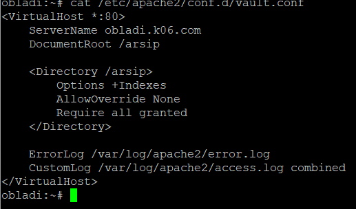


#### 4 - Menjalankan Apache

Karena image Alpine yang digunakan tidak menyertakan OpenRC, Apache dijalankan langsung menggunakan binary `httpd`.

Sebelum dijalankan, konfigurasi divalidasi terlebih dahulu:

```bash
# dijalankan di obladi dan desmond
httpd -t
```

Jika konfigurasi benar, Apache akan mengembalikan:

```text
Syntax OK
```


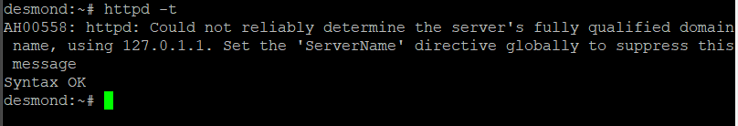

Setelah konfigurasi berhasil divalidasi, Apache dijalankan:

```bash
# dijalankan di obladi dan desmond
httpd
```

Untuk memastikan Apache telah berjalan dan mendengarkan pada port 80, dilakukan pemeriksaan proses dan port:

```bash
# dijalankan di obladi dan desmond
ps aux | grep [h]ttpd
netstat -tulnp | grep :80
```


#### 5 - Verifikasi

Verifikasi dilakukan dari salah satu klien, misalnya `alpha`, menggunakan `curl` ke hostname dan bukan alamat IP. Pengujian dilakukan pada kedua node vault:

```bash
# dijalankan di client
curl http://obladi.k06.com
curl http://desmond.k06.com
```

Hasil yang diharapkan adalah `curl` mengembalikan halaman HTML autoindex bawaan Apache dengan judul `Index of /` yang memuat daftar file `readme.txt`, `operasi-001.txt`, dan `operasi-002.txt`.


Hasil tersebut menunjukkan bahwa layanan web statis telah berjalan, directory listing aktif, dan masing-masing node dapat diakses melalui hostname yang telah ditentukan.

#### Persistensi

Karena image AlpiNet tidak menggunakan OpenRC, mekanisme startup yang digunakan adalah `/root/init.sh`. File `/root/init.sh` dipanggil oleh `/etc/alpinet-init.sh` ketika node dimulai.

Pada masing-masing node vault dibuat script `/root/soal9.sh`. Script ini menunggu koneksi jaringan siap, memastikan Apache terpasang, menyiapkan direktori arsip dan konfigurasi virtual host, kemudian menjalankan Apache.

Pada `obladi`, isi `/root/soal9.sh` adalah:

```sh
#!/bin/sh
# /root/soal9.sh - obladi (web statis vault)

# Tunggu koneksi internet untuk apk
i=0
while [ $i -lt 30 ]; do
    ping -c1 -W1 192.168.122.1 >/dev/null 2>&1 && break
    i=$((i + 1))
    sleep 1
done

# Install Apache jika belum terpasang
if ! apk info -e apache2 >/dev/null 2>&1; then
    apk update
    apk add apache2
fi

# Pastikan direktori tersedia
mkdir -p /etc/apache2/conf.d
mkdir -p /var/log/apache2
mkdir -p /arsip

# Buat file arsip jika belum ada
if [ ! -f /arsip/readme.txt ]; then
    echo "Arsip rahasia The Mesh - node vault" > /arsip/readme.txt
    echo "data operasi 001" > /arsip/operasi-001.txt
    echo "data operasi 002" > /arsip/operasi-002.txt
fi

# Konfigurasi Virtual Host
cat > /etc/apache2/conf.d/vault.conf <<'APACHE'
<VirtualHost *:80>
    ServerName obladi.k06.com
    DocumentRoot /arsip

    <Directory /arsip>
        Options +Indexes
        AllowOverride None
        Require all granted
    </Directory>

    ErrorLog /var/log/apache2/error.log
    CustomLog /var/log/apache2/access.log combined
</VirtualHost>
APACHE

# Jika Apache masih berjalan, hentikan terlebih dahulu
pkill -x httpd 2>/dev/null

# Tunggu sampai port 80 kosong
j=0
while [ $j -lt 10 ]; do
    netstat -tulnp 2>/dev/null | grep -q ':80 ' || break
    pkill -x httpd 2>/dev/null
    j=$((j + 1))
    sleep 1
done

# Validasi konfigurasi Apache
httpd -t || exit 1

# Jalankan Apache
httpd
```

Pada `desmond`, isi `/root/soal9.sh` sama dengan `obladi`, tetapi `ServerName` pada konfigurasi Apache diganti menjadi `desmond.k06.com`.

Script startup `/root/init.sh` pada masing-masing node adalah:

```sh
#!/bin/sh

nohup /root/soal9.sh >/tmp/soal9.log 2>&1 &
```

Kemudian kedua file dibuat executable:

```bash
# dijalankan di obladi dan desmond
chmod +x /root/init.sh
chmod +x /root/soal9.sh
```

[SS - hasil `ls -l /root/init.sh /root/soal9.sh` yang menunjukkan kedua script memiliki permission executable]

Untuk memastikan mekanisme persistensi berjalan setelah node di-restart, node dapat di-restart terlebih dahulu kemudian dilakukan pemeriksaan:

```bash
# dijalankan di obladi dan desmond setelah restart
ps aux | grep [h]ttpd
netstat -tulnp | grep :80
```

[SS - hasil pemeriksaan setelah restart yang menunjukkan proses Apache berjalan dan port 80 kembali listening]

Kemudian akses hostname diuji kembali dari klien:

```bash
# dijalankan di klien setelah restart node
curl http://obladi.k06.com
curl http://desmond.k06.com
```

[SS - hasil `curl` setelah restart yang menunjukkan halaman autoindex tetap dapat diakses]

Dengan konfigurasi tersebut, `/root/init.sh` akan menjalankan `/root/soal9.sh` ketika node dimulai. Script kemudian memastikan Apache, direktori `/arsip/`, file arsip, dan konfigurasi virtual host tersedia sebelum menjalankan web server.

### 10 - Web Dinamis PHP-FPM + Nginx (Area Core)

Jalankan layanan web dinamis (PHP-FPM) pada hostname di node core (menggunakan nginx). Buat sebuah aplikasi sederhana yang memuat halaman beranda dan halaman profil. Terapkan aturan rewrite pada server sehingga akses ke /profil dapat berfungsi dengan URL bersih (tanpa akhiran .php). Akses pengujian wajib dilakukan melalui hostname.

Pada soal ini dijalankan layanan web dinamis pada node area core, yaitu oblada dan molly, menggunakan Nginx sebagai web server dan PHP-FPM sebagai pemroses PHP. Dibuat aplikasi sederhana dengan dua halaman: beranda dan profil. Diterapkan aturan rewrite pada Nginx sehingga akses ke `/profil` berfungsi dengan URL bersih (tanpa akhiran `.php`). Akses pengujian dilakukan melalui hostname (oblada.k06.com dan molly.k06.com), bukan IP.

Tujuannya agar area core berfungsi sebagai layanan aplikasi dinamis yang mampu mengeksekusi PHP dan menyajikan URL yang rapi tanpa ekstensi file.

Konfigurasi berikut dijalankan pada kedua node core (oblada dan molly) dengan langkah yang sama.

#### 1 - Instal Nginx dan PHP-FPM
Pada Alpine, digunakan Nginx dan PHP-FPM versi 8.4

```bash
apk update
apk add nginx php84 php84-fpm
```

#### 2 - Membuat Aplikasi (Beranda dan Profil)

Dibuat direktori aplikasi `/var/www/core` berisi dua file PHP: `index.php` (beranda) dan `profil.php` (profil). 

```bash
mkdir -p /var/www/core

cat > /var/www/core/index.php <<'EOF'
<?php
echo "<h1>Beranda - The Mesh Core</h1>\n";
echo "<p>Selamat datang di layanan web dinamis area core.</p>\n";
echo "<p>Dilayani oleh: " . gethostname() . "</p>\n";
EOF

cat > /var/www/core/profil.php <<'EOF'
<?php
echo "<h1>Profil - The Mesh Core</h1>\n";
echo "<p>Halaman profil aplikasi dinamis.</p>\n";
echo "<p>Dilayani oleh: " . gethostname() . "</p>\n";
EOF
```

#### 3 - Konfigurasi Nginx (dengan Rewrite Clean URL)

Dibuat server block Nginx yang mengarahkan root ke `/var/www/core`, meneruskan file `.php` ke PHP-FPM, dan menerapkan aturan agar `/profil` (tanpa `.php`) tetap dijalankan sebagai `profil.php`. Server block bawaan Nginx (`default.conf`) dihapus lebih dulu agar tidak bentrok di port 80. 

- oblada
```bash
rm -f /etc/nginx/http.d/default.conf
cat > /etc/nginx/http.d/core.conf <<'EOF'
server {
    listen 80;
    server_name oblada.k06.com;
    root /var/www/core;
    index index.php;

    location / {
        try_files $uri $uri/ @php;
    }

    location @php {
        fastcgi_pass 127.0.0.1:9000;
        include fastcgi.conf;
        fastcgi_param SCRIPT_FILENAME $document_root$uri.php;
    }

    location ~ \.php$ {
        fastcgi_pass 127.0.0.1:9000;
        include fastcgi.conf;
    }
}
EOF
```

-molly

```bash
rm -f /etc/nginx/http.d/default.conf
cat > /etc/nginx/http.d/core.conf <<'EOF'
server {
    listen 80;
    server_name molly.k06.com;
    root /var/www/core;
    index index.php;

    location / {
        try_files $uri $uri/ @php;
    }

    location @php {
        fastcgi_pass 127.0.0.1:9000;
        include fastcgi.conf;
        fastcgi_param SCRIPT_FILENAME $document_root$uri.php;
    }

    location ~ \.php$ {
        fastcgi_pass 127.0.0.1:9000;
        include fastcgi.conf;
    }
}
EOF
```

`location /` dengan `try_files $uri $uri/ @php;` mencoba mencari file/direktori persis dulu; bila tidak ada, request dilempar ke named location `@php`. `location @php` mengeksekusi PHP dengan `SCRIPT_FILENAME $document_root$uri.php`. Saat klien mengakses `/profil`, file `profil` tidak ada, sehingga diteruskan ke `@php` yang menjalankan `profil.php`. Inilah yang membuat `/profil` berfungsi tanpa `.php`. `location ~ \.php$` menangani akses langsung ke file `.php` (misalnya `index.php`).

#### 4 - Menjalankan PHP-FPM dan Nginx

Selanjutnya, konfigurasi Nginx divalidasi, lalu PHP-FPM dan Nginx dijalankan langsung lewat binary-nya (image Alpine tidak menyertakan OpenRC):

```bash
nginx -t
php-fpm84
nginx
```

`nginx -t` harus menampilkan `syntax is ok` dan `test is successful`. Verifikasi kedua proses berjalan:

```bash
pgrep -x nginx
pgrep -x php-fpm84
```


#### 5 - Verifikasi

Verifikasi dilakukan dengan membuat salah satu client mengakses beranda dan profil melalui hostname, dengan `/profil` tanpa `.php`:

```bash
curl http://oblada.k06.com/
curl http://oblada.k06.com/profil
curl http://molly.k06.com/
curl http://molly.k06.com/profil
```

Hasil yang diharapkan:
- `oblada.k06.com/` menampilkan beranda ("Beranda - The Mesh Core", "Dilayani oleh: oblada")
- `oblada.k06.com/profil` menampilkan profil ("Profil - The Mesh Core") meskipun tanpa akhiran `.php`
- `molly.k06.com/` dan `/profil` menampilkan hal serupa dengan "Dilayani oleh: molly"
- Baris "Dilayani oleh:" menampilkan hostname node, membuktikan PHP dieksekusi

!

#### Persistensi

Karena paket dan konfigurasi hilang saat node core di-restart, seluruh langkah dibungkus dalam script `/root/soal10.sh` pada masing-masing node core. 

 - oblada:

```sh
#!/bin/sh
# /root/soal10.sh

# Berhenti kalau nginx sudah jalan.
pgrep -x nginx >/dev/null 2>&1 && exit 0

# Tunggu koneksi internet siap (untuk apk).
i=0
while [ $i -lt 30 ]; do
    ping -c1 -W1 192.168.122.1 >/dev/null 2>&1 && break
    i=$((i+1))
    sleep 1
done

# 1. Install nginx + php-fpm
apk update
apk add nginx php84 php84-fpm

# 2. Aplikasi beranda + profil
mkdir -p /var/www/core
cat > /var/www/core/index.php <<'EOF'
<?php
echo "<h1>Beranda - The Mesh Core</h1>\n";
echo "<p>Selamat datang di layanan web dinamis area core.</p>\n";
echo "<p>Dilayani oleh: " . gethostname() . "</p>\n";
EOF
cat > /var/www/core/profil.php <<'EOF'
<?php
echo "<h1>Profil - The Mesh Core</h1>\n";
echo "<p>Halaman profil aplikasi dinamis.</p>\n";
echo "<p>Dilayani oleh: " . gethostname() . "</p>\n";
EOF

# 3. Konfigurasi nginx (clean URL /profil via named location @php)
rm -f /etc/nginx/http.d/default.conf
cat > /etc/nginx/http.d/core.conf <<'EOF'
server {
    listen 80;
    server_name oblada.k06.com;
    root /var/www/core;
    index index.php;

    location / {
        try_files $uri $uri/ @php;
    }

    location @php {
        fastcgi_pass 127.0.0.1:9000;
        include fastcgi.conf;
        fastcgi_param SCRIPT_FILENAME $document_root$uri.php;
    }

    location ~ \.php$ {
        fastcgi_pass 127.0.0.1:9000;
        include fastcgi.conf;
    }
}
EOF

# 4. Start php-fpm + nginx
php-fpm84
nginx
```

 - molly:

```sh
#!/bin/sh
# /root/soal10.sh

# Berhenti kalau nginx sudah jalan.
pgrep -x nginx >/dev/null 2>&1 && exit 0

# Tunggu koneksi internet siap (untuk apk).
i=0
while [ $i -lt 30 ]; do
    ping -c1 -W1 192.168.122.1 >/dev/null 2>&1 && break
    i=$((i+1))
    sleep 1
done

# 1. Install nginx + php-fpm
apk update
apk add nginx php84 php84-fpm

# 2. Aplikasi beranda + profil
mkdir -p /var/www/core
cat > /var/www/core/index.php <<'EOF'
<?php
echo "<h1>Beranda - The Mesh Core</h1>\n";
echo "<p>Selamat datang di layanan web dinamis area core.</p>\n";
echo "<p>Dilayani oleh: " . gethostname() . "</p>\n";
EOF
cat > /var/www/core/profil.php <<'EOF'
<?php
echo "<h1>Profil - The Mesh Core</h1>\n";
echo "<p>Halaman profil aplikasi dinamis.</p>\n";
echo "<p>Dilayani oleh: " . gethostname() . "</p>\n";
EOF

# 3. Konfigurasi nginx (clean URL /profil via named location @php)
rm -f /etc/nginx/http.d/default.conf
cat > /etc/nginx/http.d/core.conf <<'EOF'
server {
    listen 80;
    server_name molly.k06.com;
    root /var/www/core;
    index index.php;

    location / {
        try_files $uri $uri/ @php;
    }

    location @php {
        fastcgi_pass 127.0.0.1:9000;
        include fastcgi.conf;
        fastcgi_param SCRIPT_FILENAME $document_root$uri.php;
    }

    location ~ \.php$ {
        fastcgi_pass 127.0.0.1:9000;
        include fastcgi.conf;
    }
}
EOF

# 4. Start php-fpm + nginx
php-fpm84
nginx
```


Baris `post-up` ditambahkan pada `/etc/network/interfaces` masing-masing node core:

```
    post-up nohup sh /root/soal10.sh >/tmp/soal10.log 2>&1 &
```


