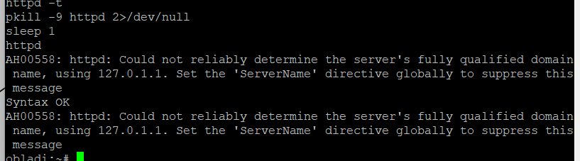
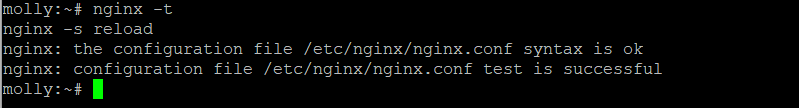
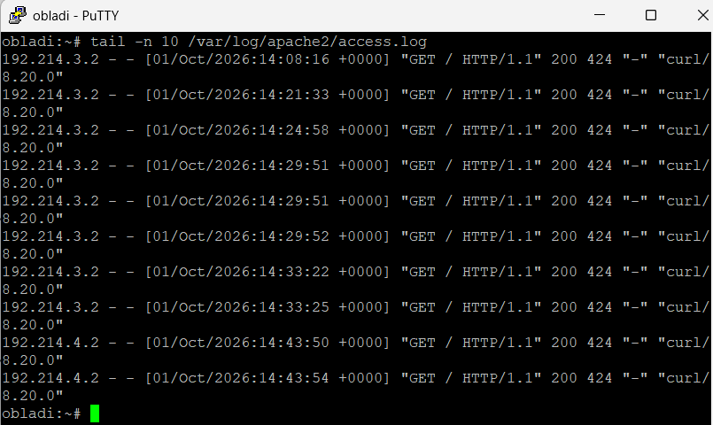
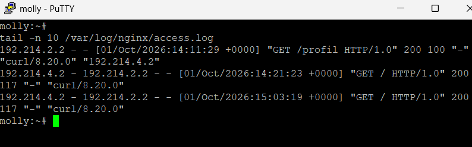

### 14 - Access Log dengan IP Asli Klien

Pada soal ini dipastikan bahwa access log pada seluruh backend web di area vault dan core mencatat alamat IP asli pengunjung, bukan alamat IP reverse proxy. Penny dan Abbey dari soal 11 sudah meneruskan header `X-Real-IP`, sehingga backend dikonfigurasi untuk menggunakan header tersebut saat menulis access log.

Tujuannya agar rekam jejak akses tetap akurat. Jika klien `alpha` dengan IP `192.214.4.2` mengakses layanan melalui Penny atau Abbey, backend harus mencatat `192.214.4.2`, bukan IP Penny `192.214.3.2` atau IP Abbey `192.214.2.2`.

#### 1 - Konfigurasi Backend Vault (Apache)

Dijalankan pada node `obladi` dan `desmond`. Apache dikonfigurasi menggunakan modul `mod_remoteip`, sehingga nilai `X-Real-IP` dari reverse proxy digunakan sebagai alamat klien pada access log. IP reverse proxy yang dipercaya adalah Penny (`192.214.3.2`).

```bash
# (dijalankan di obladi dan desmond)
cat > /etc/apache2/conf.d/real-ip.conf <<'EOF'
LoadModule remoteip_module modules/mod_remoteip.so

RemoteIPHeader X-Real-IP
RemoteIPTrustedProxy 192.214.3.2
LogFormat "%a - %u %t \"%r\" %>s %b \"%{Referer}i\" \"%{User-Agent}i\"" realip
EOF

sed -i 's#CustomLog /var/log/apache2/access.log combined#CustomLog /var/log/apache2/access.log realip#' \
/etc/apache2/conf.d/vault.conf

httpd -t
pkill -9 httpd 2>/dev/null
sleep 1
httpd
```

Pada Alpine, format `combined` menggunakan `%a` sebagai alamat klien. Setelah `mod_remoteip` aktif, `%a` akan berisi alamat dari `X-Real-IP`, sehingga access log Apache mencatat IP asli pengunjung.



#### 2 - Konfigurasi Backend Core (Nginx)

Nginx menggunakan variabel `$http_x_real_ip` untuk menulis alamat IP asli dari header yang diteruskan Abbey (`192.214.2.2`).

Pada konfigurasi server block core, ditambahkan format log dan `access_log` berikut:

```bash
# (dijalankan di oblada dan molly)
cat > /etc/nginx/http.d/00-real-ip-log.conf <<'EOF'
log_format realip '$http_x_real_ip - $remote_addr - $remote_user [$time_local] "$request" '
                  '$status $body_bytes_sent "$http_referer" '
                  '"$http_user_agent"';
EOF
```

Kemudian pada `/etc/nginx/http.d/core.conf`, di dalam block `server`, ditambahkan:

```nginx
access_log /var/log/nginx/access.log realip;
```

Contoh posisi konfigurasinya:

```nginx
server {
    listen 80;
    server_name oblada.k06.com;
    root /var/www/core;
    index index.php;

    access_log /var/log/nginx/access.log realip;

    location / {
        try_files $uri $uri/ @php;
    }

    location @php {
        fastcgi_pass 127.0.0.1:9000;
        include fastcgi.conf;
        fastcgi_param SCRIPT_FILENAME $document_root$uri.php;
    }

    location ~ \.php$ {
        fastcgi_pass 127.0.0.1:9000;
        include fastcgi.conf;
    }
}
```

Pada `molly`, `server_name` disesuaikan menjadi `molly.k06.com`.

Konfigurasi Nginx divalidasi dan dimuat ulang:

```bash
# (dijalankan di oblada dan molly)
nginx -t
nginx -s reload
```



#### 3 - Menghasilkan Request dari Klien

Sebelum memeriksa log, request dibuat dari klien `alpha` dengan IP `192.214.4.2`. Request dikirim melalui nama kanonik masing-masing gerbang:

```bash
# (dijalankan di alpha)
curl http://www.k06.com/
curl http://static.k06.com/
```

Request pertama melewati Penny menuju backend vault, sedangkan request kedua melewati Abbey menuju backend core.

#### 4 - Memeriksa Access Log Backend

Pada backend vault, log Apache diperiksa:

```bash
# (dijalankan di obladi atau desmond)
tail -n 10 /var/log/apache2/access.log
```

Pada backend core, log Nginx diperiksa:

```bash
# (dijalankan di oblada atau molly)
tail -n 10 /var/log/nginx/access.log
```

Hasil yang diharapkan: baris log menampilkan IP `192.214.4.2`, yaitu IP asli alpha. Log tidak boleh mencatat IP Penny (`192.214.3.2`) atau Abbey (`192.214.2.2`) sebagai alamat klien.





#### Persistensi

Agar konfigurasi access log tetap aktif setelah restart, konfigurasi dibungkus dalam `/root/soal14.sh` pada setiap backend. Script ini menulis konfigurasi `mod_remoteip` pada backend Apache, menambahkan format log `realip` pada backend Nginx, lalu memvalidasi dan me-restart service web.

##### Script pada obladi dan desmond

```sh
#!/bin/sh
# /root/soal14.sh - backend vault Apache

mkdir -p /etc/apache2/conf.d /var/log/apache2

cat > /etc/apache2/conf.d/real-ip.conf <<'EOF'
LoadModule remoteip_module modules/mod_remoteip.so
RemoteIPHeader X-Real-IP
RemoteIPTrustedProxy 192.214.3.2
LogFormat "%a - %u %t \"%r\" %>s %b \"%{Referer}i\" \"%{User-Agent}i\"" realip
EOF

sed -i 's#CustomLog /var/log/apache2/access.log combined#CustomLog /var/log/apache2/access.log realip#' \
/etc/apache2/conf.d/vault.conf

httpd -t || exit 1
pkill -9 httpd 2>/dev/null
sleep 1
httpd
```

##### Script pada oblada dan molly

```sh
#!/bin/sh
# /root/soal14.sh - backend core Nginx

mkdir -p /etc/nginx/http.d /var/log/nginx

cat > /etc/nginx/http.d/00-real-ip-log.conf <<'EOF'
log_format realip '$http_x_real_ip - $remote_addr - $remote_user [$time_local] "$request" '
                  '$status $body_bytes_sent "$http_referer" '
                  '"$http_user_agent"';
EOF

# Tambahkan access_log ke server block core satu kali.
if ! grep -q 'access_log /var/log/nginx/access.log realip;' /etc/nginx/http.d/core.conf; then
    sed -i '/server_name /a\    access_log /var/log/nginx/access.log realip;' /etc/nginx/http.d/core.conf
fi

nginx -t || exit 1
nginx -s reload 2>/dev/null || nginx
```

Pada setiap node, script dibuat executable:

```bash
# (dijalankan di obladi, desmond, oblada, dan molly)
chmod +x /root/soal14.sh
```

Script kemudian dipanggil dari `/root/init.sh` setelah service web dari soal sebelumnya aktif. Contoh pada backend vault:

```sh
#!/bin/sh
sh /root/soal9.sh >/tmp/soal9.log 2>&1
sh /root/soal14.sh >/tmp/soal14.log 2>&1
```

Contoh pada backend core:

```sh
#!/bin/sh
sh /root/soal10.sh >/tmp/soal10.log 2>&1
sh /root/soal14.sh >/tmp/soal14.log 2>&1
```


