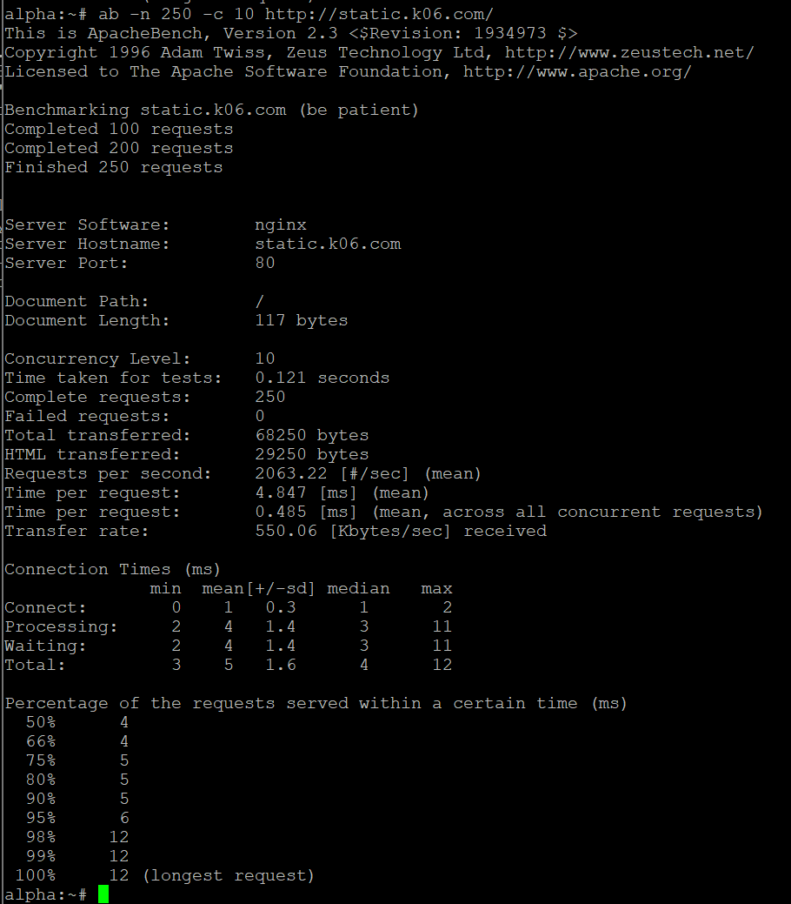
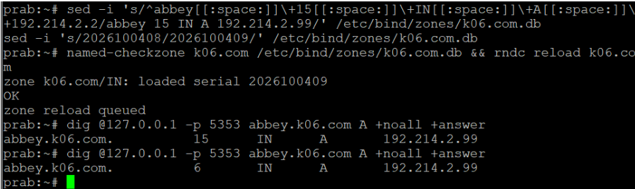
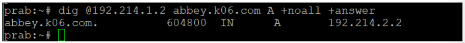
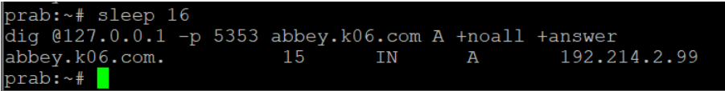
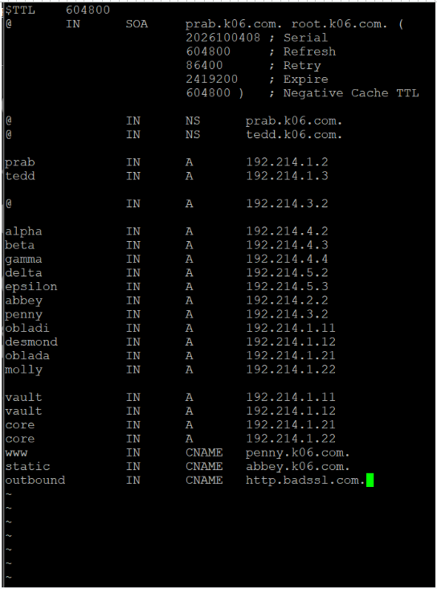
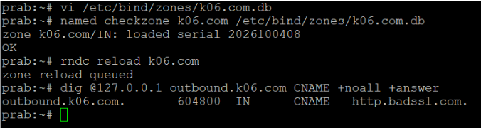
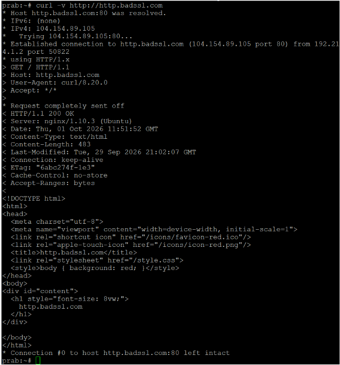
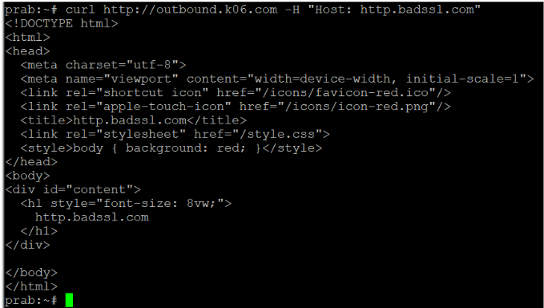

# LAPORAN SOAL 16

## 1. Requirement

Ketahanan gerbang The Mesh harus diuji untuk menghadapi bombardir permintaan. Salah satu klien, yaitu Alpha, bertugas melakukan stress test benchmark menggunakan ApacheBench dengan 250 requests dan tingkat konkurensi (concurrencies) 10 untuk masing-masing titik akhir `www.k06.com` dan `static.k06.com`.

Karena domain yang digunakan pada praktikum adalah `k06.com`, maka endpoint yang diuji adalah:

| No. | Endpoint | Jumlah Request | Concurrency |
|---|---|---:|---:|
| 1 | `www.k06.com` | 250 | 10 |
| 2 | `static.k06.com` | 250 | 10 |

## 2. Konsep yang Digunakan

### ApacheBench

ApacheBench (AB) adalah tool benchmarking HTTP yang digunakan untuk menguji kemampuan suatu web server dalam menangani sejumlah request secara bersamaan.

Pada soal ini digunakan dua parameter utama:

- `-n 250` → mengirim 250 total HTTP requests.
- `-c 10` → menjalankan maksimal 10 requests secara bersamaan (concurrency level).

Dengan demikian, kedua endpoint diuji menggunakan beban yang sama sehingga hasil benchmark dapat dibandingkan.

## 3. Konfigurasi dan Persiapan

Pengujian dilakukan dari client Alpha.

Sebelum melakukan benchmark, dilakukan pengecekan resolusi DNS dan konektivitas HTTP terhadap kedua endpoint.

Hasil resolusi DNS:

- `www.k06.com` → `penny.k06.com` → `192.214.3.2`
- `static.k06.com` → `abbey.k06.com` → `192.214.2.2`

Kedua endpoint juga berhasil memberikan respons:

```text
HTTP/1.1 200 OK
```

ApacheBench kemudian dipastikan tersedia pada client Alpha.


Pengecekan HTTP dan DNS dapat digunakan sebagai screenshot pendukung jika diperlukan.

## 4. Command yang Dieksekusi

Instalasi ApacheBench

```bash
apk add apache2-utils
```

Pengecekan versi

```bash
ab -V
```

Benchmark `www.k06.com`

```bash
ab -n 250 -c 10 http://www.k06.com/
```

Benchmark `static.k06.com`

```bash
ab -n 250 -c 10 http://static.k06.com/
```

## 5. Hasil Benchmark `www.k06.com`

Pengujian dilakukan menggunakan:

```bash
ab -n 250 -c 10 http://www.k06.com/
```

Hasil utama:

| Parameter | Hasil |
|---|---|
| Server Software | Apache/2.4.68 |
| Concurrency Level | 10 |
| Complete Requests | 250 |
| Failed Requests | 0 |
| Time Taken | 0.170 seconds |
| Requests per Second | 1469.27 req/s |
| Time per Request | 6.806 ms |
| Transfer Rate | 852.29 KB/s |
| Longest Request | 15 ms |



Hasil benchmark www.k06.com.

Hasil pengujian ApacheBench terhadap www.k06.com dengan 250 requests dan concurrency 10.

## 6. Hasil Benchmark `static.k06.com`

Pengujian dilakukan menggunakan:

```bash
ab -n 250 -c 10 http://static.k06.com/
```

Hasil utama:

| Parameter | Hasil |
|---|---|
| Server Software | nginx |
| Concurrency Level | 10 |
| Complete Requests | 250 |
| Failed Requests | 0 |
| Time Taken | 0.121 seconds |
| Requests per Second | 2063.22 req/s |
| Time per Request | 4.847 ms |
| Transfer Rate | 550.06 KB/s |
| Longest Request | 12 ms |


Hasil benchmark static.k06.com.

Hasil pengujian ApacheBench terhadap static.k06.com dengan 250 requests dan concurrency 10.

Hasil:

1469.27 req/s, failed 0.

## 7. Rangkuman Hasil

| Parameter | www.k06.com | static.k06.com |
|---|---:|---:|
| Server | Apache/2.4.68 | nginx |
| Requests | 250 | 250 |
| Concurrency | 10 | 10 |
| Failed Requests | 0 | 0 |
| Time Taken | 0.170 s | 0.121 s |
| Requests/sec | 1469.27 | 2063.22 |
| Time/request | 6.806 ms | 4.847 ms |
| Longest Request | 15 ms | 12 ms |

## 8. Analisis

Berdasarkan hasil pengujian, kedua endpoint berhasil menyelesaikan seluruh 250 requests dengan tingkat konkurensi 10 dan tidak terdapat failed requests.

Pada endpoint www.k06.com, ApacheBench mencatat rata-rata 1469.27 requests per second dengan waktu rata-rata 6.806 ms per request.

Sementara itu, static.k06.com mencatat rata-rata 2063.22 requests per second dengan waktu rata-rata 4.847 ms per request.

Perbedaan hasil benchmark juga berkaitan dengan karakteristik layanan yang digunakan. www.k06.com dilayani oleh Apache, sedangkan static.k06.com dilayani oleh nginx, serta ukuran respons yang diberikan kedua endpoint berbeda.

Hasil ini menunjukkan bahwa pada beban pengujian yang diberikan, yaitu 250 requests dengan concurrency 10, kedua endpoint dapat menangani seluruh permintaan tanpa kegagalan.

## 9. Evidence Utama Soal 16

### Evidence 1 — www.k06.com

📸 Screenshot hasil:

```bash
ab -n 250 -c 10 http://www.k06.com/
```

Menunjukkan:

- Complete requests: 250
- Failed requests: 0
- Requests per second: 1469.27

Gambar X. Hasil benchmark ApacheBench pada www.k06.com.

### Evidence 2 — static.k06.com

```bash
ab -n 250 -c 10 http://static.k06.com/
```

Menunjukkan:

- Complete requests: 250
- Failed requests: 0
- Requests per second: 2063.22


Gambar X. Hasil benchmark ApacheBench pada static.k06.com.

# LAPORAN SOAL 17

## 1. Requirement

Soal 17 meminta penambahan TXT record pada DNS untuk seluruh client pada sayap kiri dan sayap kanan, yaitu Alpha, Beta, Gamma, Delta, dan Epsilon. Setiap hostname harus memiliki TXT record yang mengembalikan teks berupa nama hostname tersebut ketika dilakukan query DNS terhadap domainnya.

Mapping-nya:

| Hostname | TXT Record |
|---|---|
| `alpha.k06.com` | `"alpha"` |
| `beta.k06.com` | `"beta"` |
| `gamma.k06.com` | `"gamma"` |
| `delta.k06.com` | `"delta"` |
| `epsilon.k06.com` | `"epsilon"` |

## 2. Konsep yang Digunakan

### Apa itu TXT record?

TXT (Text) record adalah tipe DNS record yang menyimpan teks sebagai informasi tambahan pada suatu domain/hostname.

Dalam soal ini, TXT record digunakan supaya:

- `alpha.k06.com` → `"alpha"`
- `beta.k06.com` → `"beta"`
- `gamma.k06.com` → `"gamma"`
- `delta.k06.com` → `"delta"`
- `epsilon.k06.com` → `"epsilon"`

Jadi ketika client melakukan:

```bash
dig @127.0.0.1 alpha.k06.com TXT
```

DNS harus mengembalikan:

```text
"alpha"
```

## 3. Konfigurasi yang Dilakukan

Kita menambahkan record berikut ke:

```text
/etc/bind/zones/k06.com.db
```

Konfigurasinya:

```text
alpha IN TXT "alpha"
beta IN TXT "beta"
gamma IN TXT "gamma"
delta IN TXT "delta"
epsilon IN TXT "epsilon"
```


Gambar X. Penambahan TXT record untuk seluruh client pada DNS zone k06.com.

## 4. Command yang Dieksekusi

Kita masuk ke zone file dengan:

```bash
vi /etc/bind/zones/k06.com.db
```

Kemudian menambahkan:

```text
alpha IN TXT "alpha"
beta IN TXT "beta"
gamma IN TXT "gamma"
delta IN TXT "delta"
epsilon IN TXT "epsilon"
```

Setelah selesai, kita keluar dari vi menggunakan:

```text
ESC
:wq
ENTER
```

Kemudian dilakukan validasi menggunakan:

```bash
/usr/bin/named-checkzone k06.com /etc/bind/zones/k06.com.db
```

## 5. Hasil Validasi


Gambar X. Hasil validasi zone file menggunakan named-checkzone.

Berdasarkan hasil validasi, zone `k06.com` berhasil dimuat dengan serial `2026100407` dan memperoleh status `OK`. Hal ini menunjukkan bahwa konfigurasi TXT record yang ditambahkan memiliki sintaks DNS yang valid.

Output-nya:

```text
zone k06.com/IN: loaded serial 2026100407
OK
```

Ini membuktikan bahwa zone file berhasil diparse oleh BIND dan tidak memiliki kesalahan sintaks.

## 6. Evidence Utama Soal 17

Untuk membuktikan DNS server benar-benar mengembalikan TXT record ketika ditanya. Kita melakukan DNS query menggunakan `dig`.

Kita lakukan:

```bash
dig @127.0.0.1 alpha.k06.com TXT
```

Lalu:

```bash
dig @127.0.0.1 beta.k06.com TXT
```

Lalu:

```bash
dig @127.0.0.1 gamma.k06.com TXT
```

Lalu:

```bash
dig @127.0.0.1 delta.k06.com TXT
```

Lalu:

```bash
dig @127.0.0.1 epsilon.k06.com TXT
```


Gambar X. Hasil query TXT record seluruh client.

# LAPORAN SOAL 18

## 1. Requirement

Soal 18 meminta perubahan A record DNS milik `abbey.k06.com` menjadi alamat IP fiktif dengan format yang valid. Setelah perubahan dilakukan, serial SOA pada DNS primary (PRAB) harus dinaikkan dan perubahan tersebut harus tersinkronisasi ke DNS secondary (TEDD).

Selain itu, TTL pada record yang relevan ditetapkan sebesar 15 detik. Verifikasi dilakukan dalam tiga fase, yaitu sebelum perubahan, ketika cache masih menyimpan IP lama dalam periode TTL, dan setelah TTL expired ketika cache telah memperoleh IP baru.

Mapping perubahan:

| Hostname | IP Awal | IP Baru | TTL |
|---|---|---|---|
| `abbey.k06.com` | `192.214.2.2` | `192.214.2.99` | 15 detik |

IP `192.214.2.99` digunakan sebagai IP fiktif yang tetap valid secara format IPv4.

## 2. Konsep yang Digunakan

### Apa itu A record?

A (Address) record adalah DNS record yang digunakan untuk memetakan sebuah hostname/domain ke alamat IPv4.

Dalam soal ini:

```text
abbey.k06.com → 192.214.2.99
```

Jadi ketika client melakukan:

```bash
dig @127.0.0.1 abbey.k06.com A
```

DNS harus mengembalikan alamat:

```text
192.214.2.99
```

### Apa itu TTL?

TTL (Time To Live) menentukan berapa lama hasil DNS dapat disimpan oleh resolver dalam cache.

Pada soal ini TTL ditetapkan:

```text
15 detik
```

Artinya, resolver yang sudah memiliki record lama dapat tetap memberikan IP lama sampai masa cache tersebut habis. Setelah TTL expired, resolver akan melakukan query kembali dan memperoleh data terbaru.

## 3. Konfigurasi yang Dilakukan

Perubahan dilakukan pada zone file:

```text
/etc/bind/zones/k06.com.db
```

A record `abbey` awalnya:

```text
abbey IN A 192.214.2.2
```

Kemudian diubah menjadi:

```text
abbey 15 IN A 192.214.2.99
```

Serial SOA juga dinaikkan untuk menandakan bahwa terdapat perubahan pada zone.

Konfigurasi akhirnya:

```text
abbey 15 IN A 192.214.2.99
```

## 4. Command yang Dieksekusi

Kita masuk ke zone file menggunakan:

```bash
vi /etc/bind/zones/k06.com.db
```

Kemudian A record `abbey` diubah menjadi:

```text
abbey 15 IN A 192.214.2.99
```

Serial SOA dinaikkan agar perubahan zone dikenali oleh BIND.

Setelah selesai, dilakukan validasi menggunakan:

```bash
/usr/bin/named-checkzone k06.com /etc/bind/zones/k06.com.db
```

Kemudian zone di-reload menggunakan:

```bash
rndc reload k06.com
```

## 5. Hasil Validasi



Gambar X. Hasil validasi zone file dan reload zone.

Berdasarkan hasil validasi, zone `k06.com` berhasil dimuat oleh BIND dengan serial yang telah dinaikkan. Status `OK` menunjukkan bahwa konfigurasi zone file memiliki sintaks DNS yang valid dan dapat digunakan oleh DNS server.

Output validasi menunjukkan:

```text
zone k06.com/IN: loaded serial 20261004XX
OK
```

Hal ini membuktikan bahwa perubahan A record berhasil diparse oleh BIND dan zone file tidak memiliki kesalahan sintaks.

## 6. Evidence Utama Soal 18

Untuk membuktikan pengaruh TTL terhadap DNS cache, dilakukan pengujian dalam tiga fase.

### Fase 1 — Before Change

Sebelum perubahan dilakukan, query terhadap `abbey.k06.com` menghasilkan IP lama:

```text
abbey.k06.com. 604800 IN A 192.214.2.2
```



Gambar X. Kondisi awal A record `abbey.k06.com` sebelum perubahan.

Hasil tersebut menunjukkan bahwa `abbey.k06.com` masih mengarah ke:

```text
192.214.2.2
```

### Fase 2 — Selama TTL Belum Expired

Setelah A record pada authoritative DNS diubah menjadi:

```text
192.214.2.99
```

cache DNS sebelumnya masih menyimpan alamat IP lama.

Query dilakukan melalui DNS cache:

```bash
dig @127.0.0.1 -p 5353 abbey.k06.com A +noall +answer
```

Hasil:

```text
abbey.k06.com. 9 IN A 192.214.2.2
```


Gambar X. Kondisi DNS cache ketika TTL belum expired.

DNS cache masih mengembalikan IP lama `192.214.2.2` karena TTL record sebelumnya belum habis.

Meskipun authoritative DNS sudah memiliki IP baru `192.214.2.99`, cache masih memberikan IP lama karena record tersebut masih berada dalam masa TTL.

### Fase 3 — Setelah TTL Expired

Setelah menunggu lebih dari 15 detik:

```bash
sleep 16
```



Gambar X. Proses menunggu hingga TTL expired.

Setelah lebih dari 15 detik, query dilakukan kembali:

```bash
dig @127.0.0.1 -p 5353 abbey.k06.com A +noall +answer
```

Hasil:

```text
abbey.k06.com. 15 IN A 192.214.2.99
```


Gambar X. Hasil query setelah TTL expired.

DNS cache telah memperbarui data dan mengembalikan IP baru `192.214.2.99` setelah TTL expired.

Hasil ini membuktikan bahwa setelah cache lama expired, resolver memperoleh data terbaru dari authoritative DNS.

## 7. Verifikasi Sinkronisasi TEDD

Setelah perubahan dilakukan pada PRAB, dilakukan pengecekan terhadap DNS secondary TEDD menggunakan:

```bash
dig @192.214.1.3 abbey.k06.com A +noall +answer
```

Hasil:

```text
abbey.k06.com. 15 IN A 192.214.2.99
```


Gambar X. Verifikasi sinkronisasi A record pada DNS secondary TEDD.

TEDD berhasil menerima perubahan A record dari PRAB.

Hasil tersebut menunjukkan bahwa A record pada TEDD telah tersinkronisasi dengan PRAB, yaitu:

```text
abbey.k06.com → 192.214.2.99
```

dengan TTL:

```text
15 detik
```

## 8. Analisis

Percobaan menunjukkan bahwa perubahan pada authoritative DNS dapat langsung mengubah data yang diberikan oleh server authoritative, tetapi resolver yang memiliki cache masih dapat memberikan data lama selama TTL belum habis.

Pada pengujian ini, record awal `abbey.k06.com` mengarah ke `192.214.2.2`.

Setelah diubah menjadi `192.214.2.99` dengan TTL 15 detik, cache masih mengembalikan `192.214.2.2` ketika TTL belum expired. Setelah lebih dari 15 detik, cache diperbarui dan menghasilkan `192.214.2.99`.

Selain itu, perubahan zone pada PRAB berhasil tersinkronisasi ke TEDD sehingga kedua DNS server memiliki A record terbaru.

# LAPORAN SOAL 19

## 1. Requirement

Soal 19 meminta pembuatan CNAME record yang melakukan binding dari domain internal `outbound.k06.com` menuju domain eksternal `http.badssl.com`. Setelah konfigurasi dilakukan, dilakukan perintah `curl` terhadap `http://outbound.k06.com` untuk memastikan koneksi menuju domain eksternal tersebut dapat dilakukan dan membandingkan hasil konten yang diperoleh dengan halaman `http.badssl.com`.

Mapping-nya:

| Domain Internal | CNAME | Domain Eksternal |
|---|---|---|
| `outbound.k06.com` | CNAME | `http.badssl.com` |

## 2. Konsep yang Digunakan

### CNAME record

CNAME (Canonical Name) record adalah DNS record yang digunakan untuk membuat alias dari suatu hostname menuju hostname lain.

Dalam soal ini:

```text
outbound.k06.com → http.badssl.com
```

Artinya ketika DNS ditanyakan mengenai:

```text
outbound.k06.com
```

DNS akan menunjukkan bahwa hostname tersebut merupakan alias dari:

```text
http.badssl.com
```

CNAME tidak secara langsung melakukan HTTP redirect. CNAME bekerja pada level DNS, sehingga hostname tujuan tetap menjadi `http.badssl.com`.

## 3. Konfigurasi yang Dilakukan

Kita menambahkan CNAME record pada zone file:

```text
/etc/bind/zones/k06.com.db
```

Konfigurasinya:

```text
outbound IN CNAME http.badssl.com.
```

Titik (`.`) pada bagian akhir `http.badssl.com.` digunakan untuk menunjukkan bahwa nama tersebut merupakan FQDN (Fully Qualified Domain Name) dan bukan nama relatif terhadap zone `k06.com`.



Gambar X. Konfigurasi CNAME `outbound.k06.com` menuju `http.badssl.com`.

## 4. Command yang Dieksekusi

Kita masuk ke zone file menggunakan:

```bash
vi /etc/bind/zones/k06.com.db
```

Kemudian menambahkan:

```text
outbound IN CNAME http.badssl.com.
```

Setelah konfigurasi selesai, dilakukan validasi zone menggunakan:

```bash
named-checkzone k06.com /etc/bind/zones/k06.com.db
```

Kemudian zone di-reload menggunakan:

```bash
rndc reload k06.com
```

Hasil validasi menunjukkan:

```text
zone k06.com/IN: loaded serial 2026100407
OK
zone reload queued
```

Hal ini menunjukkan bahwa konfigurasi CNAME berhasil diproses oleh BIND.

## 5. Hasil Validasi CNAME

Untuk memastikan CNAME berhasil dikonfigurasi, dilakukan query DNS menggunakan:

```bash
dig @127.0.0.1 outbound.k06.com CNAME +noall +answer
```

Hasilnya:

```text
outbound.k06.com. 604800 IN CNAME http.badssl.com.
```



Gambar X. Hasil query DNS yang menunjukkan `outbound.k06.com` merupakan alias dari `http.badssl.com`.

Berdasarkan hasil tersebut, DNS server berhasil memberikan CNAME record:

```text
outbound.k06.com → http.badssl.com
```

## 6. Evidence Utama Soal 19

Untuk membuktikan bahwa hostname internal dapat digunakan untuk melakukan koneksi HTTP, dilakukan perintah:

```bash
curl http://outbound.k06.com
```

Hasil koneksi berhasil dan menghasilkan:

```text
HTTP/1.1 200 OK
Server: nginx/1.10.3 (Ubuntu)
```

Namun, konten yang diterima berupa halaman default nginx:

```html
<title>Welcome to nginx!</title>
```


Gambar X. Hasil akses HTTP melalui `outbound.k06.com` yang berhasil menghasilkan HTTP response `200 OK`.

Hal ini menunjukkan bahwa koneksi HTTP melalui hostname `outbound.k06.com` berhasil dilakukan. Namun, halaman yang dikembalikan berbeda dengan halaman `http.badssl.com`.

## 7. Verifikasi terhadap Domain Eksternal

Untuk membandingkan hasil tersebut dengan domain tujuan secara langsung, dilakukan:

```bash
curl -v http://http.badssl.com
```

Hasilnya memberikan:

```text
HTTP/1.1 200 OK
```

dan konten halaman:

```html
<title>http.badssl.com</title>
```



Gambar X. Hasil `curl -v http://http.badssl.com`.

Hasil akses langsung terhadap halaman `http.badssl.com` digunakan sebagai pembanding.

## 8. Verifikasi CNAME terhadap HTTP Host

Perbedaan hasil sebelumnya terjadi karena CNAME hanya bekerja pada resolusi DNS, sedangkan HTTP request tetap menggunakan hostname yang diminta sebagai nilai `Host`.

Pada:

```bash
curl http://outbound.k06.com
```

HTTP request menggunakan:

```text
Host: outbound.k06.com
```

Untuk menguji apakah server tujuan dapat memberikan halaman `http.badssl.com` ketika Host diarahkan ke domain tujuan, dilakukan:

```bash
curl http://outbound.k06.com -H "Host: http.badssl.com"
```

Hasilnya memberikan konten:

```html
<title>http.badssl.com</title>
```

dan:

```html
<h1 style="font-size: 8vw;">
 http.badssl.com
</h1>
```



Gambar X. Hasil request melalui `outbound.k06.com` dengan HTTP Host diarahkan ke `http.badssl.com`.

Hasil request melalui `outbound.k06.com` dengan HTTP Host diarahkan ke `http.badssl.com`, menghasilkan konten halaman `http.badssl.com`.

Hasil tersebut menunjukkan bahwa koneksi dari `outbound.k06.com` menuju server tujuan berhasil dan server memberikan halaman `http.badssl.com` ketika HTTP Host header sesuai dengan domain tujuan.

## 9. Analisis

Percobaan menunjukkan bahwa konfigurasi CNAME berhasil dilakukan. DNS server memberikan informasi bahwa:

```text
outbound.k06.com → http.badssl.com
```

Query menggunakan `dig` juga membuktikan bahwa CNAME record telah terpasang dengan benar.

Ketika dilakukan:

```bash
curl http://outbound.k06.com
```

koneksi HTTP berhasil dengan status `200 OK`, tetapi server mengembalikan halaman default nginx. Hal tersebut terjadi karena request HTTP menggunakan:

```text
Host: outbound.k06.com
```

sedangkan server tujuan memiliki konfigurasi berdasarkan hostname yang diberikan melalui HTTP Host header.

Ketika dilakukan request dengan:

```bash
curl http://outbound.k06.com -H "Host: http.badssl.com"
```

server mengembalikan konten halaman `http.badssl.com`. Hal ini menunjukkan perbedaan antara DNS CNAME resolution dan HTTP Host-based routing.

Dengan demikian, CNAME berhasil melakukan binding pada level DNS, tetapi CNAME sendiri tidak mengubah nilai HTTP Host header.