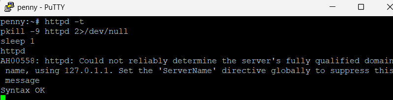
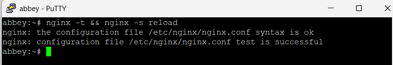
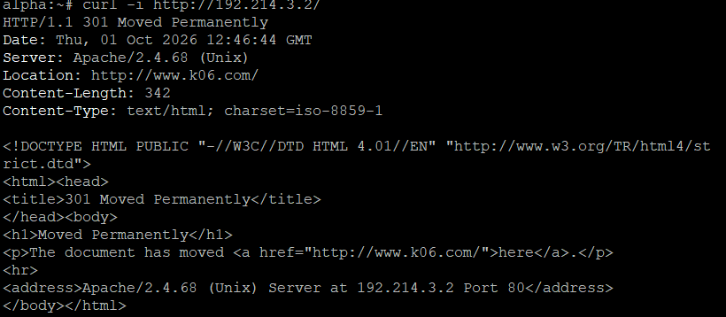
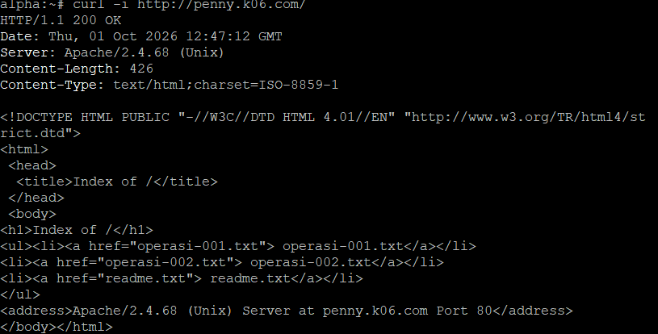
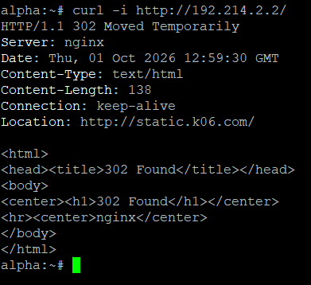
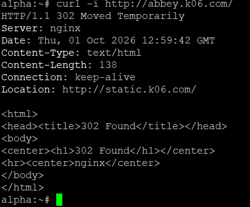

### Soal 13: Redirect Kanonik (Penny → www.k06.com, Abbey → static.k06.com)

Pada soal ini, setiap entitas yang mengakses gerbang menggunakan nama non-kanonik (IP atau hostname langsung) harus dipaksa diarahkan ke nama kanonik yang benar. Aturan yang berlaku:

- Akses ke IP penny (`192.214.3.2`) atau `penny.k06.com` → redirect **permanen (301)** ke `www.k06.com`
- Akses ke IP abbey (`192.214.2.2`) atau `abbey.k06.com` → redirect **sementara (302)** ke `static.k06.com`

---

#### A. Penny — Redirect 301 ke www.k06.com (Apache)

##### 1. Konfigurasi Redirect

Ditambahkan VirtualHost khusus pada penny untuk menangkap akses lewat IP (`192.214.3.2`) dan hostname (`penny.k06.com`), kemudian mengarahkannya secara permanen ke `www.k06.com`. VirtualHost proxy soal 11 diperbarui agar hanya merespons request dengan nama kanonik `www.k06.com`, sehingga tidak bentrok dengan VirtualHost redirect.

```sh
# (dijalankan di penny)
cat > /etc/apache2/conf.d/redirect-penny.conf <<'EOF'
<VirtualHost *:80>
    ServerName 192.214.3.2
    ServerAlias penny.k06.com
    Redirect permanent / http://www.k06.com/
</VirtualHost>
EOF
```

Sekaligus diperbarui ServerName pada config proxy vault agar hanya merespons `www.k06.com`:

```sh
# (dijalankan di penny)
cat > /etc/apache2/conf.d/proxy-vault.conf <<'EOF'
<VirtualHost *:80>
    ServerName www.k06.com

    ProxyPreserveHost On
    RequestHeader set X-Real-IP "%{REMOTE_ADDR}s"

    ProxyPass "/admin" "!"
    Alias "/admin" "/var/www/admin"

    <Directory "/var/www/admin">
        Options -Indexes
        AllowOverride None
        AuthType Basic
        AuthName "Ruang Rahasia The Mesh"
        AuthUserFile "/etc/apache2/.htpasswd"
        Require valid-user
    </Directory>

    <Proxy "balancer://vault">
        BalancerMember "http://192.214.1.11"
        BalancerMember "http://192.214.1.12"
    </Proxy>

    ProxyPass        "/" "balancer://vault/"
    ProxyPassReverse "/" "balancer://vault/"
</VirtualHost>
EOF
```

##### 2. Validasi dan Restart Apache

```sh
# (dijalankan di penny)
httpd -t
pkill -9 httpd 2>/dev/null
sleep 1
httpd
```



#### B. Abbey — Redirect 302 ke static.k06.com (Nginx)

##### 1. Konfigurasi Redirect

Ditambahkan server block khusus pada abbey untuk menangkap akses lewat IP (`192.214.2.2`) dan hostname (`abbey.k06.com`), kemudian mengarahkannya sementara ke `static.k06.com`. Server block proxy core diperbarui agar hanya merespons `static.k06.com`.

```sh
# (dijalankan di abbey)
cat > /etc/nginx/http.d/redirect-abbey.conf <<'EOF'
server {
    listen 80;
    server_name 192.214.2.2 abbey.k06.com;
    return 302 http://static.k06.com/;
}
EOF
```

Sekaligus diperbarui `server_name` pada config proxy core:

```sh
# (dijalankan di abbey)
cat > /etc/nginx/http.d/proxy-core.conf <<'EOF'
upstream core {
    server 192.214.1.21;
    server 192.214.1.22;
}

server {
    listen 80;
    server_name static.k06.com;

    location / {
        proxy_pass http://core;
        proxy_set_header Host $host;
        proxy_set_header X-Real-IP $remote_addr;
        proxy_set_header X-Forwarded-For $proxy_add_x_forwarded_for;
    }
}
EOF
```

##### 2. Validasi dan Reload Nginx

```sh
# (dijalankan di abbey)
nginx -t && nginx -s reload
```



#### Verifikasi

Verifikasi dilakukan dari alpha dengan mengakses keempat titik (IP dan hostname masing-masing gerbang) untuk membuktikan status code redirect yang benar.

```sh
# (dijalankan di alpha)
curl -i http://192.214.3.2/
curl -i http://penny.k06.com/
curl -i http://192.214.2.2/
curl -i http://abbey.k06.com/
```

Hasil yang diharapkan:
- `192.214.3.2` dan `penny.k06.com` mengembalikan `301 Moved Permanently` dengan `Location: http://www.k06.com/`
- `192.214.2.2` dan `abbey.k06.com` mengembalikan `302 Moved Temporarily` dengan `Location: http://static.k06.com/`










#### Persistensi

Konfigurasi redirect dibungkus dalam script `/root/soal13.sh` pada masing-masing node agar tetap aktif setelah restart.

##### Script penny

```sh
#!/bin/sh
# /root/soal13.sh - penny (redirect 301 ke www.k06.com)

cat > /etc/apache2/conf.d/redirect-penny.conf <<'EOF'
<VirtualHost *:80>
    ServerName 192.214.3.2
    ServerAlias penny.k06.com
    Redirect permanent / http://www.k06.com/
</VirtualHost>
EOF

httpd -t || exit 1
pkill -9 httpd 2>/dev/null
sleep 1
httpd
```

##### Script abbey

```sh
#!/bin/sh
# /root/soal13.sh - abbey (redirect 302 ke static.k06.com)

cat > /etc/nginx/http.d/redirect-abbey.conf <<'EOF'
server {
    listen 80;
    server_name 192.214.2.2 abbey.k06.com;
    return 302 http://static.k06.com/;
}
EOF

nginx -t || exit 1
nginx -s reload 2>/dev/null || nginx
```

Script dijalankan dari `/root/init.sh` masing-masing node setelah script soal sebelumnya selesai, dan dibuat executable:

```sh
chmod +x /root/soal13.sh
```